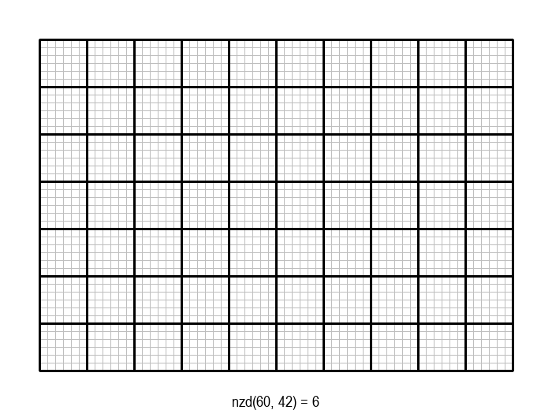
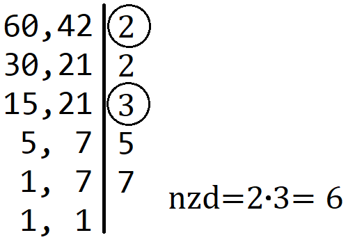
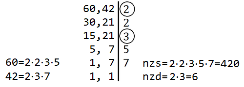

Највећи заједнички делилац
==========================

Појам највећег заједничког делиоца нам је познат још из основне школе. Подсетимо се:

.. infonote::

    Највећи заједнички делилац (НЗД) два природна броја је највећи природан број који дели оба дата 
    броја без остатка.
    
На пример, НЗД бројева 60 и 42 је 6, јер 6 дели и 60 и 42, а при томе не постоји већи број са овом особином.

|

Задатак налажења НЗД бројева :math:`a` и :math:`b` може да се графички интерпретира на следећи начин: 
дат је правоугаоник од :math:`a \cdot b` јединичних квадрата, а потребно је одредити највеће :math:`d`, 
такво да дати правоугаоник може да се покрије квадратима величине :math:`d \cdot d`.
    

Постоје разни начини да се на основу датих :math:`a` и :math:`b` израчуна ово највеће :math:`d`.
У наставку ћемо анализирати неколико поступака за израчунавање НЗД два дата природна броја, 
обраћајући посебну пажњу на ефикасност тих поступака. Након сваког поступка ћемо поставити иста питања, 
уобичајена при анализи ефикасности алгоритама: 

- који су посебно неповољни случајеви улаза за дати алгоритам, тј. за који улаз је алгоритму потребно 
  највише времена да дође до одговора?
- колико операција, односно времена може да буде потребно алгоритму у најнеповољнијим случајевима?

.. comment

    Скраћивање разломка
    Проблем самерљивости (штапови, посуде)

Алгоритам смањивања за по 1
---------------------------

Једно, алгоритамски веома лоше решење, било би да редом испробавамо природне бројеве почевши од 
:math:`min(a, b)` наниже као могуће НЗД, док не наиђемо на број који је делилац и од :math:`a` и од 
:math:`b`. Први заједнички делилац на који наиђемо је уједно и највећи број са том особином, па је 
то НЗД.

.. activecode:: nzd_dva_broja_smanjivanjem
    :passivecode: true
    :coach:
    :includesrc: _src/1_algebarski/nzd_dva_broja_smanjivanjem.cs

У графичкој илустрацији алгоритма која следи, свака слика одговара једној итерацији алгоритма. 
Квадрат се смањује све док се и ширина и висина правоугаоника не уклопе у мрежу квадрата.

.. gallery:: nzd0_smanjivanje
    :width: 600px
    :height: 100%
    :folder: ../../_images/1_algebarski
    :images: nzd_smanj_01.png, nzd_smanj_02.png, nzd_smanj_03.png, nzd_smanj_04.png, nzd_smanj_05.png, nzd_smanj_06.png, nzd_smanj_07.png, nzd_smanj_08.png, nzd_smanj_09.png, nzd_smanj_10.png, nzd_smanj_11.png, nzd_smanj_12.png, nzd_smanj_13.png, nzd_smanj_14.png, nzd_smanj_15.png, nzd_smanj_16.png, nzd_smanj_17.png, nzd_smanj_18.png, nzd_smanj_19.png, nzd_smanj_20.png, nzd_smanj_21.png, nzd_smanj_22.png, nzd_smanj_23.png, nzd_smanj_24.png, nzd_smanj_25.png, nzd_smanj_26.png, nzd_smanj_27.png, nzd_smanj_28.png, nzd_smanj_29.png, nzd_smanj_30.png, nzd_smanj_31.png, nzd_smanj_32.png, nzd_smanj_33.png, nzd_smanj_34.png, nzd_smanj_35.png, nzd_smanj_36.png, nzd_smanj_37.png 

.. questionnote::

    Опишите један посебно неповољан улаз за алгоритам смањивања за по 1, тј. вредности :math:`a` и :math:`b` 
    за које је алгоритму потребан посебно велики број операција.
    
    Можете ли да процените време рада алгоритма у случају неповољних 64-битних вредности (тј. вредности типа ``long``)?

Није тешко приметити да је за алгоритам смањивања за по 1 (у смислу броја потребних операција) 
неповољно када су вредности :math:`a` и :math:`b` веома велике и међусобно блиске, јер је тада 
вредност НЗД сразмерно веома мала. Екстреман пример би био :math:`a=2^{63}-1, b=2^{63}-2`.
У овом случају једини заједнички делилац бројева :math:`a` и :math:`b` је један (зашто?), тј. 
ови бројеви су узајамно прости. Због тога је број операција потребних да се на описани начин 
дође до резултата реда :math:`2^{63} \approx 10^{19}`, а за то је, као што већ знамо, данашњим рачунарима 
потребно више стотина година.

Алгоритам истовремене факторизације
-----------------------------------

Поступак који се учи у основној школи је да се дати бројеви раставе на просте чиниоце, а затим се у 
факторизацијама датих бројева пронађу прости чиниоци који су заједнички. Производ тих заједничких 
простих чинилаца је тражени НЗД. На пример, :math:`60 = 2 \cdot 2 \cdot 3 \cdot 5, 42 = 2 \cdot 3 \cdot 7`, 
заједнички прости чиниоци су 2 и 3, па је НЗД једнак :math:`2 \cdot 3 = 6`. Уобичајено је да се 
бројеви чији НЗД тражимо факторишу истовремено, користећи запис као на следећој слици. Са десне 
стране црте пишемо све чиниоце којима је дељив бар један од бројева са леве стране, а оне са којим су 
дељива оба броја посебно означимо и на крају помножимо.

    
    Поступак налажења НЗД факторизацијом два броја (заједнички фактори су заокружени).

Из поступка факторизације знамо да потенцијалне просте делиоце :math:`d` броја :math:`a` треба да 
тражимо све док је :math:`d \leq \sqrt a`, а делиоце броја :math:`b` док је :math:`d \leq \sqrt b`.
Пошто се делиоци оба броја налазе истовремено, услов за останак у петљи је да за бар један од 
бројева :math:`a, b` претрага није завршена. Овај услов може формално да се искаже на неколико 
логички равноправних начина, нпр:

.. math::

    \begin{aligned}
    d \cdot d \leq a \lor d \cdot d \leq b &\iff d \leq \sqrt a \lor d \leq \sqrt b\\
    &\iff d \leq max(\sqrt {a}, \sqrt {b})\\
    &\iff d \leq \sqrt {max(a, b)}\\
    \end{aligned}

Ево и програма за поступак одређивања НЗД истовременом факторизацијом:

.. activecode:: nzd_dva_broja_faktorizacijom
    :passivecode: true
    :coach:
    :includesrc: _src/1_algebarski/nzd_dva_broja_faktorizacijom.cs

.. questionnote::

    Које вредности су посебно неповољне за алгоритам налажења НЗД помоћу факторизације?
    
    Колико операција, односно времена може у најнеповољнијем случају да буде потребно 
    овом алгоритму за вредности из опсега типа ``long``?

Алгоритам налажења НЗД помоћу факторизације је веома сличан поступку факторизације, тј. растављања 
једног датог броја на просте чиниоце. Због тога је и број операција, као и код алгоритма факторизације, 
у најгорем случају сразмеран корену из већег од бројева :math:`a, b`. Као што смо раније видели, 
неповољан случај су велики прости бројеви, а за такве бројеве може да буде потребно око 
:math:`2^{30}` операција, тј. неколико секунди.

Еуклидов алгоритам
------------------

Еуклидов алгоритам се заснива на једноставној идеји, познатој од давнина. Да бисмо ту идеју представили 
на што јаснији начин, вратимо се графичкој интерпретацији проблема, у којој је потребно да се 
правоугаоник прекрије што већим (међусобно једнаким) квадратима странице :math:`d`. Нека су :math:`a` 
и :math:`b` странице правоугаоника и нека је :math:`a \geq b`. Пошто квадрат странице :math:`d` треба 
да прекрије правоугаоник, његова страница се цео број пута садржи у страници :math:`b`. Самим тим, мада 
још не знамо колико је :math:`d`, знамо да ћемо квадратима величине :math:`d \cdot d` лако покрити квадрат 
величине :math:`b \cdot b`. Зато од полазног правоугаоника можемо да одбацимо квадрат величине :math:`b \cdot b` и 
наставимо да тражимо највећи квадрат којим може да се покрије преостали правоугаоник величине 
:math:`(a-b) \cdot b`.

Ово размишљање можемо да понављамо све док преостали правоугаоник не постане квадрат, када је одговор 
очигледан. Описани поступак овако изгледа на примеру :math:`a=60, b= 42`:

.. gallery:: nzd1_euklid1
    :width: 600px
    :height: 100%
    :folder: ../../_images/1_algebarski
    :images: nzd_euk_minus_01.png, nzd_euk_minus_02.png, nzd_euk_minus_03.png, nzd_euk_minus_04.png, nzd_euk_minus_05.png, nzd_euk_minus_06.png, nzd_euk_minus_07.png 

Исту идеју можемо да искажемо и формално. Нека је :math:`d` заједнички делилац бројева :math:`a, b`, 
тј. нека је :math:`a=m \cdot d, b=n \cdot d`. Без губљења општости можемо да претпоставимо :math:`a \geq b`. 
Тада је :math:`d` делилац и броја :math:`a-b` јер :math:`a-b = (m-n) \cdot d`. Важи и обрнуто, 
ако је :math:`d` заједнички делилац бројева :math:`a-b` и :math:`b`, онда је :math:`d` делилац 
и броја :math:`a`. Одавде закључујемо да је скуп заједничких делилаца бројева :math:`a` и :math:`b` 
исти као и скуп заједничких делилаца бројева :math:`a-b` и :math:`b`. Два иста скупа имају и исти максимум, 
што значи да је :math:`nzd(a, b) = nzd(a-b, b)`.

Овим је оправдан приступ који се користи у Еуклидовом поступку за одређивање НЗД, тј. ово је суштина доказа 
да је поступак коректан. Запишимо поступак и помоћу програма:

.. activecode:: nzd_dva_broja_euklid_1
    :passivecode: true
    :coach:
    :includesrc: _src/1_algebarski/nzd_dva_broja_euklid_1.cs

Пре него што пређемо на анализу, уочимо да поступак може додатно да се оптимизује тако што узастопна 
одузимања :math:`b` од :math:`a` заменимо рачунањем остатка при дељењу. На пример, од правоугаоника 
величине :math:`18 \times 42`, одузимањем :math:`42-18=24` прелазимо на правоугаоник :math:`18 \times 24`, 
а затим одузимањем :math:`24-18=6` на правоугаоник :math:`18 \times 6`. 
Када од неког броја :math:`p \in \mathbb{N}` узастопно одузимамо број :math:`q  \in \mathbb{N}` док 
год је :math:`p \geq q`, на крају као резултат добијамо остатак при дељењу :math:`p` са :math:`q`. 
Према томе, претходно описани поступак можемо још да побољшамо (убрзамо), тако што уместо :math:`(a-b)` 
користимо :math:`(a \bmod b)`. Након ове поправке, кораци поступка изгледају овако:

.. gallery:: nzd2_euklid2
    :width: 600px
    :height: 100%
    :folder: ../../_images/1_algebarski
    :images: nzd_euk_mod_01.png, nzd_euk_mod_02.png, nzd_euk_mod_03.png, nzd_euk_mod_04.png 

Ово може да буде значајна уштеда када је један од бројева :math:`a, b` веома велики, а други веома мали. 

Ево и програма за оптимизовану верзију Еуклидовог алгоритма, који уместо одузимања користи остатак при дељењу:

.. activecode:: nzd_dva_broja_euklid_2
    :passivecode: true
    :coach:
    :includesrc: _src/1_algebarski/nzd_dva_broja_euklid_2.cs

.. questionnote::

    Покушајте да пронађете вредности :math:`a` и :math:`b`, за које би Еуклидовом алгоритму био потребан 
    што већи број итерација. Да бисте дошли до таквог пара бројева, предлажемо вам да кренете од вредности 
    за :math:`a` и :math:`b` у последњој итерацији, затим у претпоследњој итд. ка почетним вредностима.
    Наравно, број итерација које на овај начин можемо да извршимо уназад, ограничен је опсегом 64-битних 
    променљивих које користимо у овим алгоритмима.

Пошто желимо да максимизирамо број итерација, најбоље је да почнемо од најмањег могућег завршног пара 
вредности, а то је :math:`a=1, b=1`. Да бисмо у датом опсегу могли да изведемо што већи број итерација 
уназад, вредности :math:`a` и :math:`b` ћемо повећавати штедљиво, тј. тако да ове вредности што спорије 
расту у свакој од итерација. Према томе, тражимо прво најмањи пар бројева који у једној итерацији доводи до 
пара :math:`a=1, b=1`, а то је пар :math:`a=2, b=1`. Да бисмо направили следећи корак уназад, потребан нам 
је што мањи број :math:`a`, који при дељењу са 2 даје остатак 1, а то је 3. Тако добијамо претходни пар 
:math:`a=3, b=2`. Настављајући поступак, добијамо следеће парове:

.. code::

    a = 1, b = 1 -> 0 iteracija
    a = 2, b = 1 -> 1 iteracija
    a = 3, b = 2 -> 2 iteracije
    a = 5, b = 3 -> 3 iteracije
    a = 8, b = 5 -> 4 iteracije
    a = 13, b = 8 -> 5 iteracija
    a = 21, b = 13 -> 6 iteracija
    a = 34, b = 21 -> 7 iteracija
    a = 55, b = 34 -> 8 iteracija
    a = 89, b = 55 -> 9 iteracija
    a = 144, b = 89 -> 10 iteracija
    a = 233, b = 144 -> 11 iteracija
    a = 377, b = 233 -> 12 iteracija
    a = 610, b = 377 -> 13 iteracija
    a = 987, b = 610 -> 14 iteracija
    a = 1597, b = 987 -> 15 iteracija
    a = 2584, b = 1597 -> 16 iteracija
    a = 4181, b = 2584 -> 17 iteracija
    a = 6765, b = 4181 -> 18 iteracija
    a = 10946, b = 6765 -> 19 iteracija
    a = 17711, b = 10946 -> 20 iteracija
    a = 28657, b = 17711 -> 21 iteracija
    a = 46368, b = 28657 -> 22 iteracije
    a = 75025, b = 46368 -> 23 iteracije
    a = 121393, b = 75025 -> 24 iteracije
    a = 196418, b = 121393 -> 25 iteracija
    a = 317811, b = 196418 -> 26 iteracija
    a = 514229, b = 317811 -> 27 iteracija
    a = 832040, b = 514229 -> 28 iteracija
    a = 1346269, b = 832040 -> 29 iteracija
    a = 2178309, b = 1346269 -> 30 iteracija
    ...
    a = 259695496911122585, b = 160500643816367088 -> 83 iteracije
    a = 420196140727489673, b = 259695496911122585 -> 84 iteracije
    a = 679891637638612258, b = 420196140727489673 -> 85 iteracija
    a = 1100087778366101931, b = 679891637638612258 -> 86 iteracija
    a = 1779979416004714189, b = 1100087778366101931 -> 87 iteracija
    a = 2880067194370816120, b = 1779979416004714189 -> 88 iteracija
    a = 4660046610375530309, b = 2880067194370816120 -> 89 iteracija
    a = 7540113804746346429, b = 4660046610375530309 -> 90 iteracija
    a = 12200160415121876738, b = 7540113804746346429 -> 91 iteracija

Можда изненађујуће, видимо да после свега неколико десетина итерација долазимо до граница опсега 64-битне 
променљиве. Нагласимо још једном да су ово, према начину на који су добијени, парови бројева за које је 
Еуклидовом алгоритму потребан највећи број итерација. Прецизније речено, не постоје мањи парови бројева 
за које је Еуклидовом алгоритму потребан исти или већи број итерација.

Одавде следи важан закључак: за било који пар бројева из опсега 64-битног целобројног типа, Еуклидовом 
алгоритму је довољно стотинак итерација да дође до резултата. Према томе, Еуклидов алгоритам је далеко, 
далеко ефикаснији од алгоритма факторизације, коме би за просте бројеве са границе опсега 64-битног 
целобројног типа биле потребне милијарде итерација.

|

Резимирајмо закључке до којих смо дошли током анализе различитих алгоритама за одређивање НЗД:

-   Налажење НЗД алгоритмом смањивања за 1 је очигледно веома споро, тако да никоме не пада на памет да овај 
    поступак користи при ручном одређивању НЗД. Једини разлог што се он понекад виђа као програм је што се 
    веома лако записује у облику програма. Међутим, сасвим кратка и једноставна анализа показује да је налажење 
    НЗД овим приступом бесмислено арчење рачунарских ресурса (као и код ручног рачунања). За веће вредности 
    аргумената, алгоритам је практично неупотребљив.
    
-   Алгоритам истовремене факторизације два броја се ослања на од раније познат алгоритам факторизације 
    једног броја. Тај поступак јесте најефикаснији познат начин за одређивање простих чинилаца датог броја, 
    међутим у проблему НЗД он одређује више него што се тражи. Због тога је број операција за налажење НЗД 
    алгоритмом истовремене факторизације ипак непотребно висок. 
    
-   Еуклидов алгоритам је толико ефикасан, да би веома брзо (у делићу секунде) нашао НЗД и за бројеве од 
    више хиљада цифара. За остале поменуте алгоритме о томе нема ни помисли.
    
Рачунање најмањег заједничког садржаоца
---------------------------------------

Са појмом највећег заједничког делиоца, тесно је повезан појам најмањег заједничког садржаоца. Подсетимо се 
и њега:

.. infonote::

    Најмањи заједнички садржалац (НЗС) два природна броја је најмањи природан број који је дељив са оба дата 
    броја без остатка.
    
На пример, НЗС бројева 60 и 42 је 420, јер 420 је дељив и са 60 и са 42, а при томе не постоји мањи број са овом 
особином.

|

За ефикасно израчунавање најмањег заједничког садржаоца можемо да искористимо једнакост 
:math:`nzd(a, b) \cdot nzs(a, b) = a \cdot b`. Да бисмо разумели зашто ова једнакост важи, размотримо 
пажљиво шта се дешава при поступку дељења простим чиниоцима, којим на папиру налазимо НЗД и НЗС.

Прости чиниоци који деле оба броја са леве стране (на слици заокружени), користе се и у рачунању НЗД 
и НЗС, а они који деле само један од бројева са леве стране, учествују само у производу за НЗС. Према 
томе, прости чиниоци који учествују два пута у производима на левој страни, учествују два пута и на десној, а 
они који учествују само једном на левој страни, учествују једном и на десној (само у НЗС). Према 
томе, производ свих простих чинилаца, при чему заокружене бројимо два пута, једнак је и са 
:math:`a \cdot b` и са :math:`nzd(a, b) \cdot nzs(a, b)`, па су ова два израза међусобно једнака.

Једнакост :math:`nzd(a, b) \cdot nzs(a, b) = a \cdot b` може да се докаже и формалније, посматрањем 
факторизација бројева :math:`a` и :math:`b`. Нека је: 

.. math::

    \begin{aligned}
    a &= p_1 ^ {\alpha_1} \cdot p_2 ^ {\alpha_2}  \cdot ... \cdot p_k ^ {\alpha_k}, \\
    b &= p_1 ^ {\beta_1} \cdot p_2 ^ {\beta_2}  \cdot ... \cdot p_k ^ {\beta_k}\\
    \end{aligned}

Тада је: 

.. math::

    \begin{aligned}
    nzs(a, b) &= p_1 ^ {max(\alpha_1, \beta_1)} \cdot p_2 ^ {max(\alpha_2, \beta_2)}  \cdot ... \cdot p_k ^ {max(\alpha_k, \beta_k)}\\ 
    nzd(a, b) &= p_1 ^ {min(\alpha_1, \beta_1)} \cdot p_2 ^ {min(\alpha_2, \beta_2)}  \cdot ... \cdot p_k ^ {min(\alpha_k, \beta_k)}\\
    \end{aligned}

Сада имамо: 

.. math::

    \begin{aligned}
    nzs(a, b) \cdot nzd(a, b) &= \left(p_1 ^ {max(\alpha_1, \beta_1)} \cdot p_2 ^ {max(\alpha_2, \beta_2)}  \cdot ... \cdot p_k ^ {max(\alpha_k, \beta_k)}\right) \cdot \left(p_1 ^ {min(\alpha_1, \beta_1)} \cdot p_2 ^ {min(\alpha_2, \beta_2)}  \cdot ... \cdot p_k ^ {min(\alpha_k, \beta_k)}\right)\\
    &= p_1 ^ {max(\alpha_1, \beta_1) + min(\alpha_1, \beta_1)} \cdot p_2 ^ {max(\alpha_2, \beta_2) + min(\alpha_2, \beta_2)}  \cdot ... \cdot p_k ^ {max(\alpha_k, \beta_k) + min(\alpha_k, \beta_k)}\\
    &= p_1 ^ {\alpha_1 + \beta_1} \cdot p_2 ^ {\alpha_2 + \beta_2}  \cdot ... \cdot p_k ^ {\alpha_k + \beta_k}\\
    &= \left(p_1 ^ {\alpha_1} \cdot p_2 ^ {\alpha_2}  \cdot ... \cdot p_k ^ {\alpha_k}\right) \cdot \left(p_1 ^ {\beta_1} \cdot p_2 ^ {\beta_2}  \cdot ... \cdot p_k ^ {\beta_k}\right)\\
    &= a \cdot b\\
    \end{aligned}

Захваљујући овој једнакости, можемо да искористимо Еуклидов алгоритам и за ефикасно израчунавање НЗС. Ради тога 
је довољно да прво израчунамо :math:`nzd(a, b)`, а затим НЗС добијамо из :math:`nzs(a, b) = a \cdot (b / nzd(a, b))`.
При овом рачунању је потребно да се пази и на редослед операција. Мада је тај редослед математички гледано небитан, 
у програму редослед може да утиче на резултат. Погледајмо, на пример, шта се дешава за бројеве 
:math:`a=1~000~000~000~000`  и :math:`b=2~000~000~000~000`. Еуклидовим алгоритмом добијамо :math:`nzd(a, b) = 1~000~000~000~000`. 
Ако бисмо сада НЗС рачунали као ``nzs = a * b / nzd``, добили бисмо погрешан резултат због прекорачења (``a * b`` излази 
ван опсега 64-битне променљиве), док бисмо наредбом ``nzs = a * (b / nzd)`` добили тачан резултат. Проверите ово 
малим варијацијама следећег програма.

.. activecode:: nzs
    :passivecode: true
    :coach:
    :includesrc: _src/1_algebarski/nzs.cs

