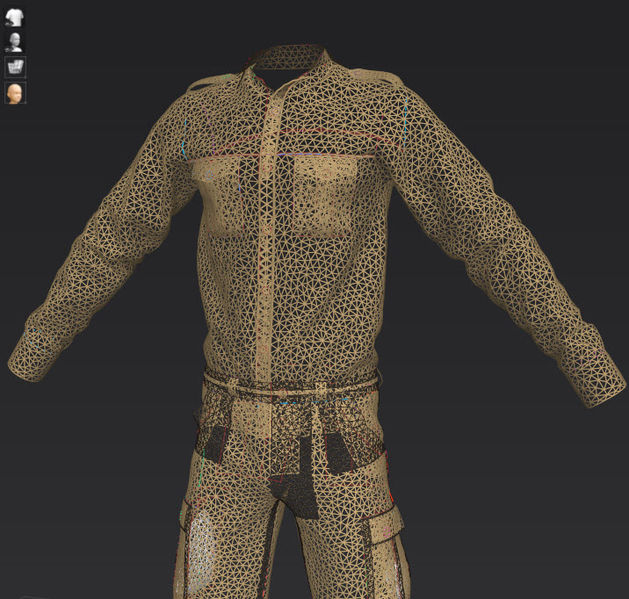

Увод
====

Рачунарска геометрија је грана рачунарства која служи као основа у разним областима софтверске 
индустрије, као што су израда тродимензионалних модела, визуелизација и анимација, дизајн и производња 
помоћу рачунара, рачунарске игре и друге. Примена рачунарске геометрије је огромна и зато је веома 
важно да алгоритми који се користе буду што квалитетнији у сваком смислу. Поменимо неке од најважнијих 
квалитета алгоритама.

- **Универзалност приступа:** За алгоритам је пожељно да има што мање специјалних случајева, јер је 
  за покривање сваког специјалног случаја потребан додатни кôд. То алгоритам чини тежим за писање и 
  одржавање (лакше се праве пропусти и грешке), а свакако и успорава рад алгоритма као целине. Да ли 
  ће нешто бити специјалан случај или не, зависи од приступа, тј. алгоритма. Пажљивим промишљањем може 
  да се постигне да оно што је у неком претходном алгоритму био специјалан случај, у новом не мора да 
  буде. Да избегнемо забуну, специфични улазни подаци (нпр. колинеарне тачке тамо где се очекују тачке 
  у општем положају) увек заслужују посебну пажњу, нарочито при тестирању. То, међутим, не значи да ти 
  специфични улазни подаци захтевају посебан третман и у самом алгоритму. Могуће је да и такви подаци 
  буду исправно обрађени општим приступом, ако је општи приступ смишљен тако да води рачуна и о њима.
  У том смислу, алгоритам је утолико бољи, уколико има мање специјалних случава које посебно обрађује 
  (идеално ниједан). 
  
- **Ефикасност:** Основни геометријски алгоритми се често користе као градивни блокови за решавање 
  већих проблема. При томе је чест случај да се основни алгоритам примењује огроман број пута при 
  решавању већег проблема, а да се од програма у којима се ти основни алгоритми користе очекује да раде 
  у реалном времену. На пример, када се користе сложени 3D модели који се израчунавају или ажурирају 
  у сваком фрејму анимације, алгоритам који израчунава видљивост или осветљеност сваког појединачног 
  троугла треба да буде екстремно ефикасан. Ефикасност алгоритма се у оваквим задацима, између осталог, 
  огледа у избегавању релативно спорих рачунских функција, као што су :math:`\sin x, \cos x, \sqrt x`, 
  па чак и дељења, као рачунски најспорије од 4 основне аритметичке операције. У идеалном случају, 
  алгоритми користе само сабирање и одузимање целих бројева уз мали број множења. Овај идеалан случај 
  је и постигнут у многим задацима за које испрва не бисмо очекивали да је то могуће. С овим је у вези 
  могућност коришћења реалних бројева у фиксном зарезу (уместо уобичајеног, покретног зареза), о чему 
  ће још бити речи.

    
    Сложени објекат моделиран помоћу великог броја троуглова
    
    CGElves, `CC BY-SA 4.0 <https://creativecommons.org/licenses/by-sa/4.0>`_, via Wikimedia Commons

- **Исправно третирање рачунских грешака:** Рачунар при чувању неких реалних бројева и при операцијама 
  над њима чини извесну малу грешку. Приликом непажљивог смишљања алгоритма, ово може да доведе до 
  погрешних закључака. Овај проблем је илустрован следећим примером:

.. activecode:: tacnost
    :passivecode: true
    :coach:
    :includesrc: _src/2_geometrijski/tacnost.cs

Програм исписује 

.. code::

    Nije jednako
    0.1 + 0.2 - 0.3 = 5.551115123125783E-17

Резултат има 16 нула иза децималне тачке, али је ипак позитиван, а не нула. Осим грешке због ограничене 
тачности при чувању реалних бројева, грешка може и да се акумулира током рачунања, па и о томе треба 
водити рачуна. Ево неких начина да се програм учини робуснијим када су у питању грешке настале због 
ограничене тачности представљања реалних бројева и рачунања са њима:
  
- Користе се цели бројеви уместо реалних кад год то поставка проблема допушта (јер они се памте потпуно тачно).
- Ослањамо се више на провере типа :math:`a < b` или :math:`a > b`, а избегавамо провере типа :math:`a == b`.
- Када је неопходна провера једнакости, уместо услова :math:`a == b`, користимо услов :math:`|a-b|< \varepsilon`, 
  за погодно одабрано :math:`\varepsilon`. Вредност :math:`\varepsilon` треба изабрати имајући на уму тачност 
  са којом рачунамо. На пример, ако знамо да су вредности :math:`a, b` дате са прве четири децимале, 
  а да се грешка заокруживања код типа ``double`` јавља на шеснаестој (или после више рачунских операција 
  можда на петнаестој) децимали, можемо да изаберемо нпр. :math:`\varepsilon = 10^{-6}`.

У лекцијама које следе, обрадићемо неколико основних геометријских проблема, које (као што је већ поменуто) 
можемо да посматрамо као примитиве, тј. градивне блокове од којих затим формирамо решења сложенијих проблема. 
Код већине задатака ћемо продискутовати предложена решења по квалитетима који су овде описани.
