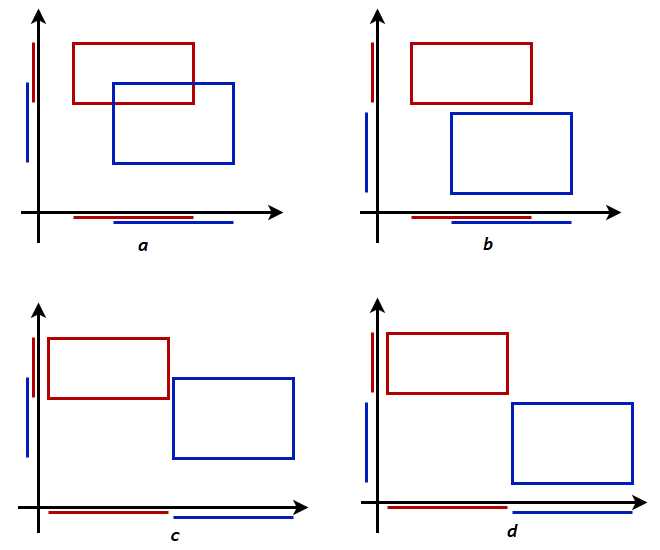
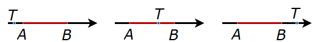

Поравнати правоугаоници и квадрови
==================================

Мотив
-----

У многим применама рачунарске геометрије потребно је да се брзо провери да ли два објекта имају 
заједничких тачака, тј. да ли се ти објекти секу. Значај овог проблема је јаснији ако имамо на уму 
да наши геометријски модели често представљају стварне објекте у простору који се крећу по неким 
правилима. Установљавањем да нема пресека, потврђујемо да стварни објекти током свог кретања не би 
утицали један на други и да би наставили да се крећу по истим правилима као и до тада. Постојање 
пресека би значило да је дошло до судара и да се надаље објекти крећу по измењеним правилима. Зато 
се овај проблем често и назива откривање судара, односно откривање колизије (енгл. *collision 
detection*). Када се узме типична величина разматраног простора и објеката које пратимо, до судара 
два конкретна, изабрана објекта долази веома ретко, па је најчешћи одговор не. Зато је корисно да се 
пронађе начин који са врло мало рачунања може у многим случајевима да препозна да нема пресека. У ту 
сврху, у тродимензионалној графици уз сваки објекат може да се памти и најмањи квадар који садржи тај 
објекат, а чије су ивице паралелне координатним осама (енгл. *axis-alligned bounding box*, скраћено: 
*AABB*). Приликом провере постојања пресека објеката, обично се прво израчуна да ли се секу одговарајући 
квадрови. Ово је често много брже него провера постојања пресека самих објеката, који могу да буду 
разних компликованих облика. Кад год су два објекта довољно удаљени један од другог, неће се сећи 
квадрови, а тиме ни објекти, па добијамо брз одговор да пресек не постоји. У преосталим, ређим 
случајевима, потребно је да се обаве и остале, захтевније провере. Када се посматра велики број провера 
пресецања, овим поступком се често уштеди дуже време (потребно за сложеније рачунање), а тек понекад 
се изгуби краће време (за проверу пресека квадрова), па се укупно време рачунања овим поступком значајно 
смањује. 
Поменути квадрови који садрже објекте могу да буду корисни и у другим сличним проблемима, као што је 
провера припадности тачке објекту, односно одређивање тачке продора праве кроз објекат, ако продор 
постоји. Да би се рачунање додатно смањило, може да се формира хијерархија ових квадрова, у којој 
сваки квадар следећег нивоа садржи више квадрова претходног нивоа. Тако, у случају да већи квадар не 
садржи тачку (или нема пресека са другим квадром), нема потребе да проверавамо појединачне квадрове 
који се налазе у овом већем, па тиме додатно штедимо време.

|

Потпуно иста идеја може да се искористи и у дводимензионалној графици, само се уместо квадрова користе 
правоугаоници, чије су странице паралелне координатним осама (који се на енглеском такође називају 
*axis-aligned bounding boxes*, скраћено: *AABB*). За овакве правоугаонике и раније описане квадрове нема 
опште познатог, распрострањеног домаћег термина, па ћемо их у даљем тексту називати једноставно **рамови** 
и **кутије**. 

|

.. comment

    bounding volume = гранични опсег 
    bounding box = гранични оквир?
    
    примене код одређивања видљивости

Због значаја рамова и кутија у применама, проћи ћемо кроз неколико једноставних, али у пракси важних 
поступака са њима.

Погледајмо различите положаје два рама. Видимо да се рамови секу само онда када се секу њихове пројекције 
на обе координатне осе.

    
    Међусобни положаји два рама и њихових пројекција на координатне осе.

Према томе, провера постојања пресека рамова се своди на проверу постојања пресека дужи на правој, што 
је једноставнији проблем. Можемо да кажемо да се овај дводимензиони проблем решава тако што два пута 
решимо одговарајући једнодимензиони проблем. При томе су једнодимензиони проблеми независни један од 
другог. 

Лако можемо да се уверимо да још неки проблеми са рамовима имају исту особину, тј. могу да се разложе 
на два једнодимензиона проблема. Такви су, на пример, провера да ли рам садржи дату тачку, растојање 
тачке од рама и растојање између два рама. Због тога ћемо прво да решимо одговарајуће проблеме са 
дужима и тачкама на правој.

Припадања, пресеци и растојања на правој
----------------------------------------

Тачке на правој имају само једну координату, па се свака тачка праве задаје једним реалним бројем. 
Пошто је дуж одређена двема крајњим тачкама, дуж на правој се задаје са два броја, од којих сваки 
представља координату једне од крајњих тачака. На пример, ако је координата тачке :math:`A` једнака 
3, а координата тачке :math:`B` једнака 5, дуж је у потпуности одређена координатама :math:`3` и 
:math:`5`. При томе, координате тачака које припадају дужи :math:`AB` се налазе у интервалу :math:`[3,5]`.

Услов да тачка припада дужи на правој
'''''''''''''''''''''''''''''''''''''

Нека је :math:`t` координата тачке :math:`T`, а :math:`t_0, t_1` координате крајева дужи 
:math:`AB`, где је :math:`t_0 < t_1`. Тачка :math:`T` је између тачака :math:`AB` ако и само ако 
је њена координата :math:`t` између координата крајева дужи :math:`AB`. Према томе, важи услов:

.. math::

    T \in AB \iff t_0 \leq t \leq t_1.

Растојање тачке од дужи на правој
'''''''''''''''''''''''''''''''''

Растојање тачке :math:`T` од дужи :math:`AB` дефинише се као растојање тачке :math:`T` од њој 
најближе тачке, која припада дужи :math:`AB`. 

    
    Различити међусобни положаји тачке и дужи на правој.
    
На слици су приказани различити међусобни положаји тачке и дужи на правој. У првом случају растојање 
је једнако дужини дужи :math:`TA`, у другом нули, а у трећем дужини дужи :math:`TB`. Користећи исте 
ознаке за координате као код услова припадности, имамо: 

.. math::

    d(T, AB) =
    \left\{
        \begin{array}{ll}
            t_0 - t  & \mbox{ако } t < t_0\\
            0 & \mbox{ако } t_0 \leq t \leq t_1\\
            t - t_1  & \mbox{ако } t > t_1\\
        \end{array}
    \right.

Да убудуће не бисмо посебно наводили дефиниције растојања између две дужи, два рама, две кутије и 
слично, даћемо овде општију дефиницију растојања између два затворена скупа тачака, која може да 
се примени у свим случајевима који су нам од значаја. За скуп тачака кажемо да је затворен ако 
садржи своју границу.

.. infonote::
            
    Растојање између два затворена скупа тачака :math:`S_1, S_2` се дефинише као минимум 
    растојања тачака :math:`P_1, P_2`, таквих да је :math:`P_1 \in S_1, P_2 \in S_2`.

Растојање између две дужи на правој
'''''''''''''''''''''''''''''''''''

Нека су на правој дате тачке :math:`M_0, M_1, N_0, N_1` и нека су њихове координате редом 
:math:`m_0, m_1, n_0, n_1` такве да је :math:`m_0 < m_1, n_0 < n_1`. Растојање између дужи 
:math:`M_0M_1` и :math:`N_0N_1` може да се израчуна разматрањем случајева:

.. math::

    d(M_0M_1, N_0N_1) =
    \left\{
        \begin{array}{ll}
            m_0 - n_1 & \mbox{ако } m_0 > n_1\\
            n_0 - m_1 & \mbox{ако } n_0 > m_1\\
            0 & \mbox{иначе }\\
        \end{array}
    \right.

Први случај је да је цела дуж :math:`M_0M_1` десно од дужи :math:`N_0N_1` (редослед координата 
је :math:`n_0 < n_1 < m_0 < m_1`), други случај је да је цела дуж :math:`M_0M_1` лево од дужи 
:math:`N_0N_1` (редослед координата је :math:`m_0 < m_1 < n_0 < n_1`), а трећи случај су сви 
остали редоследи координата, јер при сваком од њих постоји тачка која је заједничка двема 
дужима, па је растојање између дужи нула. 

Постојање пресека двеју дужи на правој
''''''''''''''''''''''''''''''''''''''

Из малопређашњег разматрања видимо да се дужи секу ако ниједна од њих није у целости лево (или 
десно) од друге. Ако користимо исте ознаке као при одређивању растојања између дужи, услов да  
се дужи секу је да не важи ниједна од неједнакости :math:`m_0 > n_1, n_0 > m_1`. Према томе:

.. math::

    M_0M_1 \cap N_0N_1 \neq \emptyset \iff m_0 \leq n_1 \land n_0 \leq m_1.

Другим речима: две дужи на правој се секу ако и само ако крећући се по правој, свака од њих почиње 
пре него што се друга заврши.

Формуле које смо до сада извели могу да се искористе за писање класе која представља дуж на правој. 
Део ``1D`` у називу ``Duz1D`` означава да се ради о једној димензији, тј. да свака тачка има само 
једну координату.

.. activecode:: klasa_duz
    :passivecode: true
    :coach:
    :includesrc: _src/2_geometrijski/klasa_duz.cs

Погледајмо сада како ову класу можемо да искористимо у решавању проблема у равни. 

Припадања, пресеци и растојања у равни
--------------------------------------

У претходном делу дошли смо до формула које представљају решења следећих проблема:

- Одредити услов да тачка припада дужи на правој;
- Израчунати растојање тачке од дужи на правој;
- Израчунати растојање између две дужи на правој;
- Утврдити да ли се две дужи на правој секу.

Сваки од ова четири проблема има и своју верзију у равни, која се добија када реч `дуж` заменимо речју 
`рам`, а реч `права` речју `раван`. Као што смо већ нагласили, сваки од ова четири проблема може да се 
разложи на два независна једнодимензиона проблема исте врсте. У тексту који следи под пројекцијама се 
подразумевају пројекције на координатне осе.

- Тачка у равни припада раму ако и само ако њене пројекције припадају пројекцијама рама.
- Нека су :math:`dx, dy` растојања пројекција тачке :math:`T` од пројекција рама :math:`R`.
  Тада је растојање тачке :math:`T` од рама :math:`R` једнако :math:`\sqrt{dx^2+dy^2}`.
- Нека су :math:`dx, dy` растојања пројекција рама :math:`R_1` од пројекција рама :math:`R_2`.
  Тада је растојање између рамова :math:`R_1` и :math:`R_2` једнако :math:`\sqrt{dx^2+dy^2}`.
- Два рама се секу ако и само ако се као дужи секу њихове пројекције на обе координатне осе.

Сва наведена тврђења могу да се докажу разматрањем случајева. При томе могу да буду од помоћи 
слике попут оне са почетка ове стране. Користећи ова тврђења и претходно написану класу ``Duz1D``, 
можемо да напишемо класу ``Ram`` са методима за решавање ових задатака. При томе користимо и 
једноставну класу ``Tacka2D``, која представља тачку у равни (``2D`` -- две димензије).

.. activecode:: klasa_ram
    :passivecode: true
    :coach:
    :includesrc: _src/2_geometrijski/klasa_ram.cs

Овако написано решење се лако преправља за решавање истих проблема у (тродимензионалном) простору.

Припадања, пресеци и растојања у простору
-----------------------------------------

Лако се уверавамо да у случају тродимензионалног простора важе суштински иста тврђења као и у равни. 
Измене у формулацији су минималне, а односе се само на број димензија.

- Тачка у равни припада раму ако и само ако њене пројекције припадају пројекцијама рама.
- Нека су :math:`dx, dy, dz` растојања од пројекција тачке :math:`T` од пројекција рама :math:`R`.
  Тада је растојање тачке :math:`T` од рама :math:`R` једнако :math:`\sqrt{dx^2+dy^2+dz^2}`.
- Нека су :math:`dx, dy, dz` растојања од пројекција рама :math:`R_1` од пројекција рама :math:`R_2`.
  Тада је растојање између рамова :math:`R_1` и :math:`R_2` једнако :math:`\sqrt{dx^2+dy^2+dz^2}`.
- Два рама се секу ако и само ако се као дужи секу њихове пројекције на све три координатне осе.

Као и у случају две димензије, сада имамо све што је потребно за писање класа ``Tacka3D`` и ``Kutija``. 

.. activecode:: klasa_kutija
    :passivecode: true
    :coach:
    :includesrc: _src/2_geometrijski/klasa_kutija.cs

Када видимо колико су имплементације класа ``Ram`` и ``Kutija`` сличне, долазимо до идеје да напишемо 
класу која може да послужи и за две и за три димензије. У тој имплементацији, тачку би требало задати 
низом координата од два или три елемента, па би и класа ``Tacka`` била дефинисана у складу са тиме.
Слично томе, уопштење рама и кутије би могло да се представи низом једнодимензионих дужи, који би такође 
имао два или три елемента. У таквој класи би за рачунање растојања и проверу припадности 
и пресека била потребна петља по координатама. Овде се таквим решењем нећемо бавити.

Задаци:
-------

- За две дате дужи проверити да ли нека од њих у потпуности садржи ону другу.
- За два дата рама проверити да ли неки од њих у потпуности садржи онај други.
- За дати низ рамова одредити најмањи рам који их све у целости садржи.
- Дате су две дужи на правој и њихове брзине (које могу да буду и негативне). Одредити временски 
  интервал током кога ће ове дужи имати пресек.
- Дата су два рама у равни и њихови вектори брзина (сваки вектор се задаје са два реална броја). Одредити 
  временски интервал током кога ће ови рамови имати пресек.
- Дата је тачка на правој и њена брзина. Одредити да ли ће та тачка упасти у дату дуж, и ако хоће -- колико 
  најмање времена је потребно за то.
- Дате су координате тачке у равни и њен вектор брзине. Одредити да ли ће та тачка упасти у дати рам, и 
  ако хоће -- колико најмање времена је потребно за то.

.. comment

    1. Припадност тачке раму и кутији
    '''''''''''''''''''''''''''''''''

    .. questionnote::

        | 1. Написати функцију која проверава да ли дата тачка припада датом раму.
        | 2. Написати функцију која проверава да ли дата тачка припада датој кутији.

    - могућност решавања по свакој димензији посебно: пројекције на осе, теорема

    .. activecode:: ramovi
        :passivecode: true
        :coach:
        :includesrc: _src/2_geometrijski/ramovi.cs

    .. activecode:: kutije
        :passivecode: true
        :coach:
        :includesrc: _src/2_geometrijski/kutije.cs

    .. activecode:: kutije_nd
        :passivecode: true
        :coach:
        :includesrc: _src/2_geometrijski/kutijeND.cs
       

    2. Пресек два рама, или две кутије
    ''''''''''''''''''''''''''''''''''

    .. questionnote::

        | 1. Написати функцију која проверава да ли се два дата рама секу.
        | 2. Написати функцију која проверава да ли се две дате кутије секу.

    3. Растојање два рама, или две кутије
    '''''''''''''''''''''''''''''''''''''

    .. questionnote::

        | 1. Написати функцију која одређује растојање између два дата рама у равни.
        | 2. Написати функцију која одређује растојање између две дате кутије у простору.
