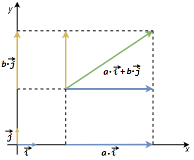
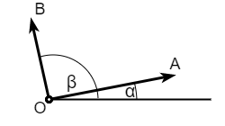
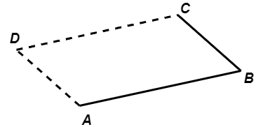
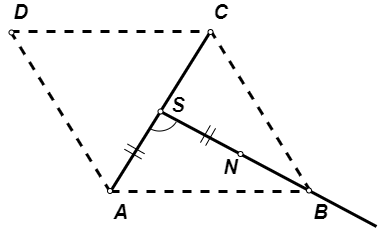

Тачке и вектори
===============

У геометријским проблемима вектори се често користе, јер нам позната терминологија и ознаке које иду 
уз њих помажу да лакше излажемо и размењујемо идеје, чак и да лакше размишљамо о проблему.

Овде се нећемо бавити увођењем вектора, већ полазимо од претпоставке да је појам вектора познат из 
математике и физике. Поменућемо укратко само неке особине вектора, које су нам овде значајне. 
Вектор је одређен својим правцем, смером и интензитетом. У неким применама је за вектор битна и 
такозвана нападна тачка, а такав вектор називамо везани вектор. Овде се таквим векторима нећемо 
бавити. Од интереса су нам само такозвани слободни вектори (прави вектори), који могу по вољи да се 
транслаторно померају. Слободни вектори се таквим померањем не мењају, јер задржавају свој правац, 
смер и интензитет. На даље реч вектор користимо у значењу "слободан вектор".

Јединични вектор :math:`x` осе означавамо са :math:`\overrightarrow{i}`, а јединични вектор :math:`y` 
осе са :math:`\overrightarrow{j}`. Сваки вектор у равни може да се разложи на две компоненте, од којих 
је једна паралелна :math:`x` оси а друга :math:`y` оси. Ове две компоненте могу редом да се изразе као 
:math:`a \cdot \overrightarrow{i}` и :math:`b \cdot \overrightarrow{j}`, где су :math:`a, b` неки реални 
бројеви. 

    
    Разлагање вектора на компоненте дуж оса.

Одавде следи важан закључак:

.. infonote::

    За сваки вектор :math:`\overrightarrow{V}` у равни постоји јединствен пар реалних бројева :math:`(a, b)`, 
    такав да је :math:`\overrightarrow{V} = a \cdot \overrightarrow{i} + b \cdot \overrightarrow{j}`. 
    Очигледно важи и обрнуто, тј. сваком пару бројева :math:`(a, b)` одговара тачно један вектор 
    :math:`\overrightarrow{V}`, такав да важи претходна једнакост (то је вектор 
    :math:`a \cdot \overrightarrow{i} + b \cdot \overrightarrow{j}`). 

    Према томе, **вектори у равни могу да се поистовете са паровима реалних бројева** :math:`(a, b)`. 
    Зато често уместо :math:`\overrightarrow{V} = a \cdot \overrightarrow{i} + b \cdot \overrightarrow{j}` 
    пишемо кратко :math:`\overrightarrow{V} = (a, b)`, а бројеве :math:`a, b` често називамо координатама 
    вектора.

Приметимо да од бројева :math:`a, b` један или оба могу да буду једнаки нули. Ако је само :math:`a` једнак 
нули, добијамо вектор паралелан оси :math:`y`; ако је само :math:`b` једнак нули, добијамо вектор паралелан 
оси :math:`x`; а ако су оба једнака нули, добијамо нула-вектор.

Операције над векторима и тачкама
---------------------------------

**Множење вектора реалним бројем (скаларом)** 

Нека је вектор 
:math:`\overrightarrow{V} = a \cdot \overrightarrow{i} + b \cdot \overrightarrow{j} = (a, b)` 
и :math:`\alpha` реалан број. Тада важи:

.. math::

    \alpha \cdot \overrightarrow{V} = 
    \alpha \cdot (a \cdot \overrightarrow{i} + b \cdot \overrightarrow{j}) = 
    (\alpha \cdot a \cdot \overrightarrow{i} + \alpha \cdot b \cdot \overrightarrow{j}) = 
    (\alpha \cdot a, \alpha \cdot b).

**Сабирање и одузимање вектора**

Нека је :math:`\overrightarrow{V_1} = (a_1, b_1), \overrightarrow{V_2} = (a_2, b_2)`.
Тада важи: 

.. math::

    \begin{aligned}
    \overrightarrow{V_1} + \overrightarrow{V_2} = (a_1 + a_2, b_1 + b_2),\\
    \overrightarrow{V_1} - \overrightarrow{V_2} = (a_1 - a_2, b_1 - b_2).\\
    \end{aligned}

**Транслација тачке за дати вектор**

Нека се транслацијом тачке :math:`A(a_x, a_y)` за вектор 
:math:`\overrightarrow{V} = (v_x, v_y)` добија тачка :math:`B(b_x, b_y)`. Тада важи:

.. math::

    \begin{aligned}
    b_x = a_x + v_x,\\
    b_y = a_y + v_y.\\
    \end{aligned}

Због облика ових једнакости, уместо да кажемо: *транслација тачке* :math:`A` *за вектор* 
:math:`\overrightarrow{V}`, често кажемо: *збир тачке* :math:`A` *и вектора* 
:math:`\overrightarrow{V}` и пишемо :math:`B = A + \overrightarrow{V}`.

Провера ортогоналности вектора
------------------------------

Нека су дати вектори :math:`\overrightarrow{\rm OA}` и :math:`\overrightarrow{\rm OB}`. 
Наш задатак је да, помоћу координата ових вектора, изразимо услов да су вектори међусобно 
ортогонални (нормални један на другом). Означимо најпре са :math:`\alpha, \beta` углове 
које ови вектори редом заклапају са позитивним смером :math:`x` осе. Тада је угао између 
ова два вектора једнак :math:`\beta - \alpha`. 

    
    Налажење услова нормалности вектора

Угао :math:`\angle AOB = \beta - \alpha` је прав ако и само ако је косинус тог угла једнак нули. 
Нека су познате координате тачака :math:`A, B, O`, тј. нека је 
:math:`A(x_a, y_a), B(x_b, y_b), O(x_o, y_o)`. Даље, користећи адициону формулу за косинус разлике 
углова, имамо:

.. math::

    \begin{aligned}
    \overrightarrow{\rm OA} \perp \overrightarrow{\rm OB} &\iff \cos \angle AOB = 0 \\
    &\iff \cos (\beta - \alpha) = 0\\
    &\iff \cos \beta \cdot \cos \alpha + \sin \beta \cdot \sin \alpha = 0\\
    &\iff \frac{x_a-x_o}{|OA|} \frac{x_b-x_o}{|OB|} + \frac{y_a-y_o}{|OA|} \frac{y_b-y_o}{|OB|} = 0\\
    &\iff (x_a-x_o)(x_b-x_o) + (y_a-y_o)(y_b-y_o) = 0.\\
    \end{aligned}

Одавде следи закључак:

.. infonote::

    Вектори :math:`\overrightarrow{\rm OA}` и :math:`\overrightarrow{\rm OB}` су међусобно ортогонални 
    ако и само ако важи: 
    
    .. math::
    
        (x_a-x_o)(x_b-x_o) + (y_a-y_o)(y_b-y_o) = 0.

Из услова ортогоналности вектора једноставно се добија и услов ортогоналности правих. Наиме, праве 
:math:`AB` и :math:`CD` су међусобно ортогоналне ако и само ако су ортогонални вектори 
:math:`\overrightarrow{\rm AB}` и :math:`\overrightarrow{\rm CD}`. Угао између вектора се не мења 
њиховим паралелним померањем, па зато важи и ово тврђење:

.. infonote::
    
    Праве :math:`AB` и :math:`CD` су међусобно ортогоналне ако и само ако важи 
    
    .. math::
    
        (x_b-x_a)(x_d-x_c) + (y_b-y_a)(y_d-y_c) = 0.

У случају да је тачка :math:`O` координатни почетак, имамо :math:`x_o = y_o = 0`, што нам даје 
једноставнији услов нормалности вектора :math:`\overrightarrow{\rm OA}` и :math:`\overrightarrow{\rm OB}`:

.. math::
    
    x_a x_b + y_a y_b = 0.

Ова једнакост може да нам послужи да за дату тачку :math:`A` одредимо једну могућу тачку :math:`B`, такву 
да је :math:`OA \perp OB`. На пример, ако изаберемо :math:`x_b = y_a, y_b = -x_a`, добијамо:

.. math::
    
    x_a x_b + y_a y_b = x_a y_a - y_a x_a = 0.

Дакле, ако је дато :math:`A(x_a, y_a)`, да бисмо формирали прав угао :math:`\angle AOB` можемо да 
изаберемо тачку :math:`B` као :math:`B(y_a, -x_a)`. 

Ако тачка :math:`O` није координатни почетак, услов нормалности вектора :math:`\overrightarrow{\rm OA}` 
и :math:`\overrightarrow{\rm OB}` гласи:

.. math::

    (x_a-x_o)(x_b-x_o) + (y_a-y_o)(y_b-y_o) = 0.

У том случају можемо да изаберемо :math:`x_b = x_o + (y_a - y_o), y_b = y_o - (x_a - x_o)`. Увршавањем 
ових :math:`x_b, y_b` у претходни услов уверавамо се да је он испуњен.

Примене вектора у задацима са троугловима и четвороугловима
-----------------------------------------------------------

.. questionnote::

    **Пример 1**:
    
    Дате су редом координате темена :math:`A, B, C` паралелограма :math:`ABCD`. Одредити координате 
    темена :math:`D`.

Решење: У паралелограму :math:`ABCD` су странице :math:`AD` и :math:`BC` паралелне и једнаке, 
па важи :math:`\overrightarrow{\rm AD} = \overrightarrow{\rm BC}`. Означимо са :math:`O` координатни 
почетак. Циљ нам је да изразимо :math:`\overrightarrow{\rm OD}` помоћу :math:`\overrightarrow{\rm OA}`, 
:math:`\overrightarrow{\rm OB}` и :math:`\overrightarrow{\rm OC}`. Сабирањем и одузимањем вектора 
добијамо:

.. math::

    \begin{aligned}
    \overrightarrow{\rm OD} &= \overrightarrow{\rm OA} + \overrightarrow{\rm AD}\\
    &= \overrightarrow{\rm OA} + \overrightarrow{\rm BC}\\
    &= \overrightarrow{\rm OA} + (\overrightarrow{\rm OC} - \overrightarrow{\rm OB}),\\
    \end{aligned}

одакле непосредно следе једнакости по координатама:

.. math::

    \begin{aligned}
    x_d = x_a + x_c - x_b,\\
    y_d = y_a + y_c - y_b.\\
    \end{aligned}

.. questionnote::

    **Пример 2**:
    
    Дате су редом координате темена :math:`A, C` краће дијагонале ромба :math:`ABCD`, чији је оштар угао 
    :math:`60^{\circ}`. Одредити координате темена :math:`B, D`.

Решење: Означимо са :math:`S` центар симетрије ромба :math:`ABCD`. Тачка :math:`S` полови обе дијагонале, 
па можемо да је израчунамо као средиште дужи :math:`AC`, тј. 

.. math::

    \begin{aligned}
    x_s = \frac{x_a + x_c}{2},\\
    y_s = \frac{y_a + y_c}{2}.\\
    \end{aligned}

    
    Одређивање темена `B` и `D` ромба `ABCD`.

Одредимо сада једну тачку :math:`N`, такву да је :math:`SA \perp SN`. Раније смо видели да као тачку 
:math:`N` можемо да изаберемо :math:`N(x_s + y_a - y_s, y_s - x_a + x_s)`. За овако изабрану тачку 
:math:`N`, поред :math:`SA \perp SN` важи још и :math:`SA = SN`.

Из услова задатка закључујемо да је троугао :math:`ABC` једнакостраничан, па за његову висину :math:`SB` 
важи :math:`SB = \frac{\sqrt{3}}{2} \cdot AC = \sqrt{3} \cdot SA = \sqrt{3} \cdot SN`. Одавде, због 
паралелности вектора :math:`\overrightarrow{\rm SB}` и :math:`\overrightarrow{\rm SN}` важи 
:math:`B = S + \sqrt{3} \cdot \overrightarrow{\rm SN}`, или по координатама:

.. math::

    \begin{aligned}
    x_b = x_s + \sqrt{3} (x_n - x_s),\\
    y_b = y_s + \sqrt{3} (y_n - y_s).\\
    \end{aligned}

На крају, тачку :math:`D` можемо да израчунамо знајући да је тачка :math:`S` средиште дужи :math:`BD`. 
Из услова :math:`\overrightarrow{\rm BS} = \overrightarrow{\rm SD}` следи 
:math:`D = S + \overrightarrow{\rm BS}`, или по координатама:

.. math::

    \begin{aligned}
    x_d = x_s + (x_s - x_b),\\
    y_d = y_s + (y_s - y_b).\\
    \end{aligned}

Задаци за вежбу:
''''''''''''''''

- Дате су редом координате темена :math:`A, C` квадрата :math:`ABCD`. Одредити координате темена 
  :math:`B, D`.

- Нека су :math:`C_1, A_1, B_1` редом средишта страница :math:`AB, BC, CA` троугла :math:`ABC`.
  Ако су дате координате тачака :math:`C_1, A_1, B_1`, одредити координате темена троугла :math:`ABC`.

- Дате су редом координате темена :math:`A, B` квадрата :math:`ABCD`. Одредити координате темена 
  :math:`C, D`.

- Нека су :math:`M, N, P` редом средишта страница :math:`AB, BC, CD` паралелограма :math:`ABCD`.
  Ако су дате координате тачака :math:`M, N, P`, одредити координате темена паралелограма :math:`ABCD`.
