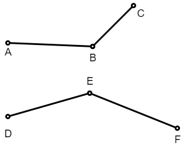
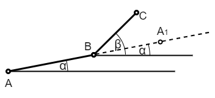

Колинеарност и оријентација тројке тачака
=========================================

Колинеарност
------------

Један од основних задатака у рачунарској геометрији је провера да ли три дате тачке припадају истој 
правој, тј. да ли су три дате тачке колинеарне. Поставимо задатак формално.

.. questionnote::

    Дате су целобројне координате тачака :math:`A, B, C` (по апсолутној вредности мање или једнаке 
    милион). Написати функцију којом се проверава да ли су тачке :math:`A, B, C` колинеарне.

Претпоставимо да тачке :math:`A, B` одређују праву :math:`b`, а да тачке :math:`A, C` одређују праву 
:math:`c`. Тада се задатак своди на питање да ли су :math:`b` и :math:`c` иста права. Пошто праве 
:math:`b` и :math:`c` обе садрже тачку :math:`A`, да би то биле исте праве довољно је да имају исти 
коефицијент правца, тј. да је :math:`\frac{y_b - y_a}{x_b - x_a} = \frac{y_c -y_a}{x_c - x_a}`.

Пошто се у задатку каже да су дате координате целобројне, можемо да користимо целобројне променљиве 
и тиме избегнемо проблем тачности реалних бројева у рачунару. Међутим, у том случају треба избећи и 
дељење, јер нам целобројно дељење није од користи, а употребом реалног дељења враћамо и проблем 
тачности реалних бројева. 

Дељење можемо да избегнемо тако што помножимо обе стране једнакости са оба имениоца. Тако добијамо 
нови услов: 

.. math::

    (y_b - y_a) \cdot (x_c - x_a) = (y_c - y_a)(x_b - x_a).

Овим не само да смо избегли реално дељење и проблеме повезане са тиме, већ смо избегли и неке 
специјалне случајеве:

- Претпоставком да тачке :math:`A, B` одређују праву :math:`b`, а тачке :math:`A, C` праву :math:`c`, 
  занемарили смо могућност да се тачка :math:`A` подудара са неком од тачака :math:`B, C` или чак са 
  обе. Преласком на множење уместо дељења обухваћени су и ови случајеви и не морају да се посебно 
  обрађују као специјални. Конкретније, ако је тачка :math:`A` подударна некој од тачака :math:`B, C`, 
  обе стране једнакости су једнаке нули и једнакост је тачна. Такав резултат и треба да добијемо јер 
  ако дате три тачке нису све међусобно различите, онда су сигурно колинеарне, тј. постоји права која 
  их све садржи. Узгред, случај када су тачке :math:`B` и :math:`C` подударне је и раније био, а и 
  после преласка на производ је остао обухваћен општим случајем, тј. главним током решавања задатка.
- Случај када је нека од разлика :math:`x_b - x_a, x_c - x_a` једнака нули, тј. када је нека од правих 
  :math:`b, c` вертикална, овим такође престаје да буде специјалан и ни о њему не морамо посебно да 
  водимо рачуна.

Као што видимо, ова мала промена у једначини коју користимо за проверу колинеарности је на неколико 
начина поправила квалитет решења: по брзини (множење се извршава брже од дељења), елиминисањем 
специјалних случајева и избегавањем проблема тачности записа реалних бројева. 

Када су координате целобројне и нема опасности од прекорачења, метод за проверу колинеарности и 
програм за тестирање можемо да напишемо овако:

.. activecode:: kolinearnost2
    :passivecode: true
    :coach:
    :includesrc: _src/2_geometrijski/kolinearnost2.cs
    
У случају реалних координата количнике и даље треба избегавати, али сада уместо: 

.. math::

    (y_b - y_a) \cdot (x_c - x_a) = (y_c - y_a)(x_b - x_a)

треба писати: 

.. math::

    |(y_b - y_a) \cdot (x_c - x_a) - (y_c - y_a)(x_b - x_a)| < \varepsilon
    
за погодно одабрано :math:`\varepsilon` (подсетите се кратке дискусије о томе у `уводу <01_geom_uvod.html>`_ 
у ово поглавље).

Заокрет налево и надесно
------------------------

Концепт заокрета је изузетно значајан и користи се у многим стандардним проблемима рачунарске 
геометрије. Неке од једноставнијих примена можете да нађете у задацима на дну ове стране. 
Треба имати на уму да се заокрет користи и у тежим задацима, као што је одређивање конвексног омотача
датог многоугла, о чему ће бити речи у последњем поглављу `Одабрани алгоритми и структуре података <https://petlja.org/kurs/7831/5/5366>`_. 

|

**Појам заокрета**

Када три различите дате тачке не чине колинеарну тројку, кретањем од прве преко друге ка трећој 
чинимо заокрет на леву или десну страну. На пример, на следећој слици тројка :math:`ABC` чини 
заокрет налево, а тројка :math:`DEF` заокрет надесно. 

Појам заокрета може да се и прецизно математички дефинише, а овде дајемо један од могућих начина.

Нека је :math:`ABC` неколинеарна тројка тачака и нека тачка :math:`A_1` припада продужетку праве 
:math:`AB`, тако да је тачка :math:`B` између тачака :math:`A` и :math:`A_1`.

Посматрајмо угао :math:`\angle A_1BC` као оријентисан. То значи да се при проласку тог угла од 
крака :math:`BA_1` ка краку :math:`BC` крећемо у смеру супротном од смера казаљке на сату. За 
тако дефинисан оријентисани угао важи :math:`0 \leq \angle A_1BC < 360^{\circ}`.

.. infonote::

    **Дефиниција**: Неколинеарна тројка тачака :math:`ABC` чини **заокрет налево** ако и само 
    ако je оријентисани угао :math:`\angle A_1BC` конвексан (тј. 
    :math:`0 < \angle A_1BC < 180^{\circ}`).
    
    Неколинеарна тројка тачака :math:`ABC` чини **заокрет надесно** ако и само ако не чини 
    заокрет налево.

**Одређивање заокрета**

Ако са :math:`\alpha, \beta` означимо оријентисане углове које вектори 
:math:`\overrightarrow{\rm BA_1}, \overrightarrow{\rm BC}` редом заклапају са позитивним смером 
:math:`x` осе, тада је оријентисани угао :math:`\angle A_1BC` једнак 
:math:`\beta - \alpha`. Овде подразумевамо да је и разлика :math:`\beta - \alpha` сведена на интервал 
:math:`[0, 360^{\circ})`, што можемо да учинимо додавањем по потреби :math:`\pm 360^{\circ}`.

Даље имамо:

.. math::

    \begin{aligned}
    0 < \angle A_1BC < 180^{\circ} &\iff \sin(\angle A_1BC) > 0\\
    & \iff \sin(\beta - \alpha) > 0\\
    & \iff \sin \beta \cos \alpha - \sin \alpha \cos \beta > 0\\
    & \iff \frac{y_c - y_b}{|BC|}\frac{x_b - x_a}{|AB|} - \frac{y_b - y_a}{|AB|}\frac{x_c - x_b}{|BC|} > 0\\
    & \iff (y_c - y_b)(x_b - x_a) - (y_b - y_a)(x_c - x_b) > 0\\
    \end{aligned}

Из овог извођења можемо да закључимо:

.. infonote::

    Неколинеарна тројка тачака :math:`ABC` чини **заокрет налево** ако и само ако је: 
    
    .. math::
    
        (y_c - y_b)(x_b - x_a) - (y_b - y_a)(x_c - x_b) > 0.

    Неколинеарна тројка тачака :math:`ABC` чини **заокрет надесно** ако и само ако је: 
    
    .. math::
    
        (y_c - y_b)(x_b - x_a) - (y_b - y_a)(x_c - x_b) < 0.
    
Следећи програм илуструје како за дате три тачке можемо да израчунамо да ли оне чине заокрет 
налево, заокрет надесно, или су колинеарне.

.. activecode:: zaokret
    :passivecode: true
    :coach:
    :includesrc: _src/2_geometrijski/zaokret.cs

Примене заокрета - задаци за вежбу
----------------------------------

Покушајте да решите следеће задатке применом заокрета. Пре него што се упустите у решавање, скрећемо 
вам пажњу на то да ови задаци могу да се реше и без употребе заокрета, али су таква решења по правилу 
лошија из више разлога. На пример, припадност тачке :math:`M` троуглу :math:`ABC` може да се утврди 
и рачунањем површина троуглова :math:`P_{ABC}, P_{ABM}, P_{BCM}, P_{CAM}` и провером да ли је 
:math:`P_{ABC} = P_{ABM} + P_{BCM} + P_{CAM}`. Једна мана приступа са упоређивањем површина је тачност. 
Поменули смо више пута до сада да провера да ли су два реална броја једнака није поуздана и треба је 
избегавати када је могуће. При употреби заокрета управо избегавамо проверу једнакости реалних бројева, 
јер се на тај начин проверава само да ли је један реалан број мањи од другог. Ова провера није толико 
проблематична и теже може да доведе до погрешног закључка. Друга мана рачунања површина може да буде 
ефикасност, а у зависности од начина рачунања ова мана може да буде мање или више изражена. Неке 
ефикасне начине рачунања површине било каквог многоугла (па и троугла) можете да видите на следећој 
страници овог курса.
Пошто је у многим програмима типична ситуација да се користи велики број троуглова за моделирање 
објеката, пожељно је да алгоритам утврђивања припадности тачке троуглу буде прецизан, ефикасан и 
без специјалних случајева. 

**Задаци:**

- Дате су тачке :math:`A, B, M, N`, од којих никоје три нису колинеарне. Утврдити да ли су тачке 
  :math:`M, N` са исте стране праве :math:`AB`.
- Дате су тачке :math:`A, B, C, D`, од којих никоје три нису колинеарне. Утврдити да ли дужи 
  :math:`AB` и :math:`CD` имају заједничких тачака. Напомињемо да задатак може да се реши и без 
  претпоставке о неколинеарности, али та варијанта задатка захтева знатно више пажње.
- Утврдити да ли дата тачка :math:`P` припада унутрашњости датог троугла :math:`ABC`.
- Дата су редом темена многоугла, при чему никоја три узастопна нису колинеарна. Утврдити да ли 
  је тај многоугао конвексан.
- Дата су редом темена конвексног многоугла, при чему никоја три узастопна нису колинеарна. 
  Утврдити да ли дата тачка припада том многоуглу.
