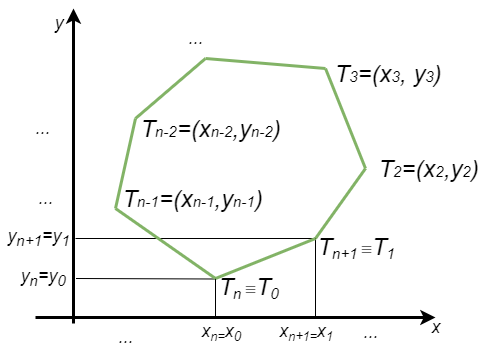
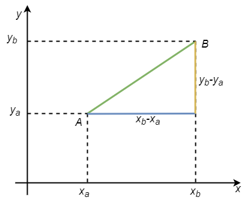
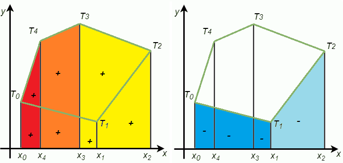
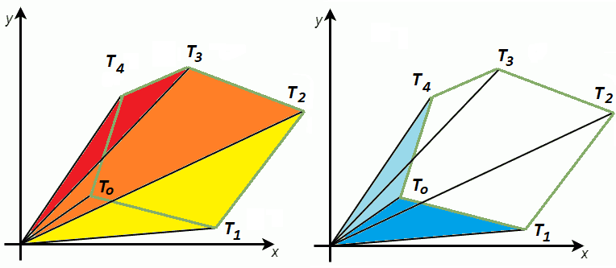
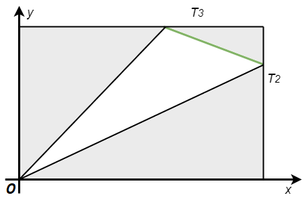
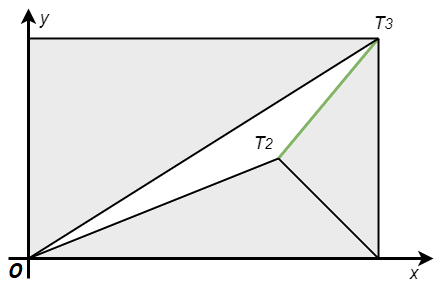
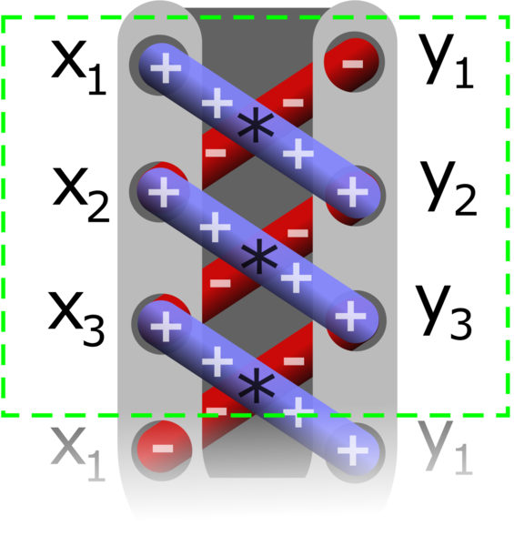

Обими и површине многоуглова
============================

**Ознаке:** Да не бисмо у сваком задатку са многоугловима изнова уводили исте ознаке, увешћемо их 
овде, подразумевајући да важе за дати многоугао у сваком од проблема који следе.
Број темена многоугла означавамо са :math:`n`, а координате темена :math:`T_i` са :math:`x_i, y_i`.
Током анализе ћемо ради једноставнијег записа формула подразумевати да се индекси узимају по модулу 
:math:`n`. Тако нпр. важи :math:`T_0 \equiv T_n, T_1 \equiv T_{n+1}`, односно општије 
:math:`T_к \equiv T_{k \bmod n}`.

Многоугао ће у програмима бити представљен низом од :math:`n` тачака, чији су индекси :math:`0, 1, .. n-1`.
Програми су по правилу написани тако да није потребно да се стварно рачуна остатак индекса при дељењу 
са :math:`n`.

    
    Ознаке темена многоугла (по модулу `n`).

Обим многоугла
--------------

Рачунање обима многоугла је једноставан задатак, који се своди на поновљено рачунање дужине дужи. 
Дужину дужи у општем положају у равни можемо да израчунамо помоћу Питагорине теореме. Нека су 
:math:`A(x_a, y_a), B(x_b, y_b)` дате тачке у равни. 

    
    Израчунавање дужине дужи помоћу Питагорине теореме.

Када је :math:`AB` коса дуж, она је хипотенуза правоуглог троугла чије су катете 
:math:`(x_b - x_a), (y_b - y_a)`. Користећи Питагорину теорему, одавде добијамо формулу за дужину 
дужи:

.. math::

    |AB| = \sqrt{(x_b - x_a)^2 + (y_b - y_a)^2}.

Лако се уверавамо да иста формула важи и када је дуж :math:`AB` водоравна или усправна, односно да 
формула важи за било које две тачке :math:`A, B`.

|

Користећи горе уведене ознаке координата темена и конвенцију о њиховим индексима, формула за обим 
многоугла је:

.. math::

    O = \sum_{i=1}^{n} \sqrt{(x_{i}-x_{i-1})^2 + (y_i-y_{i-1})^2}.

Ова формула важи за било какав многоугао, чак и онај који има самопресека (тзв. сложени многоугао). 
Следећи пример показује како може да се напише и користи функција за израчунавање обима.

.. activecode:: obim_mnogougla
    :passivecode: true
    :coach:
    :includesrc: _src/2_geometrijski/obim_mnogougla.cs

Наравно, када је потребно да израчунамо обим нпр. троугла или четвороугла, не морамо да користимо 
низ и петљу, већ је довољно да само саберемо дужине три или четири странице. Ови случајеви су још 
једноставнији и њима се нећемо посебно бавити.

Површине многоуглова
--------------------

Површину многоугла можемо да израчунамо користећи разложиву и допунску једнакост ликова. Конкретније, 
многоугао можемо да представимо као збир и разлику неколико једноставнијих фигура (ликова). У наставку 
ћемо да покажемо два таква начина разлагања многоугла и да изведемо одговарајуће формуле за површину.

Разлагање помоћу трапеза
''''''''''''''''''''''''

Означимо са  :math:`T'_{i}` пројекцију темена :math:`T_{i}` на :math:`x` осу, :math:`0 \leq i < n`.
Претпоставимо за сада да се сва темена многоугла налазе у првом квадранту. Уочимо правоугле трапезе 
којима је коси крак једна страница многоугла, други крак је пројекција те странице на :math:`x` осу, 
а основице су паралелне са :math:`y` осом. Таквих трапеза има онолико, колико и страница многоугла, 
тј :math:`n`. 

    
    Разлагање многоугла на збир (лево) и разлику (десно) трапеза

На слици је пример таквог разлагања за један петоугао. Површину многоугла можемо да добијемо када 
саберемо површине црвеног, наранџастог и жутог трапеза, а затим од тог збира одузмемо површине два 
плава трапеза. Трапезе чије површине додајемо, зваћемо потребним, а оне чије површине одузимамо 
зваћемо сувишним.

Погледајмо прво како да израчунамо површину једног од ових трапеза, нпр. :math:`T_4T_3T'_3T'_4` 
(наранџасти трапез). Као што знамо, површина било ког трапеза је једнака производу средње линије и 
висине. Средња линија овог трапеза је :math:`\frac{1}{2}(y_3+y_4)`, а висина је :math:`x_3-x_4`.

У општем случају, тј. за трапез :math:`T_{i}T_{i-1}T'_{i-1}T'_{i}`, његова површина је 
:math:`P_{i, i-1} = \frac{1}{2}(y_i + y_{i-1})|x_i - x_{i-1}|` (индекси се узимају по модулу :math:`n`). 

Остаје још да установимо како да из програма одредимо које трапезе треба додати, а које одузети. Овде 
треба приметити да је код потребних трапеза (оних које додајемо) :math:`x_i < x_{i-1}`, а код сувишних је 
:math:`x_i > x_{i-1}`. То значи да за сваки трапез можемо да користимо формулу:

.. math::

    P_i = \frac{1}{2} (x_{i-1} - x_{i}) \cdot (y_i + y_{i-1}),

а вредности :math:`P_i` ће, саме по себи, код потребних трапеза бити позитивне, а код сувишних негативне. 
Према томе, површину многоугла добијамо као алгебарски збир вредности :math:`P_i` са све :math:`i`. 

Уочимо још да би при нумерацији темена у обрнутом смеру важиле обрнуте неједнакости између :math:`x_i` 
и :math:`x_{i-1}`. У том случају би се претходним рачунањем добила негативна површина многоугла. Због 
тога ћемо у коначној формули за површину многоугла од добијеног збира да узмемо апсолутну вредност:

.. math::

    P = \frac{1}{2} \left|\sum_{i=1}^{n} {(x_{i} - x_{i-1}) \cdot (y_i + y_{i-1})}\right|.

Поједине сабирке у овом збиру можемо да схватимо као оријентисане површине, тј. површине које могу 
да буду и негативне. Ова корисна апстракција нам је омогућила да, уместо да сабирамо и одузимамо 
уобичајене позитивне површине, само израчунамо алгебарски збир оријентисаних површина. Тиме смо дошли 
до једноставнијег алгоритма, који не мора да води рачуна о томе који трапези су потребни а који сувишни, 
јер је та информација садржана у предзнаку сваке оријентисане површине. 

Размислимо сада шта би се променило када бисмо цео многоугао померили улево, тако да сече :math:`y` осу, 
или се нађе у другом квадранту. Пошто све разлике :math:`x_{i} - x_{i-1}` остају исте, јасно је да ово 
померање не утиче на формулу. Исто важи и за померање наниже, мада је то нешто теже доказати. Такође, 
формула се неће променити ни у случају да многоугао није конвексан. Остављамо читаоцу да размисли како 
би доказао да формула важи и када многоугао има једну или више усправних страница.

Анализом различитих случајева можемо да се уверимо да формула важи за сваки прост многоугао (многоугао 
без самопресека, било да је конвексан или конкаван).

Разлагање помоћу троуглова
''''''''''''''''''''''''''

Многоугао можемо да разложимо и на збир и разлику троуглова, као на следећој слици:

    
    Разлагање многоугла на збир (лево) и разлику (десно) троуглова

Троуглове смо изабрали тако да им је по једно теме у координатном почетку, јер на тај начин добијамо 
једноставнију формулу за површину троугла. Посматрајмо један од ових троуглова, нпр. :math:`OT_2T_3`. 

    
    Израчунавање површине троугла чије је једно теме у координатном почетку

Површину троугла :math:`OT_2T_3` можемо да добијемо када од површине правоугаоника :math:`x_2y_3` 
одузмемо површине три правоугла троугла око полазног троугла (на слици изнад, та три троугла су сива):

.. math::

    \begin{aligned}
    P_i &= x_2y_3 - \frac{1}{2} x_3y_3 - \frac{1}{2} x_2y_2 - \frac{1}{2} (x_2 - x_3)(y_3 - y_2)\\
    &= \frac{1}{2} \left(2x_2y_3 - x_3y_3 - x_2y_2 - (x_2 - x_3)(y_3 - y_2)\right)\\
    &= \frac{1}{2} \left(2x_2y_3 - x_3y_3 - x_2y_2 - x_2y_3 - x_3y_2 + x_2y_2 + x_3y_3\right)\\
    &= \frac{1}{2} (x_2y_3 - x_3y_2).\\
    \end{aligned}

Размотримо каква се формула добија при неком другачијем положају темена, на пример, оваквом: 

    
    Израчунавање површине троугла - другачији положај темена

Површину троугла :math:`OT_2T_3` поново рачунамо одузимањем површина три сива троугла од површине правоугаоника 
:math:`x_3y_3`:

.. math::

    \begin{aligned}
    P_i &= x_3y_3 - \frac{1}{2} x_3y_3 - \frac{1}{2} x_3y_2 - \frac{1}{2} (x_3 - x_2)y_3\\
    &= \frac{1}{2} (x_3y_3 - x_3y_2 - (x_3 - x_2)y_3)\\
    &= \frac{1}{2} (x_2y_3 - x_3y_2).\\
    \end{aligned}

У овом случају се добија иста формула. Даљом анализом случајева можемо да приметимо да се овом формулом 
увек добија оријентисана површина, при чему је површина позитивна када тројка тачака :math:`OT_2T_3` чини 
заокрет налево, а негативна када је заокрет надесно. Веома слично као и при разлагању на трапезе, долазимо 
до закључка да је површина многоугла једнака апсолутној вредности алгебарског збира оријентисаних површина 
троуглова:

.. math::

    \begin{aligned}
    P &= \frac{1}{2} \left|\sum_{i=1}^{n} {(x_{i-1} \cdot y_{i}) - (x_i \cdot y_{i-1})}\right|\\
    &= \frac{1}{2} \left|\sum_{i=1}^{n} {(x_{i} \cdot y_{i-1}) - (x_{i-1} \cdot y_i)}\right|.\\
    \end{aligned}

Две дате формуле могу равноправно да се користе, јер се од целог збира на крају рачуна апсолутна вредност.
У развијеном облику формула гласи:

.. math::

    \begin{aligned}
    P = \frac{1}{2} |&(x_0 \cdot y_1) - (x_1 \cdot y_0)\\
    + &(x_1 \cdot y_2) - (x_2 \cdot y_1)\\
    + &(x_2 \cdot y_3) - (x_3 \cdot y_2)\\
    + &(x_3 \cdot y_4) - (x_4 \cdot y_3)\\
    + &...\\
    + &(x_{n-1} \cdot y_0) - (x_0 \cdot y_{n-1})|.\\
    \end{aligned}

Многи ову формулу памте помоћу следеће шеме, због које је формула позната као **формула пертлања** 
(енгл. `shoelace formula <https://en.wikipedia.org/wiki/Shoelace_formula>`_):

    
    Шема формуле пертлања (на слици су индекси темена од 1)
    
    Job Bouwman, `CC BY-SA 4.0 <https://creativecommons.org/licenses/by-sa/4.0>`_, via Wikimedia Commons

**Оптимизована формула пертлања**

Полазећи од формуле пертлања, помоћу неколико трансформација можемо да добијемо еквивалентну формулу, 
која захтева мање рачунских операција. 

.. math::

    \begin{aligned}
    \pm 2P &= \sum_{i=1}^{n} {(x_{i} \cdot y_{i-1} - y_i \cdot x_{i-1})}\\
    &= \sum_{i=1}^{n} {x_{i} \cdot y_{i-1}} - \sum_{i=1}^{n}{y_i \cdot x_{i-1}}\\
    &= \sum_{i=1}^{n} {x_{i} \cdot y_{i-1}} - \sum_{i=0}^{n-1}{y_{i+1} \cdot x_{i}} \text {   (јер је i везана променљива)}\\
    &= \sum_{i=1}^{n} {x_{i} \cdot y_{i-1}} - \sum_{i=1}^{n}{y_{i+1} \cdot x_{i}} \text {   (јер се индекси рачунају по модулу)}\\
    &= \sum_{i=1}^{n} {x_{i} \cdot (y_{i-1} - y_{i+1})}\\
    \end{aligned}

Ова формула има само једно одузимање и једно множење по страници многоугла, па је можемо сматрати 
најбољом од три дате. Следећа по ефикасности је формула трапеза, а трећа је неоптимизована верзија 
формуле пертлања. 

**Напомена**:

Из математике су вам вероватно познате неке од формула за израчунавање површине троугла, када су дате 
дужине страница :math:`a, b, c`. Таква је на пример Херонова формула :math:`P = \sqrt{s (s-a) (s-b) (s-c)}`, 
где је са :math:`s` означен полуобим. Ако се помоћу косинусне теореме израчуна косинус угла :math:`\gamma` 
између страница :math:`a` и :math:`b` као :math:`\cos \gamma = \frac{a^2+b^2-c^2}{2ab}`, могла би 
да се искористи и формула 
:math:`P = \frac{1}{2} a b \sin{\gamma} = \frac{1}{2} a b \sqrt{1-\left(\frac{a^2+b^2-c^2}{2ab}\right)^2}`. 
Са становишта рачунарске геометрије, ове и сличне формуле се убрајају у наивне приступе, јер се у 
њима користе функције попут квадратног корена (а код неких решења чак и синуса, косинуса и других), 
па је за израчунавање површине по тим формулама потребно знатно више времена него приступима које 
смо претходно изложили. Ово је нарочито важно када се површине троуглова израчунавају велики број 
пута. Зато такве формуле у рачунарској геометрији треба избегавати. 

|

У следећем програму је илустрована примена све три разматране формуле за површину многоугла.
    
.. activecode:: povrsina_mnogougla
    :passivecode: true
    :coach:
    :includesrc: _src/2_geometrijski/povrsina_mnogougla.cs

.. comment 

    Пикова (Pick) теорема? 

    Задаци
    ------

    - Написати програм који за дате три тачке одређује површину троугла чија су то темена.

