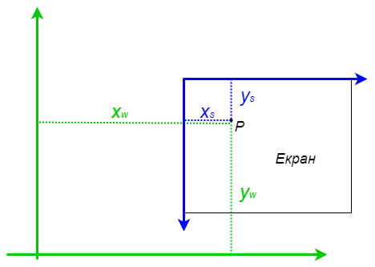
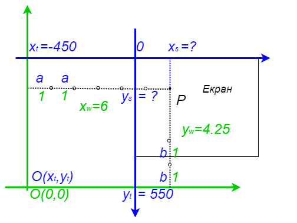

Визуализација
=============

Међу проблемима из области рачунарске геометрије које смо до сада разматрали, неки су врло погодни 
за визуализацију у графичким апликацијама. На овом месту претпостављамо да сте већ стекли основно 
знање о креирању графичких апликација, па те основе нећемо објашњавати овде. Читаоце који немају 
искуства у прављењу графичких апликација упућујемо на Петљин приручник 
`Мали увод у графички кориснички интерфејс <https://petlja.org/biblioteka/r/kursevi/gui_cs-sr-cyrl>`_.

У наставку разматрамо неке уобичајене проблеме које треба решити приликом визуализације, као што је 
омогућавање кориснику да приказ помери, увећа или умањи по својој жељи. Приказаћемо начин на који 
ово може да се постигне, тако да овде приказану технику можете да комбинујете са својим програмима, 
који ће илустровати нешто од раније наученог. 

Чак и ако се одлучите да правите једноставније програме који не омогућавају померање и зумирање 
приказа, свакако ћете имати потребе да рачунате координате у корисниковом координатном систему 
када су дате координате у пикселима и обрнуто, тако да препоручујемо да свакако проучите бар део 
о трансформацији координата.

Комплетан изворни кôд примера који је овде делимично изложен, можете да преузмете на насловној 
страници курса.  

Трансформације између координата света и екрана
-----------------------------------------------

Корисник програма за визуализацију има на уму неки свој координатни систем, у коме :math:`y` 
координата вероватно расте навише, а јединична дуж је је обично знатно већа од једног пиксела 
екрана. То значи да, када пишемо такав програм, имамо посла са два координатна система. Један 
координатни систем је корисников, а други потиче од прозора у коме цртамо. Уобичајено је да се 
координате тачака у ова два система зову редом координате света и координате екрана. Програм 
треба писати тако да су све информације које корисник задаје и добија изражене у координатама 
света.

Због тога је потребно да можемо брзо и једноставно да прерачунавамо координате тачака, тј. да од 
координата тачке у једном систему добијемо координате у другом. 

    
    Координате света (зелено) и екрана (плаво).

Трансформације светских координата у екранске
'''''''''''''''''''''''''''''''''''''''''''''

Размотримо прво како на основу координата :math:`(x_w, y_w)` неке тачке :math:`P` у систему света да 
израчунамо координате :math:`(x_s, y_s)` исте тачке у систему екрана. 

Нека је, на пример, :math:`x_w=6, y_w=4.5`, тј. нека су координате тачке :math:`P` у систему света 
:math:`(6, 4.5)`. Нека је координатни систем света померен у односу на систем екрана тако да су 
екранске координате координатног почетка светског система :math:`(-450, 550)`. Да бисмо израчунали 
екранске координате :math:`(x_s, y_s)` тачке :math:`P`, потребно је још да знамо дужине јединичних 
дужи координатних оса система света, изражене у пикселима, тј. јединицама координатног система екрана. 
Означимо те дужине редом са :math:`a, b` (:math:`a` за осу :math:`x`, а :math:`b` за осу :math:`y`).

    Израчунавање координата екрана `Xs, Ys`, када су познате координате света `Xw, Yw`.

Користећи боје и ознаке са слике, закључујемо да вредност :math:`x_s` можемо да израчунамо када "на плаву 
координату зелене :math:`y` осе (а то је :math:`x_t=-450`) додамо :math:`x_w` дужи од по :math:`a` пиксела". 
Слично томе, вредност :math:`y_s` можемо да израчунамо када "од плаве координате зелене :math:`x` осе (а то је 
:math:`y_t=550`) одузмемо :math:`y_w` дужи од по :math:`b` пиксела". Конкретно, ако узмемо :math:`a=b=100`, 
добијамо:

.. math::

    \begin{aligned}
    x_s &= -450 + 100 \cdot 6 = 150,\\
    y_s &= 550 - 100 \cdot 4.5 = 100.\\
    \end{aligned}

Приметимо да вредност :math:`y_s` добијамо одузимањем а не сабирањем, зато што су :math:`y` осе у 
ова два координатна система различито усмерене. 

Пређимо сада на општи случај. Нека је познат положај координатног почетка и величине јединичних дужи 
система света у координатама екрана. Конкретније, нека су дати следећи параметри:

- координате :math:`(x_t, y_t)` координатног почетка система света, изражене у систему екрана, 
- дужине :math:`a, b` водоравне и усправне јединичне дужи система света, изражене у систему екрана. 

Знајући :math:`x_t, y_t, a, b`, за било коју тачку чије су координате у систему света једнаке 
:math:`(x_w, y_w)`, екранске координате :math:`(x_s, y_s)` исте тачке можемо да израчунамо по формулама: 

.. math::

    \begin{aligned}
    x_s &= a \cdot x_w + x_t,\\
    y_s &= -b \cdot y_w + y_t.\\
    \end{aligned}

И у општем случају подразумевамо да су :math:`x` осе у овим системима усмерене исто, а :math:`y` осе 
различито, па зато у првој формули стоји плус, а у другој минус.

Из ових формула лако се добија и обрнута трансформација. 

Трансформације екранских координата у светске
'''''''''''''''''''''''''''''''''''''''''''''

Када су дате координате :math:`(x_s, y_s)` тачке :math:`P` у систему екрана, онда координате 
:math:`(x_w, y_w)` те тачке у систему света можемо да израчунамо помоћу следећих формула:

.. math::

    \begin{aligned}
    x_w &= \frac{1}{a} (x_s - x_t),\\
    y_w &= -\frac{1}{b} (y_s - y_t).\\
    \end{aligned}

Еко како изгледају функције за прерачунавање координата. Напомињемо да се у програму за уведене 
параметре користе мало дужа имена: 

- :math:`x_t` је у програму ``TranslationX``
- :math:`y_t` је у програму ``TranslationY``
- :math:`a` је у програму ``ScalingX``
- :math:`b` је у програму ``ScalingY``

.. activecode:: transformacija_koordinata
    :passivecode: true
    :coach:

    private void WorldToScreen(float xw, float yw, out float xs, out float ys)
    {
        xs = xw * ScalingX + TranslationX;
        ys = -yw * ScalingY + TranslationY;
    }
    private void ScreenToWorld(float xs, float ys, out float xw, out float yw)
    {
        xw = (xs - TranslationX) / ScalingX;
        yw = (ys - TranslationY) / -ScalingY;
    }

Транслаторно померање слике вучењем
-----------------------------------

Разумно је очекивати да корисник повремено жели да види део координатног система који тренутно 
није приказан на екрану. Многи програми зато омогућавају кориснику да мишем повуче приказ у жељену 
страну. Корисник вуче приказ тако што помера миша са притиснутим тастером и за то време координате 
миша не треба да се се мењају у систему света, већ само у систему екрана. 

Како се мењају параметри трансформације координата приликом вучења приказа? Дужине :math:`a, b` 
јединичних дужи се не мењају, али се мења положај :math:`x_t, y_t` координатног почетка система 
света, и то тачно за онолико, за колико се помери миш приликом вучења. Према томе, да бисмо подржали 
вучење приказа, потребно је да током померања миша са притиснутим тастером ажурирамо вредности 
:math:`x_t` и :math:`y_t` у формулама (променљиве ``TranslationX`` и ``TranslationY`` у програму).
Ево како то може да изгледа у програму:

.. activecode:: podrska_vucenju_prikaza
    :passivecode: true
    :coach:

    private void Form1_MouseDown(object sender, MouseEventArgs e)
    {
        if (e.Button == MouseButtons.Right)
        {
            // zapocni vucenje
            IsDragging = true;
            LastDraggingPosX = e.X;
            LastDraggingPosY = e.Y;
        }
        ... // druge obrade dogadjaja pritiska tastera misa
    }

    private void Form1_MouseMove(object sender, MouseEventArgs e)
    {
        if (IsDragging)
        {
            TranslationX += e.X - LastDraggingPosX;
            TranslationY += e.Y - LastDraggingPosY;
            LastDraggingPosX = e.X;
            LastDraggingPosY = e.Y;
            Invalidate();
        }
        ... // druge obrade dogadjaja pomeranja misa
    }
    
    private void Form1_MouseUp(object sender, MouseEventArgs e)
    {
        if (e.Button == MouseButtons.Right)
            IsDragging = false;
    }

Покретањем примера који следи, можете да стекнете јаснију представу о томе како програм треба да се 
понаша приликом вучења приказа мишем. Резимирајмо које је очекивано понашање:

- Програм приказује на екрану нацртан координатни систем света и координате миша у систему света. 
- Током обичног померања миша мењају се приказане координате миша у систему света, а положај 
  координатног система света се не мења. 
- Насупрот томе, када корисник вуче приказ (тј. помера миша са притиснутим тастером), приказане 
  координате миша се не мењају, али се мења положај целог координатног система света.

.. comment

    ***********************************************************************************************
    Kada se izvrsava direktno ,ovaj pajton program radi kako treba.
    Kada se izvrsava u stranici kursa, ne radi mu zumiranje, a na pomeranje misa cesto preskace.
    Bilo bi dobro zameniti ga javascriptom.
    ***********************************************************************************************

.. activecode:: viz_transformacije_koordinata_py
   :nocodelens:
   :modaloutput:
   :playtask:
   :includehsrc: _src\2_geometrijski/viz_transformacije_koordinata.py

Зумирање
--------

Корисник може да има потребу да увећа или умањи приказ који му нудимо. То се у програмима најчешће 
ради окретањем точка миша. Размислимо како треба да се промене параметри трансформације координата, 
да бисмо подржали умањивање или увећавање приказа. Овај пут, мењају се дужине :math:`a, b` јединичних 
дужи. Када је потребно да се приказ увећа, ове дужине множимо неким коефицијентом (већим од један), 
а када треба да се смањи, дужине делимо истим коефицијентом. Када се мења величина приказа, пожељно 
је да се промени и величина фонта којим се црта текст на екрану, што постижемо множењем или дељењем 
величине фонта истим коефицијентом који користимо и за промену параметара трансформације координата.

Положај :math:`x_t, y_t` координатног почетка система света не морамо да мењамо, и у том случају ће 
управо координатни почетак бити непомична тачка у приказу. Оно што такође често виђамо у програмима 
је да непомична тачка буде тренутна позиција миша. У том случају треба променити и вредности 
:math:`x_t, y_t`, а извођење формула за нове вредности ових параметара остављамо читаоцима за вежбу.

У програму, подршка промени величине приказа може да изгледа овако:

.. activecode:: podrska_zumiranju
    :passivecode: true
    :coach:

        private void Form1_MouseMove(object sender, MouseEventArgs e)
        {
            ... // ostale obrade dogadjaja pomeranja misa
            if (e.Delta != 0)
            {
                // tocak misa je okrenut, zumiraj (ka ili od)
                int WheelDelta = SystemInformation.MouseWheelScrollDelta;
                float f = (float)Math.Pow(1.1, -e.Delta / WheelDelta);
                ScalingX *= f;
                ScalingY *= f;
                FontSize *= f;
                Invalidate();
            }
            ... // ostale obrade dogadjaja pomeranja misa

.. comment
            
        Пример - поплочавање равни
        --------------------------
         
        .. infonote::
         
            **T O D O** - опис и дорада примера (померање и зумирање, без трансформације), JavaScript кôд

Задаци:
-------

- Написати програм који омогућава кориснику да кликовима зада произвољан број тачака, 
  а приказује задате тачке и најмањи рам (поравнати правоугаоник) који их садржи.
- Написати програм који омогућава кориснику да кликовима зада три тачке, а приказује 
  паралелограм коме су задате тачке редом прва три темена (програм треба да одреди 
  четврто теме).
- Написати програм који омогућава кориснику да кликовима зада две тачке, а приказује 
  квадрат коме су то два суседна темена.
- Написати програм који омогућава кориснику да кликовима зада две тачке, а приказује 
  квадрат коме су то два наспрамна темена.
- Написати програм који омогућава кориснику да кликовима зада три тачке, а затим 
  одговара на питање да ли дата тројка чини заокрет и на коју страну.
- Написати програм који омогућава кориснику да кликовима зада темена многоугла, а 
  затим одговара на питање да ли је задати многоугао конвексан.
- Написати програм који омогућава кориснику да кликовима зада темена многоугла, а 
  затим израчунава и приказује обим и површину тог многоугла.

Програмима по жељи можете да додате контроле или другачију подршку, помоћу које 
корисник може да обрише тачку, помери тачку, понови цео поступак и слично.

Технике које су овде приказане можете и не морате да користите у својим програмима. 
Приказане технике су нарочито корисне у последњем задатку.

.. comment

    .. activecode:: viz_obim_i_povrsina_mnogougla_py
       :nocodelens:
       :modaloutput:
       :playtask:
       :includehsrc: _src\2_geometrijski/viz_obim_i_povrsina_mnogougla.py

    .. activecode:: viz_zaokret_py
       :nocodelens:
       :modaloutput:
       :playtask:
       :includehsrc: _src\2_geometrijski/viz_zaokret.py
