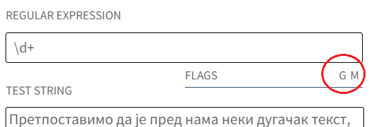

Регуларни изрази
================

Увод
----

Сигурно сте до сада користили претрагу текста у неком програму на рачунару, било да је то процесор 
текста, развојно окружење за програмирање, или обичан едитор. Као што знате, у већини програма претрагу 
можемо да започнемо притиском на тастере ``Ctrl`` и ``F``, а затим да унесемо текст који тражимо. 
Претрага је обично донекле прилагодљива, тако да можемо да задамо да ли треба да се разликују мала 
и велика слова, да ли се проверавају и делови речи или само целе речи итд. Међутим, лако можемо да 
замислимо ситуације у којима би нам добро дошао неки виши ниво флексибилности.

Нека је, на пример, пред вама електронски документ о разним животињама. Претпоставимо да вас тренутно 
интересује део о орловима. Желите да нађете прво место у тексту на коме се помињу орлови, али не 
желите да пропустите неко помињање орла само зато што није у номинативу једнине (тј. осим `орао`, 
желите да нађете и `орла`, `орлу`, `орлови`, `орлове`, `орловима` итд.). 

Једно уобичајено решење је да потражите само почетак речи, у овом случају `ор`. Међутим, у том случају 
претрага ће да пронађе и многе речи које вас не интересују, нпр. `орган`, или `оријентише`. Друго 
решење је да потражите разне облике речи `орао` једну по једну, а затим да проверите која од њих се 
прва појављује. Међутим, то није нарочито удобно. Удобније решење би било да можете да кажете програму 
да потражи две или више речи истовремено, и одмах покаже сва појављивања сваке од тражених речи, овако:

.. regex-check:: orao_orlovi
    :flags: gim
    :solution: орао|орловима|орлови|орла|орлу|орлове
    :initregex: орао|орловима|орлови|орла|орлу|орлове
    :editable:
    
    Нека је, на пример, пред вама електронски документ о разним животињама. 
    Претпоставимо да вас тренутно интересује део о орловима. Желите да нађете 
    прво место у тексту на коме се помињу орлови, али не желите да пропустите 
    неко помињање орла само зато што није у номинативу једнине (тј. осим `орао`, 
    желите да нађете и `орла`, `орлу`, `орлови`, `орлове`, `орловима` итд.). 

Оваква претрага се изводи врло једноставно помоћу **регуларних израза**. Употреба регуларних израза 
у претрази је подржана у многим програмима за обраду текста, самосталним едиторима, као и едиторима 
уграђеним у програмерска развојна окружења. Ако програм који користите подржава регуларне изразе, 
довољно је да унесете све жељене речи раздвојене знаком ``|`` и програм ће их тражити све упоредо. 
Знак ``|`` овде има значење "или", па можемо тако и да га читамо. 

Мада је већ ова могућност довољан разлог да проверите да ли програми које користите подржавају 
регуларне изразе приликом претраге, треба знати да је то само мали део онога што помоћу регуларних 
израза можете да урадите, чак и када се ради само о претрази текста. Примера ради, помоћу регуларних 
израза можете врло једноставно да нађете све бројеве у тексту. Ево таквог примера:

.. regex-check:: brojevi
    :flags: gm
    :solution: \d+
    :initregex: \d+
    :editable:
    
    Претпоставимо да је пред нама неки дугачак текст, у којем нас већи 
    део не интересује, али део са бројевима нам је битан. То може да буде 
    понуђен уговор о кредиту, у коме нас највише интересују услови отплате 
    (рок, рата, каматна стопа), или опис експеримента, у коме нас највише 
    интересују добијени резултати. Ако  читамо чланак о историјату неке 
    научне области или неке епохе у прошлости, може да нас занима само 
    хронологија најважнијих догађаја, па желимо да нађемо места где се 
    помињу године. Или можда гледамо рекламни чланак у коме се нашироко 
    описују погодности неког производа, али тренутно желимо да нађемо цене 
    понуђених модела. Укратко, било какав документ у коме желимо да 
    пронађемо бројеве. 
    
    Поменимо зато и неке бројеве у овом тексту. На пример, да ли знате ко 
    је живео у периоду 1833-1904? Можда вас интересује да је производ који 
    редовно купујете тренутно на акцији и може да се набави 10% јефтиније? 
    Или то да је важан културни догађај у вашем граду најављен за 24. април?

Као што видимо, довољно је да употребите регуларан израз ``\d+``, којим захтевате да вам програм 
покаже сва појављивања било ког броја у тексту (документу). Правила писања регуларних израза и 
значење записа попут ``\d+`` ће ускоро бити објашњени детаљније и систематичније. 

Када је реч о претраживању текста, регуларни изрази пре или касније могу да затребају сваком. Осим 
ове масовне примене, регуларне изразе можете да употребите и у упитима над базом података, као и у 
разним облицима аутоматске обраде података. Ево неких примера у којима су регуларни изрази згодно 
средство:

- Претпоставимо да пишете програм који прихвата улаз од корисника у текстуaлном облику. Можда ћете 
  желети да пре употребе података потврдите да су добијени подаци у очекиваном формату (валидација 
  података). На пример, ако се од корисника очекује да унесе своју е-адресу или број телефона, 
  помоћу регуларног израза можете да проверите да унети текст бар по формату одговара очекивању.
- Претпоставимо да имате велики број фајлова који су именовани на неки систематичан начин. Уколико 
  закључите да вам претходни систем именовања више не одговара, при преласку на нови систем именовања 
  можете да искористите регуларан израз да бисте аутоматизовали промену имена постојећих фајлова. 
- Претпоставимо да сте у неком великом програму променили дефиницију неке функције тако што сте 
  додали нови параметар после другог, а пре (некадашњег) трећег параметра. Сада, код свих старих 
  позива ове функције треба убацити одређену константу у листу стварних аргумената (између другог 
  и трећег аргумента). Ово се прилично једноставно ради помоћу регуларних израза. 
- Претпоставимо да одржавате веб сајт и да је интерна структура фолдера промењена. За кориснике који 
  приступају преко старих адреса треба обезбедити преусмеравање (редирекцију) са старих путања које 
  више нису активне, на нове. Још један задатак у коме употреба регуларних израза даје једноставно 
  решење.

Неки од ових примера су касније у овом поглављу разрађени и претворени у решене примере или задатке 
за вежбу. 

.. infonote::

    У општем случају, регуларни изрази нам омогућавају да у тексту пронађемо делове, који се уклапају 
    у неки прецизан, формалан опис. Пронађени делови текста могу да буду аутоматски замењени другим, 
    такође формално описаним текстом.
    
    Регуларним изразом се задаје **образац** (енгл. `pattern`) који тражимо у тексту, а пронађени 
    одговарајући текст се назива **поклапање** (енгл. `match`). Кажемо да дати образац поклапа одређени 
    текст, а сам поступак тражења (енгл. `pattern matching`) можемо приближно да преведемо као уклапање 
    (текста) у образац. 
    
**Напомена**: На многим местима где се користе регуларни изрази, може да се подеси 

- да ли се траже сва уклапања у дати израз, или само прво следеће појављивање, 
- да ли је претрага осетљива на мала и велика слова, 
- да ли се претражује само једна или више линија текста, 

и слично. У примерима који се користе у овом курсу, поменута подешавања можете да видите са десне стране, 
између прозора за регуларан израз и прозора за текст који се претражује. 

    
    Подешавања претраге регуларних израза

Слово **g** означава да се проналазе сва уклапања текста у регуларан израз, слово **i** (ако је 
наведено) означава да је претрага неосетљива на мала и велика слова, а слово **m** означава да се 
претражују све линије наведеног текста. 
  
Како се пишу регуларни изрази
-----------------------------

Регуларни изрази се граде надовезивањем једноставнијих регуларних израза. Зато ћемо преглед синтаксе 
почети од најједноставнијих, атомичних израза.

Појединачни карактери
'''''''''''''''''''''

Већина карактера може да се користи у регуларном изразу за проналажење истих карактера у тексту. На 
пример, појединачна слова и цифре, као што су ``A``, ``B``, ``C``, ``a``, ``b``, ``c``, ``1``, ``2``, 
``3``, ``Г``, ``Д``, ``Ђ``, ``г``, ``д``, ``ђ`` поклапају исти тај карактер у тексту. 

Међутим, видели смо да постоје и неки карактери који имају специјално значење када се појаве у 
регуларном изразу. На пример, знак ``|`` служи да раздвоји алтернативе (видети пример тражења разних 
облика речи `орао`), а знаци ``\d+`` узети заједно не поклапају те исте знаке него произвољан низ цифара. 
Карактери који не поклапају сами себе се називају специјални карактери. У регуларним изразима, следећи 
карактери су специјални: ``.``, ``*``, ``+``, ``?``, ``$``, ``^``, ``/``, ``\``, ``[``, ``{``, ``(``, 
``)``, ``}`` и ``]``. Њихово значење ћемо описати у наставку, а скраћени преглед (подсетник) је дат на 
крају ове странице. За сада истичемо да, када неки од специјалних карактера желимо да поклопимо у тексту, 
онда у регуларном изразу пишемо и карактер ``\`` испред њега. На пример:

- регуларан израз ``\\`` поклапа карактер ``\``
- регуларан израз ``\.`` поклапа тачку
- регуларан израз ``\[`` поклапа отворену угласту заграду

итд. Сви остали карактери (тј. они који нису специјални), поклапају сами себе.

Вежбање
^^^^^^^

.. questionnote::

    Задајте регуларан израз који поклапа запету (зарез).

.. regex-check:: zarez
    :flags: gm
    :solution: ,
    :editable:
    
    У знакове интерпункције спадају тачка, запета (зарез), упитник, узвичник... 
    Овај списак знакова је само започет и није комплетан. 
    Запету пишемо, на пример, када нешто набрајамо, или када одвајамо уметнути 
    део реченице.

.. questionnote::

    Задајте регуларан израз који поклапа појављивања три узастопне тачке.

.. regex-check:: tri_tacke
    :flags: gm
    :solution: \.\.\.
    :editable:
    
    У знакове интерпункције спадају тачка, запета (зарез), упитник, узвичник... 
    Овај списак знакова је само започет и није комплетан. 
    Један од знакова интерпункције су три тачке, које пишемо после недовршеног набрајања.
    Три тачке такође користимо код прекинутог говора, нпр. када нешто...

Врсте карактера
'''''''''''''''

Постоје регуларни изрази који поклапају један (било који) карактер одређене врсте, као што су: 

- **цифре**, тј. карактери ``0``, ``1``, ``2``, ``3``, ``4``, ``5``, ``6``, ``7``, ``8``, ``9``
- **алфанумерички карактери**, тј. ASCII слова, цифре и доња црта
- **белине**, тј. невидљиви карактери. Овде се најчешће мисли на размак (`space`) или табулатор (`tab` карактер),
  али у белине такође спадају и знак за прелазак у нови ред (newline, односно line feed), знак за прелазак 
  на почетак реда (carriage return) и усправни табулатор (vertical tab). Да бисмо помоћу регуларних израза 
  проналазили све ове врсте белина, потребно је додатно подесити начин употребе регуларних израза, ако 
  програм у коме претражујемо то допушта.
- Када је потребно да регуларним изразом поклопимо карактер са датим кодом, пишемо ``\x`` и 
  хексадекадни кôд тог карактера. На пример, израз ``\x41`` поклапа велико латинично слово ``A``.

У следећој табели су приказани регуларни изрази који се користе да представе по један карактер 
одређене врсте, заједно са описом и примером употребе. 

.. csv-table:: 
    :header: Запис, Значење, Пример употребе у изразу, пример поклапања
    :widths: 10, 70, 15, 15
    :align: left

    ".", "било који карактер",                                  "X.",             X4
    \\d, "Једна цифра од 0 до 9",                               \\d\\d:\\d\\d,    12:00
    \\w, "Алфанумерик (ASCII слово, цифра или доња црта)",      \\w\\w-\\w\\w\\w, B4-m_n
    \\s, "Један карактер -- белина",                            x\\sy,            x y

Примери:

- Израз ``X.`` поклапа (мечује) слово ``X`` иза кога следи још један (било који) карактер. Могућа 
  поклапања за регуларан израз ``X.`` су текстови ``X!``, ``XY``, ``X/`` итд.
- ``\d`` поклапа једну цифру, док ``\d\d`` поклапа две цифре. Према томе, израз ``\d\d:\d\d`` поклапа 
  низ од две цифре, знака ``:`` и још две цифре. Текстови ``00:00``, ``23:59`` и ``78:94`` су могућа 
  поклапања за регуларан израз ``\d\d:\d\d``, али овај израз не поклапа текстове ``3:05``, ``12 AM``, 
  или ``1200``.

Вежбање
^^^^^^^

.. questionnote::

    Задајте регуларан израз који поклапа све комбинације од једног алфанумерика и две цифре.

.. regex-check:: alfanum_plus_dve_cifre
    :flags: gm
    :solution: \w\d\d
    :editable:
    
    U folderu Jesen23 nalazi se pet fajlova: kontrolni31,  kontrolni32,  kontrolni33,  
    pismeni1 i pismeni2. U folderu Prolece-23 se nalaze fajlovi vezba-311 i vezba-312.

Ако се у регуларном изразу уместо израза ``\d``, ``\w``, односно ``\s``, употреби такав израз 
са великим словом, он поклапа сваки карактер који није поклапање за израз са одговарајућим 
малим словом. На пример:

.. csv-table::
    :header: Запис, Значење, Пример употребе у изразу, пример поклапања
    :widths: 10, 70, 15, 15
    :align: left

    \\D, "Један карактер који није поклапање за \\d (није цифра)",          \\D\\D\\D,        ABC
    \\W, "Један карактер који није поклапање за \\w (није алфанумерик)",    \\W\\W\\W\\W\\W,  \*-+=)
    \\S, "Један карактер који није поклапање за \\s (није белина)",         \\S\\S,           xy

Примери:

- Израз ``\D\D\D`` поклапа низ од три карактера, од којих ниједан није цифра. Могућа поклапања за 
  овај регуларан израз су текстови ``ABC`` или ``(!)``, али не и ``AB3``, ``XY`` или ``21``.
- Израз ``\W\W`` поклапа низ од два карактера, од којих ниједан није алфанумерик. Могућа поклапања за 
  овај регуларан израз су текстови ``[]`` или ``),``, али не и ``(3``.
  
Вежбање
^^^^^^^

.. questionnote::

    Задајте регуларан израз који поклапа низ од три знака, од којих је други доња црта, а ни први ни 
    трећи нису цифре.

.. regex-check:: nondigit_underscore_nondigit
    :flags: gm
    :solution: \D_\D
    :editable:
    
    Ознаке: А_Б, А_4, 7_Ф, 2_1, 
    _______________, 
    М_и_л_и_о_н. 

Квантификатори
''''''''''''''

Посебном ознаком у регуларном изразу можемо да задамо колико појављивања неког текста поклапа дати 
регуларан израз. Такву ознаку називамо квантификатором. У следећој табели су наведени квантификатори 
који могу да се користе у регуларним изразима. 

.. csv-table:: 
    :header: Запис, Значење, Пример употребе у изразу, пример поклапања
    :widths: 10, 40, 25, 25
    :align: left

    "\+",       "Једно или више појављивања",   R\\w+,        Rec_na_slovo_R
    {3},	    "Тачно три појављивања",        \\D{3},       ABC
    "{2,4}",	"Два до четири појављивања",    "\\d{2,4}",   56
    "{3,}",     "Три или више појављивања",     "\\w{3,}",	  dug_niz_alfanumerika
    \*,	        "Нула или више појављивања",    "X*Y*Z*",     XXXXXZZZ
    ?,	        "Нула или једно појављивање",   апарати?,     апарат

Примери:

- израз ``\d{2,4}`` поклапа било који низ од најмање две, а највише четири цифре. Могућа поклапања 
  су ``78``, ``9243``, ``555``, али израз не поклапа текстове ``9``, ``1-1``, ``12345`` (у последњем 
  поклапа део, али га не поклапа као целину).
- израз ``ha+`` поклапа текстове ``ha`` и ``haaaa``, али не и ``hahaha``
- израз ``(ha)+`` поклапа текстове ``ha`` и ``hahaha``, али не и ``haaaa``.

Као што видимо из ових примера, квантификатор делује на последњи карактер наведен пре њега. Када 
желимо да задамо број понављања за секвенцу карактера, или општије - за било какав подизраз, 
онда тај подизраз пишемо између облих заграда ``(`` и ``)``. Када се квантификатор нађе иза 
затворене заграде, он делује на подизраз у загради.

Вежбање
^^^^^^^

.. questionnote::

    Задајте регуларан израз који поклапа све низове од четири цифре

.. regex-check:: cetiri_cifre
    :flags: gm
    :solution: \d{4}
    :editable:
    
    Primer sabiranja: 998+97=1095; primer oduzimanja: 72134 - 325 = 71809; 
    Primer deljenja: 512 / 8 = 64;
    Znate li ko je ziveo u periodu 1854-1935?

Набрајања и опсези карактера
''''''''''''''''''''''''''''

- Када је потребно да регуларним изразом поклопимо било који од неколико карактера, те карактере 
  пишемо између угластих заграда ``[`` и ``]``. На пример, израз ``[AEIOU]`` поклапа један, било 
  који од карактера ``A``, ``E``, ``I``, ``O``, ``U``, тј. било који самогласник.
- Када је потребно да регуларним изразом поклопимо било који од неколико карактера чији кодови су 
  узастопни, уместо да набрајамо све те карактере, можемо између угластих заграда да наведемо први 
  и последњи од тих карактера, раздвојене цртом. На пример, израз ``[a-z]`` поклапа једно, било које 
  слово енглеске абецеде. 

У следећој табели дато је још неколико примера.

.. csv-table::
    :header: Израз, Опис, Примери поклапања
    :widths: 15, 55, 30
    :align: left

    "П[АО]Д",       "слово П, затим једно од (ћириличниих) слова А, О, затим слово Д",      "``ПАД``, ``ПОД``"
    "[A-H][1-8]",   "ознака шаховског поља (једно од слова ABCDEFGH, затим једна од цифара 12345678)",   "``E4``, ``G6``, ``D8`` (укупно 8х8=64 могућа поклапања)"
    "[A-Z0-9]",     "једно велико слово енглеске абецеде или цифра (било који алфанумерик осим доње црте)", "``G``, ``7`` (укупно 26+10=36 могућих поклапања)"
    "[A-LN-Z]",     "једно, било које, велико слово енглеске абецеде, осим слова ``M``", "``A``, ``Z``"

Вежбање
^^^^^^^

.. questionnote::

    Задајте регуларан израз који поклапа две хексадекадне цифре (два карактера, од којих је сваки цифра или једно од слова ABCDEF).

.. regex-check:: dve_hex_cifre
    :flags: gm
    :solution: [A-Fa-f0-9]{2}
    :editable:
    
    Опсег бајта је од 0x00 до 0xFF, док је опсег 32-битне целобројне 
    променљиве од 0x00000000 до 0xFFFFFFFF.
    Број GG не постоји у хексадекадном систему записивања.
    
    Baba i deda redovno dovode unuka u park.

    
Комплементи карактера и њихових група
'''''''''''''''''''''''''''''''''''''

- Када је потребно да регуларним изразом поклопимо било који карактер осим једног датог, пишемо знак 
  ``^`` испред тог карактера.
- Када је потребно да регуларним изразом поклопимо било који карактер осим набројаних, пишемо знак 
  ``^`` у угластим заградама испред набрајања.
- Када је потребно да регуларним изразом поклопимо било који карактер осим оних из датог опсега, 
  пишемо знак ``^`` у угластим заградама испред опсега.

Следе примери у табели.

.. csv-table::
    :header: Израз, Значење, Примери поклапања
    :widths: 10, 55, 35
    :align: left

    "^G",	        "било који карактер осим ``G``",                "``M``, ``7``"
    "[^1-5]",       "било који карактер осим цифара од 1 до 5",     "``9``, ``Z``"
    "[^AEIOU]",     "било који карактер осим набројаних",           "``Z``, ``4``"
    "[^A-C1-3]",    "било који карактер осим ``А``, ``B``, ``C``, ``1``, ``2``, ``3``.",           "``G``, ``5``"

Вежбање
^^^^^^^

.. questionnote::

    Задајте регуларан израз који поклапа сваки карактер који није ASCII слово (тј. није слово 
    енглеске абецеде). У овом вежбању претрага није осетљива на мала и велика слова.

.. regex-check:: ne_slova
    :flags: gim
    :solution: [^a-z]
    :editable:
    
    english   - српски   - srpski
    dandelion - маслачак - maslačak

    0123456789:;<=>?
    ABCDEFGHIJKLMNOPQRSTUVWXYZ[\]^_`
    abcdefghijklmnopqrstuvwxyz{|}~
    
    ABCČĆDDžĐEFGHIJKLLjMNNjOPRSTUVZŽ
    АБВГДЂЕЖЗИЈКЛЉМНЊОПРСТЋУФХЦЧЏШ

Подсетник
---------

**Појединачни карактери** се задају простим навођењем. 

**Специјални карактери** се наводе са знаком ``\`` испред.

**Врсте карактера**

- цифре: ``\d``
- алфанумерици: ``\w``
- белине: ``\s``
- било који карактер: ``.``
- карактер са хексадекадним кодом ``41``: ``\x41``

**Квантификатори**

.. csv-table::
    :header: Запис, најмањи број појављивања, највећи број појављивања, опис
    :widths: 10, 15, 15, 60
    :align: left

    "``+``",        1,          :math:`\infty`,  "бар једно понављање"
    "``*``",        0,          :math:`\infty`,  "нула или више понављања"
    "``?``",        0,          1,               "највише једно понављање"
    "``{n}``",      :math:`n`,  :math:`n`,       "тачно n понављања"
    "``{m,n}``",    :math:`m`,  :math:`n`,       "од m до n понављања"
    "``{n,}``",     n,          :math:`\infty`,  "n или више понављања"
    

**Набрајања и опсези карактера** (примери):

- Један самогласник: ``[AEIOU]``
- Једно велико слово енглеске абецеде: ``[A-Z]`` 
- Једно мало слово енглеске абецеде: ``[a-z]`` 
- Једна хексадекадна цифра: ``[0-9a-f]`` 

**Комплементи карактера и њихових група** се пишу са знаком ``^`` испред карактера, набрајања или опсега.

- Све осим слова ``X``: ``^X``
- Све осим самогласника: ``[^AEIOU]``
