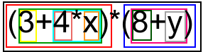
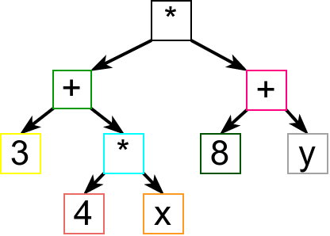

Парсирање. Формалне граматике.
==============================

.. infonote::
   
   Садржај текстуалних датотека често има неку правилну структуру. На
   пример:

   - датотеке са екстензијама `yaml`, `xml`, `json` су текстуалне
     датотеке у посебном формату, тј. писани по посебним правилима, а
     служе за записивање хијерархијски организованих податка,
   - датотеке са екстензијом `html` су текстуалне датотеке у посебном
     формату, у којима се описује садржај веб страница,
   - изворни кôд програма на разним програмским језицима се такође чува у
     текстуалним датотекама са веома правилном структуром (одређеном
     правилима програмског језика),
   - итд.

   Циљ овог поглавља је да научимо неке основне технике које омогућавају
   анализу и обраду тавких датотека.
  

Структура свих набројаних датотека је рекурзивна:

- секције са подацима у `yaml`, `xml`, или `json` датотека садрже
  друге секције,
- одељци у `html` датотекама (веб странама) садрже друге одељке,
- наредбе у програмским језицима садрже друге наредбе.
- Чак и аритметички изрази, попут, на пример, израза ``(3+4)*(5+6)``,
  имају рекурзивну структуру, јер се састоје од мањих израза у
  заградама.

Размотримо, на пример, структуру аритметичког израза
``(3+4*x)*(8+y)``.

           
- Зашто је он исправан аритметички израз? Зато што је добијен применом
  оператора ``*`` на једноставније изразе ``(3+4*x)`` и
  ``(8+y)``. Сваки исправан израз на претходној слици је уоквирен
  правоугаоником одређене боје. Полазни израз је исправан, па је
  уоквирен црном бојом и види се да се он састоји од два исправна
  подизраза (једног уоквиреног црвеном, а другог уоквиреног плавом
  бојом).

- Зашто је ``(3+4*x)`` исправан израз? Зато што је добијен стављањем
  исправног израза ``3+4*x`` у заграде (тај подизраз је на слици
  уоквирен зеленом бојом).

- Зашто је израз ``3+4*x`` исправан? Зато што је добијен применом
  оператора ``+`` на исправне подизразе ``3`` и ``4*x``.

- Зашто је израз ``3`` исправан? Зато што је у питању бројевна
  константа, а свака бројевна константа представља исправни аритметички
  израз.

- Зашто је израз ``4*x`` исправан? Зато што је добијен применом
  оператора ``*`` на исправне изразе ``4`` и ``x``.

- Зашто је израз ``4`` исправан? Зато што је у питању бројевна
  константа.

- Зашто је израз ``x`` исправан? Зато што је у питању променљива, а
  свака променљива је исправан аритметички израз.

На веома сличан начин се доказује и да је израз ``(8 + y)`` исправан
аритметички израз.

Структура датог израза се може представити и дрветом, као на следећој
слици.

Приметимо да се из дрвета јасно види однос оператора, па нема потребе
приказивати заграде. Такво дрво се назива **дрво апстрактне синтаксе**
(енгл. abstract syntax tree, **AST**).

Циљ овог поглавља је да упознамо технике програмирања које могу да се
употребе да би се анализирао структурирани текстуални улаз, попут, на
пример, текста који садржи запис аритметичких израза. Циљ нам је да
научимо како можемо да напишемо програме који могу да провере
исправност датог текста (на пример, да провере да ли ниска садржи
исправан запис израза) и да дати текст рашчлане на делове у складу са
датом структуром (на пример, да на основу записа израза креирају дрво
којим се тај израз представља), па и обраде на неки начин (на пример,
израчунају вредност аритметичког израза). Те технике се називају
**синтаксичка анализа** или **парсирање**, а програм који то ради
назива се синтаксички анализатор или **парсер**. Пошто је структура
текста углавном рекурзивна, парсирање се може вршити рекурзивним
функцијама. Основна техника која омогућава писање рекурзивних функција
за парсирање назива се **рекурзивни спуст**. Као што је то обично
случај у програмирању, рекурзија се може елиминисати ако се користи
стек, па је друга честа имплементација парсера управо заснована на
**коришћењу стека**.

Пре имплементације парсера заснованог на техници рекурзивног спуста,
пожељно је на неки што једноставнији и разумљивији начин прецизно
описати структуру улаза тј. **синтаксу** језика који се анализира. Као
што смо видели, регуларни изрази су веома користан формализам и њихова
уграђена подршка у савременим програмским језицима заиста олакшава
велики број задатака обраде текста. Са друге стране, регуларни изрази
имају своја ограничења и постоји велики број корисних језика (скупова
ниски) који се не могу описати регуларним изразима. Типичан пример су
аритметички изрази. Структура исправно записаних аритметичких израза
је рекурзивна и самим тим превише компликована да би могла да се опише
регуларним изразима. Регуларни изрази чак не могу да опишу ни само
исправност заграда унутар ниске. Наиме, број затворених заграда мора
да одговара броју отворених заграда (и додатно, заграде морају да буду
исправно угнежђене), а регуларни изрази немају могућност упаривања
броја појављивања подизраза.

У поглављу које следи ћемо описати један изражајни начин за опис
синтаксе језика. У питању су тзв. **формалне граматике** које нам дају
начин да опишемо синтаксу суштински рекурзивних објеката, какви су, на
пример, аритметички изрази. Као што неформалне граматике одређују
синтаксички исправне реченице природних језика, тако формалне
граматике прецизно одређују синтаксички исправне "реченице"
програмских језика, тј. исправне делове програмског кода или неког
другог формалног садржаја.

Кренимо од формалног граматичког описа аритметичких израза. Претходне
слике јасно показују њихову рекурзивну природу: сложенији изрази се
граде од једноставнијих израза (применом оператора и функција), при
чему су најелементарнији изрази променљиве и константе. Покушајмо сада
да опишемо која су то правила која смо користили да бисмо закључили да
је нешто исправан аритметички израз?

- Свака константа је исправан аритметички израз.
- Свака променљива је исправан аритметички израз.
- Ако је ``izraz`` исправан аритметички израз, тада је и ``(izraz)``
  исправан аритметички израз.
- Ако су ``izraz1`` и ``izraz2`` исправни аритметички изрази, тада је
  и ``izraz1 + izraz2`` исправан аритметички израз.
- Ако су ``izraz1`` и ``izraz2`` исправни аритметички изрази, тада је
  и ``izraz1 * izraz2`` исправан аритметички израз.
  
Да би оваква дефиниција израза била комплетна, набројаним правилима треба 
придружити још једно, а то је: исправни аритметички изрази се могу добити 
само применом набројаних правила. Наравно, изрази могу да буду дефинисани и 
обухватније, тј. могуће је аналогно дефинисати и правила за друге
операторе (одузимање, дељење), али једноставности ради у наставку ћемо
се често задржати само на сабирању и множењу.

Рекурзивна дефиниција коју смо приказали потпуно прецизно карактерише
исправне аритметичке изразе. Дефиниције овог типа називамо
**контекстно слободним граматикама**. Додуше, граматике се често пишу у
доста компактнијем запису (без пуно речи, само симболички). Тако би се
претходна граматика могла записати на следећи начин.

::
   
   izraz -> konstanta
   izraz -> promenljiva
   izraz -> ( izraz )
   izraz -> izraz + izraz
   izraz -> izraz * izraz

Граматика се састоји од скупа незавршних тј. нетерминалних симбола (у
овом случају је то само симбол ``izraz``) и скупа завршних
тј. терминалних симбола (у овом случају су то заграде, плус, пута,
константа и променљива). Подразумевамо да је низ карактера са улаза
већ рашчлањен на низ завршних симбола (тзв. **токена**) тј. да
приликом имплементације синтаксичког анализатора не морамо водити
рачуна о детаљима препознавања појединих завршних симбола. Дакле, у
претходној граматици подразумевамо да се зна шта је променљива и шта
је константа и да умемо да их препознамо када се јаве на улазу нашег
програма. Оне, на пример, могу бити описане коришћењем регуларних
израза, попут регуларног израза ``[a-z][a-z0-9]*`` којим се често
описују идентификатори који представљају називе променљивих. Део
програма који се бави груписањем појединачних карактера у завршне
симболе наше граматике зове се **лексички анализатор**. Упрошћено
говорећи, задатак лексичког анализатора је да од појединачних
карактера (слова) направи речи, а задатак синтаксичког анализатора
тј. парсера је да провери да ли те речи граде исправне реченице
(реченице које су у складу са жељеном граматиком).

На основу граматичких правила изводе се исправне ниске које имају
жељену структуру. На пример, израз ``konstanta * promenljiva`` је
исправан јер се може извести на следећи начин.

::

   izraz => izraz * izraz => konstanta * izraz => konstanta * promenljiva

Извођење креће од неког почетног незавршног симбола и у сваком кораку
се незавршни симболи мењају десним странама граматичких правила, све
док не остану само завршни симболи.

Често се за запис граматика користи тзв. **Бекус-Наурова нотација**,
**BNF** (каже се скраћено и **Бекусова нотација**).

::

   <izraz> ::= <konstanta> 
   <izraz> ::= <promenjiva> 
   <izraz> ::= "(" <izraz> ")"
   <izraz> ::= <izraz> "+" <izraz>
   <izraz> ::= <izraz> "*" <izraz>

Постоји и такозвана проширена Бекусова нотација (EBNF) која на неки
начин комбинује контекстно-слободне граматике са неким конструкцијама
које су нам познате из регуларних израза. На пример,

::
   
   <promenljiva> :: <slovo> {<slovo> | <cifra>}

У овој нотацији усправна црта означава "или", а витичасте заграде
означавају нешто што се понавља нула или више пута (слично као
звездица код регуларних израза).

Поставља се питање како од граматичког описа језика можемо добити
програмски код који проверава исправност ниске (проверу да ли она
припада том језику тј. да ли је у складу са датим граматичким
описом). Видели смо да савремени програмски језици нуде ту могућност
за описе дате регуларним изразима. Нажалост, то није случај за
граматике, мада постоји алат који пружа могућност аутоматског
генерисања C# кода за проверу само на основу граматике коју корисник
уноси (нпр. ANTLR, GPPG/GPLEX, Coco/R). Са друге стране, постоје
технике попут рекурзивног спуста, које омогућавају да се релативно
једноставно добије програмски код на основу граматичких описа и у
наставку овог поглавља ћемо их укратко описати.

.. infonote::

   Резиме:
   
   - Парсирање је процес анализе текстуалног садржаја и представљања
     његове структуре у облику дрвета.

   - Пошто је текстуални садржај који се анализира најчешће
     рекурзиван, парсери се могу имплементирати техником рекурзивног
     спуста.

   - Уместо рекурзије, могуће је користити и стек.
     
   - Пре имплементације парсера погодно је представити основну
     синтаксу језика који се парсира, за шта се користе формалне
     граматике, често записане у формату BNF или EBNF.

   - Постоје готови алати који на основу задате граматике могу
     аутоматски да креирају парсер.
     
