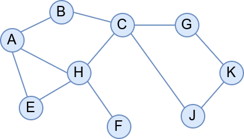

Увод
====

У склопу предмета „Дискретна математика“ вероватно сте већ изучавали
графове (чворове повезане гранама).

Графови су веома значајна структура података у рачунарству која је
погодна за моделовање и решавање великог броја разнородних проблема. У
овом поглављу упознаћемо се са дефиницијом графа и основних појмова
који су у вези са графовима. Видећемо примере графова и њихову улогу у
моделовању конкретних проблема. Научићемо и неке од најважнијих
алгоритама за рад са графовима: алгоритме за обилазак графова и њихове
примене (одређивање компонената повезаности и тополошко сортирање).
