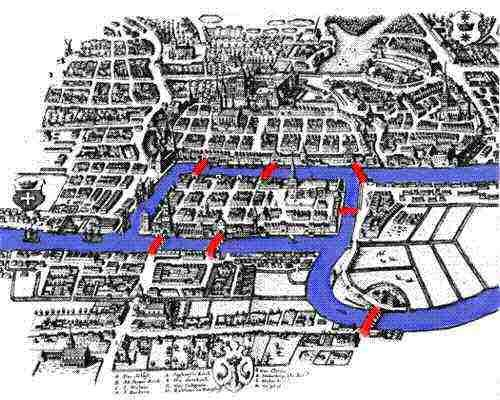
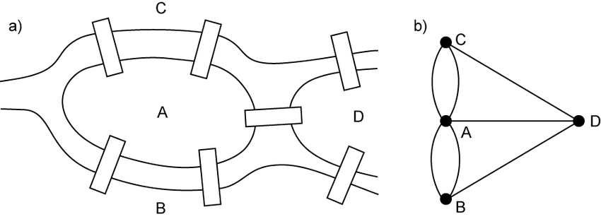
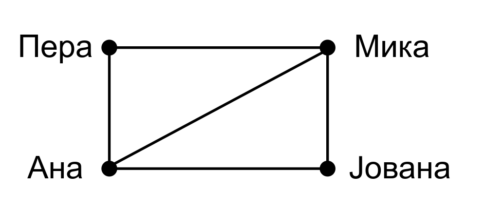
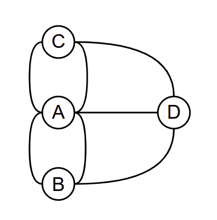
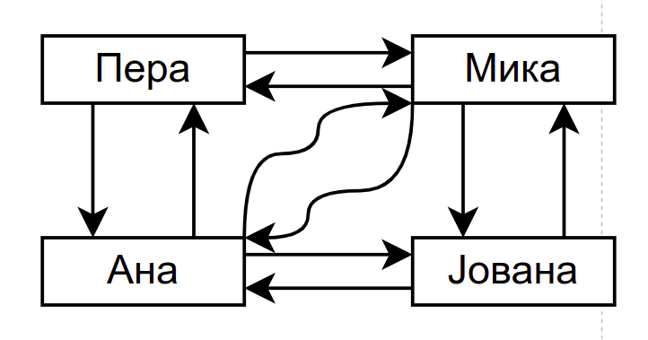
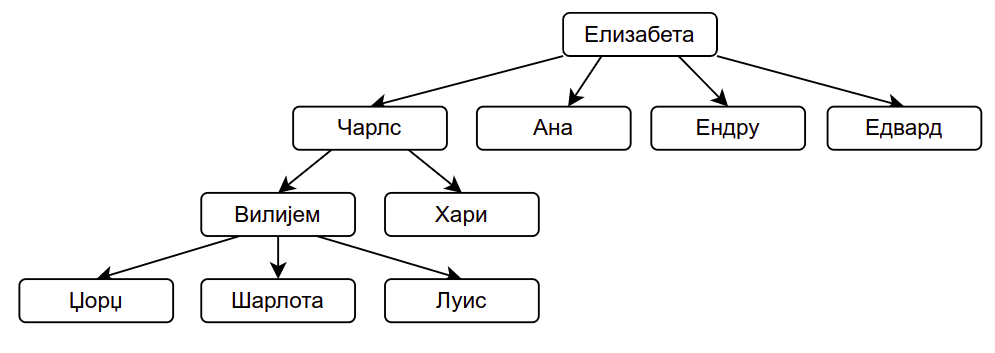
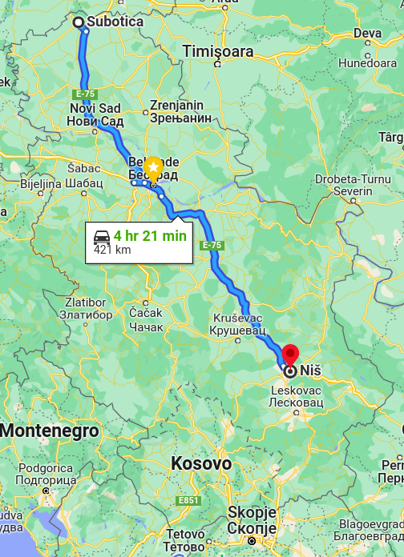
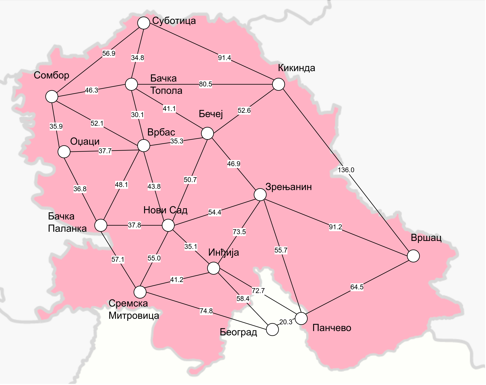

Примери графова
===============

Постоје различите врсте графова. Пре него што дамо прецизне
дефиниције, прикажимо графове кроз неколико једноставних примера
примене.

Пример 1. Пријатељства на друштвеној мрежи
------------------------------------------

Карактеристика неких друштвених мрежа (таква је, на пример, мрежа
Фејсбук) је да корисници остварују међусобне пријатељске везе. Када
један корисник прихвати захтев другога, они међусобно постају
пријатељи. Претпоставимо да је корисник Пера, пријатељ са Миком и
Аном, Мика са Пером, али и Аном и Јованом и да су Ана и Јована
међусобно пријатељи. Ови односи се могу графички представити на
следећи начин:

.. figure:: ../../_images/4_grafovski/fejsbuk.png
    :width: 300px
    :align: center
    
    Пријатељства на друштвеној мрежи

Приказани цртеж представља један **граф**. Особе се налазе у
**чворовима** (енгл. *vertex*, *node*) графа, а везе између њих су
представљене **гранама** (енгл. *edge*). Свака грана повезује два
чвора.

Када су везе представљене на овај начин, граф можемо анализирати да
бисмо сазнали разне корисне информације. На пример,

1. испитати да ли су два дата корисника пријатељи
2. одредити све пријатеље датог корисника
3. одредити број пријатеља сваког корисника
4. одредити корисника који има највећи број пријатеља
5. одредити све заједничке пријатеље датих корисника
6. ...

Пример 2. Мостови Кенингсберга
------------------------------

Један од првих примера употребе графова потиче још од чувеног
математичара Леонарда Ојлера. У граду Кенингсбергу (данашњем
Калињинграду) постојало је 7 мостова и постојало је питање да ли се
може направити шетња кроз град током које се преко сваког моста
прелази тачно једном. Мапа града је приказана на наредној слици.

    
    Мапа града Кенингсберга и његових мостова

Три копнена дела града и острво је могуће представити чворовима графа,
а везе између њих тј. мостове можемо представити гранама.

    
    Представљање града Кенингсберга и његових мостова графом

Ако до неког чвора (острва или копна) дођемо преко неког моста, можемо
га напустити само преко неког другог моста. Дакле, сваки чвор графа
(осим евентуално полазног и завршног) мора имати паран број
грана. Пошто у графу који представља мостове Кенингсберга постоје 4
чвора и сваки од њих има непаран број грана (тј. мостова), тражена
шетња не постоји.

Представљање проблема помоћу графа (скупа чворова који су повезани
гранама) је веома слично као у претходном примеру. Немојте да вас
збуни то што су графови нацртани мало другачије (цртежи се могу лако
прилагодити).

    

Ипак, постоји важна разлика између претходна два графа: у случају
Фејсбука два чвора (два пријатеља) могу бити повезани највише једном
граном, док се у случају кенингсбершких мостова између два чвора може
наћи више грана. Овакви графови се некада називају и **мултиграфови**.

Пример 3. Праћења на друштвеној мрежи
-------------------------------------

За разлику од мрежа на којима су пријатељства увек узајамна,
карактеристика неких друштвених мрежа је то да један корисник може
пратити другога, али други не мора пратити првога (такве су, на
пример, мреже Инстаграм и Твитер). Везе између корисника се такође
могу представити графом, али гране тог графа морају бити усмерене и
такав се граф назива **усмерен** или **оријентисан** граф. Размотримо,
на пример, наредни граф:

.. figure:: ../../_images/4_grafovski/instagram1.png
    :width: 300px
    :align: center
    
    Праћења на друштвеној мрежи

На њему је означено да Пера прати Мику и Ану, Мика прати Јовану,
Јована прати Перу и Ану, а Ана прати Мику и Јовану.

Пошто су све гране графа којим је представљен Фејсбук неусмерене,
такав граф се назива **неусмерен** или **неоријентисан**
граф. Приметимо да се сваки неусмерен граф може представити и као
усмерен граф. Гране неусмереног графа могу да се схвате као парови
усмерених грана, па је довољно сваку неусмерену грану заменити са две
усмерене (по једном у сваком смеру).

.. figure:: ../../_images/4_grafovski/fejsbuk.png
    :width: 300px
    :align: center
    
    Пријатељства на друштвеној мрежи представљена помоћу неусмереног графа (нпр. Фејсбук)

    
    Пријатељства на друштвеној мрежи представљена помоћу усмереног
    графа (нпр. Инстаграм)

Када су корисници и везе приказани усмереним графом, можемо одговорити
на сличан скуп питања као и код неусмереног графа, али и на нека
додатна. На пример:

1. Који корисник има највише пратилаца
2. Колико пратилаца има неки корисник, а колико корисника он прати
3. Који су корисници са којима се дати корисник узајамно прати
4. ...

Пример 4. Зависности испита
---------------------------

Да бисте савладали неке напредније вештине, потребно је прво да
савладате неке основне. Зато су предмети на факултетима организовани
тако да постоје предуслови за слушање неких предмета. На пример, да
бисте могли да слушате предмет “Програмирање 2”, потребно је да
претходно положите предмет “Програмирање 1”. Овакве везе између
предмета се могу природно представити усмереним графом, једино је
потребно договорити се да ли су стрелице усмерене ка предметима од
којих нешто зависи или ка предметима који од нечег зависе. Ако се
договоримо да стрелице усмеравамо ка предметима које је прво потребно
положити, онда се зависности између неколико програмерских предмета
могу представити следећим графом.

.. figure:: ../../_images/4_grafovski/ispiti.png
    :width: 400px
    :align: center
    
    Предуслови уписивања предмета на факултету

Над оваквим графом можемо постављати различита питања. На пример,

1. Навести све испите које је неопходно положити да би могао да буде
   уписан неки задати предмет (на пример, да би се уписали Оперативни
   системи, потребно је положити Програмирање 1 и Програмирање 2).
       
2. Одредити бар један могући редослед полагања испита који поштује све
   зависности између предмета (на пример, Програмирање 1, Програмирање
   2, Објектнооријентисано програмирање, Алгоритми и структуре
   података, Оперативни системи, Компилација програмских језика).

Пример 5. Породично стабло
--------------------------

Породично стабло се често користи да би се представили односи између
предака и потомака. Приметимо да **стабло** (каже се и **дрво**)
представља посебан облик графа и већина алгоритама који се примењују
над графовима могу да се примене и над стаблима. Са друге стране,
постоје и алгоритми који су специфични за стабла.

    
    Део породичног стабла наследника краљице Елизабете

На слици је приказан део породичног стабла наследника енглеске краљице
Елизабете друге. Над оваквим стаблом можемо постављати и следећа
питања:

1. Одредити број деце које нека особа има.
2. Одредити укупан број потомака који се налазе у стаблу.
3. Одредити родбински однос између две дате особе у стаблу.
4. Исписати све претке и све потомке неке особе.
5. ...

Пример 6. Мрежа путева
----------------------

У апликацијама за навигацију често је потребно пронаћи најбољи пут
између два места (то може бити најкраћи пут, пут којим се најбрже
стиже, најјефтинији пут који избегава плаћање путарина и слично).

    
    Проналажење најбољег пута у апликацији за навигацију

Да би се могао тражити најбољи пут, потребно је некако представити
информације о мрежи путева. За то се опет може употребити граф, чији
су чворови места, а гране путеви између њих. При том је на свакој
грани уписана и нека вредност која осликава тај пут (то може бити
дужина у километрима, цена која покрива трошкове горива и путарине,
процена времена путовања и слично). За графове на чијим гранама су
уписани неки бројеви кажемо да су **тежински** или **лабелирани**
графови.

На наредној слици је приказан тежински граф који представља мрежу путева у
Војводини (тежине на гранама су дужине путева у километрима).

    
    Део мреже путева у Војводини

Над оваквим графом можемо постављати и наредна питања:

1. Koje je место најближе датом?
2. Колика је дужина најкраћег пута између два задата места?
3. Који је најкраћи пут између два задата места?
4. Одредити дужине најкраћих путева од датог места до сваког другог
   места.
5. Одредити дужине најкраћих путева између свих места.
6. ...

Осим гранама, тежине могу бити додељене и чворовима.
