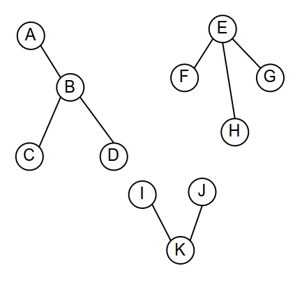

Дефиниције појмова у вези са графовима
======================================

Појам графа вам је вероватно већ познат из дискретне математике, па
ћемо овде дати само кратак преглед основних појмова.

Граф :math:`G=(V,E)` се састоји од скупа **чворова** :math:`V` и скупа
**грана** :math:`E \subseteq V \times V`.

Најчешће грана одговара пару различитих чворова, мада су понекад
дозвољене и петље, односно гране које воде од чвора ка њему самом.
Грана :math:`(u, v) \in E` је суседна чворовима :math:`u` и :math:`v`.
Чворови :math:`u` и :math:`v` су суседни ако и само ако постоји грана
која их повезује (тј. :math:`(u, v) \in E`).

Граф може бити **неусмерен** или **усмерен**.

- Гране усмереног графа су уређени парови чворова (:math:`E \subseteq
  V \times V`) и притом је важан редослед два чвора које повезује
  грана. У примерима смо видели да се гране усмереног графа цртају као
  стрелице усмерене од једног чвора (почетка) ка другом чвору (крају
  гране).

- Гране неусмереног графа би требало да се третирају као неуређени
  парови чворова: оне се цртају као обичне дужи. Неусмерен граф се
  често представља помоћу усмереног графа који се од полазног добија
  тако што се свака грана између два различита чвора замени са две
  гране (по једна у сваком смеру). Формално, неусмерен граф захтева да
  за сваки пар чворова :math:`a` и :math:`b` важи да је :math:`(a, b)
  \in E` ако и само ако је :math:`(b, a) \in E`. **Неусмерен облик**
  усмереног графа :math:`G=(V,E)` је исти граф, без смерова на гранама
  (тако да су парови чворова у :math:`E` неуређени).

Граф :math:`G'=(V', E')` је **подграф** графа :math:`G=(V,E)` ако је
:math:`V'\subseteq V` и :math:`E'\subseteq E`.

    
    Граф и један његов подграф (обојен црвеном бојом).
      
**Степен** :math:`d(v)` чвора :math:`v` је број грана суседних чвору
:math:`v` (односно број грана које чвор :math:`v` повезују са неким
другим чвором). У усмереном графу разликујемо **улазни степен** чвора
:math:`v` који је једнак броју грана за које је чвор :math:`v` крај,
односно **излазни степен** чвора :math:`v` који је једнак броју грана
за које је чвор :math:`v` почетак.

    
    Степени чворова у неусмереном графу (зелено). Улазни степени
    чворова у усмереном графу (црвено) и излазни степени чворова у
    усмереном графу (плаво).

**Пут** од чвора :math:`v_1` до чвора :math:`v_k` је низ чворова
:math:`v_1,v_2,\ldots,v_k` повезаних гранама :math:`(v_1,v_2)`,
:math:`(v_2,v_3)`, :math:`\ldots`, :math:`(v_{k-1},v_k)`. Пут је
**прост**, ако се сваки чвор у њему појављује само једном.

    
    Пут од Сомбора до Београда. Овај пут је прост.

За чвор :math:`u` се каже да је **достижан** из чвора :math:`v` ако
постоји пут (усмерен, односно неусмерен, зависно од графа) од чвора
:math:`v` до чвора :math:`u`. По дефиницији сваки чвор :math:`v` је
достижан из себе.

    
    У неусмереном графу (на слици лево) из чвора A су достижни чворови
    A, B, D и E, а нису достижни чворови C, E и F. У усмереном графу
    (на слици десно) из чвора A су достижни чворови A, B и E, а нису
    достижни чворови C и D.

**Циклус** је пут чији се први и последњи чвор поклапају. Циклус је
**прост** ако се, сем првог и последњег чвора, ни један други чвор у
њему не појављује два пута.

    
    На слици су приказана два циклуса у графу који представљају путеве
    у Војводини. Плави циклус је прост, а црвени није (јер се кроз
    Бачку Паланку пролази више пута).

За неусмерен граф се каже да је **повезан** ако постоји пут између
свака два његова чвора. **Компоненте повезаности** су повезани
подграфови графа, такви да не постоји пут између чворова у различитим
компонентама. Aко неусмерени граф :math:`G=(V,E)` није повезан, онда
се он може на јединствен начин разложити у скуп својих компонената
повезаности.

    
    Граф на слици има три компоненте повезаности (обојене различитим
    бојама).

Повезаност у усмереним графовима овде нећемо разматрати.

**Шума** је граф који (у свом неусмереном облику) не садржи
циклусе. **Дрво** је повезана шума. 

    
    Шума која се састоји од три дрвета.

Граф који има :math:`n` чворова је дрво ако и само ако је повезан и
има :math:`n-1` грана.  Ово тврђење се лако формално показује
математичком индукцијом (суштински, можемо кренути од графа са једним
чвором и нула грана који је очигледно дрво и затим га мало по мало
проширивати са по једним чвором и једном граном која повезује тај чвор
са остатком дрвета).
    
**Коренско дрво** је усмерено дрво са једним посебно издвојеним
чвором, који се зове **корен**.

    Коренско дрво (корен је чвор A)

**Повезујуће дрво** неусмереног графа :math:`G` је његов подграф који
је дрво и садржи све чворове графа :math:`G`. **Повезујућа шума**
неусмереног графа :math:`G` је његов подграф који је шума и садржи све
чворове графа :math:`G`. Повезан граф има повезујуће дрво, а неповезан
повезујућу шуму.

.. figure:: ../../_images/4_grafovski/povezujuce_stablo.png
    :width: 600px
    :align: center

    Повезујуће дрво градова у Војводини. Може се показати да је ово
    дрво минимално у односу на сва повезујућа дрвета овог графа (има
    најмању укупну дужину грана).
