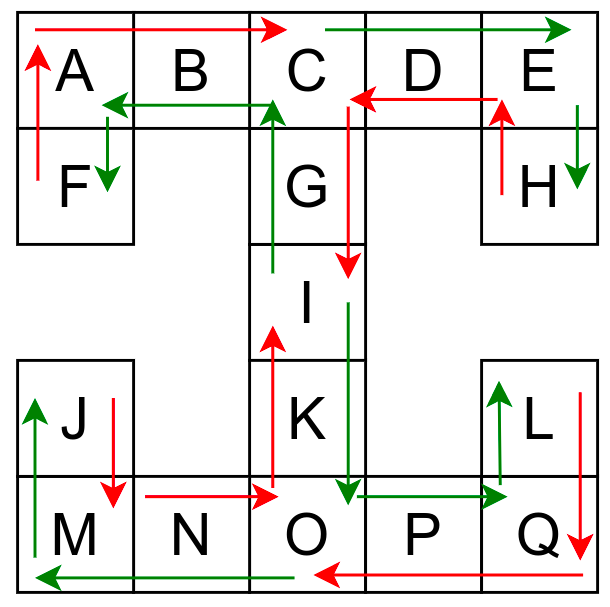
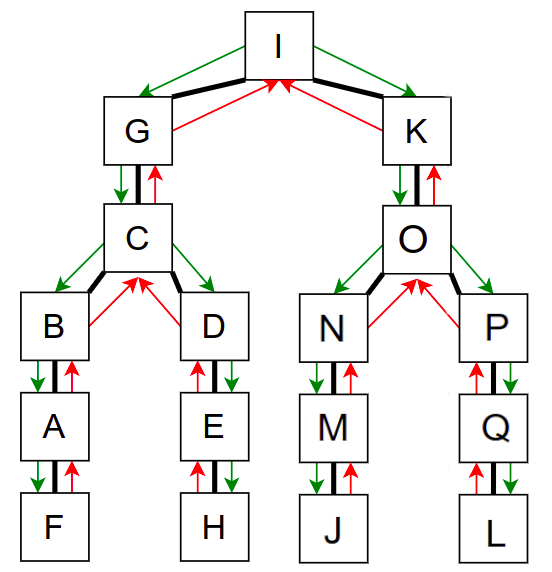
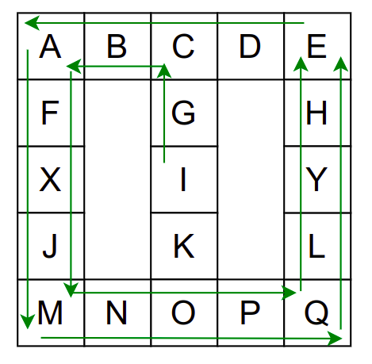
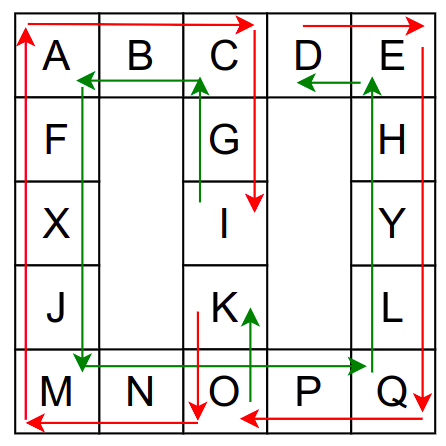
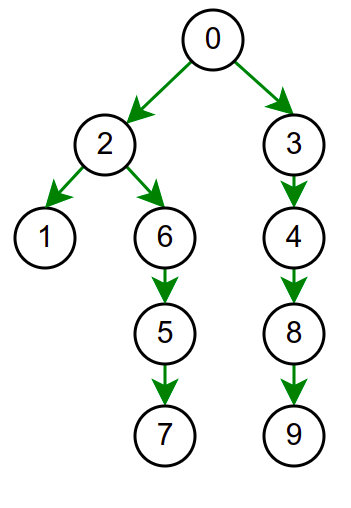
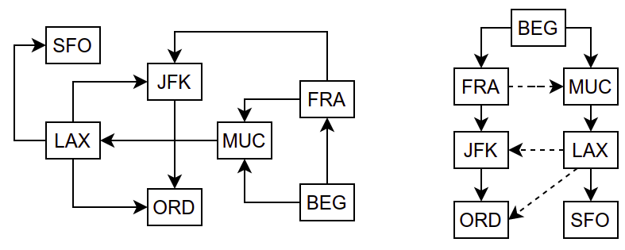

Обилазак графова
================

Основни задаци над графом се често своде на то да се, кренувши од неког
почетног чвора, праћењем грана обиђу сви чворови графа који су
достижни из тог полазног чвора. Ако је неусмерен граф повезан, тиме ће
се обићи сви његови чворови, а ако није, онда ће се обићи компонента
повезаности којој припада почетни чвор.

Примене обилазака графа су многобројне, а неке од њих ћемо видети у
наставку (на пример, одређивање компонената повезаности и тополошко
сортирање).

Постоје два основна алгоритма за обилазак графа: **обилазак у дубину**
(енгл. *depth first*) и **обилазак у ширину** (енгл. *breadth first*).

Обилазак графа у дубину
-----------------------

Обилазак графа у дубину можемо описати тако што размотримо како се
обично крећемо када обилазимо неки музеј. Размотримо мапу музеја
приказану на наредној слици.

    
    Обилазак музеја (зеленим стрелицама је означено куда смо пролазили
    док смо први пут посећивали неке собе (пошавши из собе I), а црвеним 
    куда смо пролазили док смо се враћали кроз собе које смо већ раније
    посетили).

Претпоставимо да обилазак креће из собе I. Један начин да направимо
обилазак је да кренемо на север и редом пролазимо кроз собе G и C,
затим да скренемо на запад и прођемо кроз собе B и A, и затом да
кренемо на југ и дођемо у собу F. Након тога не можемо да идемо даље и
морамо да се враћамо до собе C. Одатле сада можемо да кренемо на исток
кроз собе D и E и затим на југ до собе H. Тада се поново враћамо до
собе C, а затим и до собе I. На веома сличан начин обилазимо и јужни
део музеја и на крају се враћамо до собе I. Ово кретање је приказано и
на следећој анимацији.

.. gallery:: obilazak_muzeja_dfs
    :width: 200px
    :height: 100%
    :folder: ../../_images/4_grafovski/muzej
    :images: muzej0.png, muzej1.png, muzej2.png, muzej3.png, muzej4.png, muzej5.png, muzej6.png, muzej7.png, muzej8.png, muzej9.png, muzej10.png, muzej11.png, muzej12.png, muzej13.png, muzej14.png, muzej15.png, muzej16.png, muzej17.png, muzej18.png, muzej19.png, muzej20.png, muzej21.png, muzej22.png, muzej23.png, muzej24.png, muzej25.png, muzej26.png, muzej27.png, muzej28.png, muzej29.png, muzej30.png, muzej31.png, muzej32.png, muzej33.png, muzej34.png

             
Собе музеја и везе између њих се могу представити неусмереним графом
(у овом случају граф је дрво). На наредној слици је представљен тај
граф и његов обилазак.

    
    Граф који представља музеј. На слици је обележен и обилазак музеја
    (зеленим стрелицама је означено куда смо пролазили док смо први
    пут посећивали неке собе, а црвеним куда смо пролазили док смо се
    враћали кроз собе које смо већ раније посетили).

Поступак који спроводимо приликом доласка у сваку собу се може
рекурзивно описати на следећи начин:

.. code::

   poseti_sobu(s):
       za svaku sobu s' koja je susedna sa sobom s
            poseti_sobu(s')

Ипак, овако једноставан поступак нас неће увек успешно спровести кроз
све собе музеја. Размотримо обилазак музеја који је приказан на
наредној слици.

    
    Обилазак музеја који се никада не зауставља.

Обилазак започињемо из собе I и долазимо до собе C. Након тога крећемо
да пролазимо једну по једну собу по ободу музеја. Пошто никада не
стижемо до краја (из собе F сада можемо да наставимо кретање и дођемо
у собу X, па затим и у собу J), догодиће нам се да ћемо се стално
вртети у круг. Проблем је настао зато што у графу постоји циклус (од C
до C) и наш обилазак креће да кружи дуж тог циклуса.

Проблем можемо решити тако што ћемо памтити које собе смо већ посетили
(као Ивица и Марица који су постављали каменчиће дуж свог пута) и
избегавати да идемо даље у собу у којој смо већ били (у исту собу
можемо доћи само када се враћамо из неке претходне). На тај начин када
дођемо до собе D, нећемо ићи даље у собу C (јер смо у њој већ били),
већ ћемо се вратити назад до собе О из које ћемо имати могућност да
пређемо на север у собу K коју нисмо раније посетили. Из собе K нећемо
ићи даље ка соби I (јер смо у њој већ били) него ћемо се вратити до
собе O из које ћемо се вратити назад све до собе C. Из ње не можемо
ићи у непосећене собе (јер смо собу D већ посетили) тако да се враћамо
назад у собу I из које такође немамо непосећених алтернатива (јер смо
собу K обишли), па завршавамо обилазак.

    
    Обилазак музеја када се избегава прелазак у собе које су већ биле
    посећене.

У наредној анимацији је приказан овај обилазак музеја. Са десне стране
је приказан и граф који одгогвара мапи музеја (са експлицитно
приказаним гранама).
    
.. gallery:: obilazak_muzeja_ciklus_dfs
    :width: 400px
    :height: 100%
    :folder: ../../_images/4_grafovski/muzej_ciklus
    :images: muzej_c0.png, muzej_c1.png, muzej_c2.png, muzej_c3.png, muzej_c4.png, muzej_c5.png, muzej_c6.png, muzej_c7.png, muzej_c8.png, muzej_c9.png, muzej_c10.png, muzej_c11.png, muzej_c12.png, muzej_c13.png, muzej_c14.png, muzej_c15.png, muzej_c16.png, muzej_c17.png, muzej_c18.png, muzej_c19.png, muzej_c20.png, muzej_c21.png, muzej_c22.png, muzej_c23.png, muzej_c24.png, muzej_c25.png, muzej_c26.png, muzej_c27.png, muzej_c28.png, muzej_c29.png, muzej_c30.png, muzej_c31.png, muzej_c32.png, muzej_c33.png, muzej_c34.png, muzej_c35.png, muzej_c36.png, muzej_c37.png, muzej_c38.png

   
Рекурзивни алгоритам који овај пут спроводимо се може описати на следећи начин:

.. code::

   poseti_sobu(s):
       zapamti da si posetio sobu s
       za svaku sobu s' koja je susedna sa sobom s
            ako s' nije posećena:
               poseti_sobu(s')

На основу овог псеудокода могуће је веома једноставно направити и
реалан програмски кôд у језику C#. Претпостављамо да је граф
представљен листама повезаности.

.. activecode:: fun_dfs_rekurz
    :passivecode: true
    :coach:
    :includesrc: _src/4_grafovski/fun_dfs_rekurz.cs

Приликом обиласка графа у исти чвор се можемо вратити више
пута. Најзначајније су нам прва посета (када први пут уђемо у тај
чвор) и последња посета (када напустимо чвор и не враћамо се у њега
након тога). Приликом сваке посете чвору можемо извршити неку обраду
(на пример, исписати назив чвора). Обрада приликом прве посете се
назива **улазна обрада**, а приликом последње посете се назива
**излазна обрада**. Њих је веома једноставно реализовати у склопу
рекурзивне имплементације обиласка у дубину.

.. code::

   poseti_cvor(c):
       zapamti da si posetio cvor c
       izvrsi ulaznu obradu cvora c
       za svaki cvor c' koja je susedan čvoru c
            ako c' nije posećen:
               poseti_cvor(c')
       izvrsi izlaznu obradu cvora c

Улазна и/или излазна обрада се разликују у зависности од примене
(најчешће постоји само једна обрада). У раније приказаном C# коду
улазна обрада је била испис чвора, док је излазна обрада била
изостављена.

Ако претпоставимо да улазна обрада чвора подразумева да се он обоји у
сиву боју, а излазна да се обоји у црну боју, наредне анимације
приказују обилазак у дубину два графа (први је дрво, а други граф који
садржи циклусе.

.. gallery:: obilazak_drveta_dfs
    :width: 400px
    :height: 100%
    :folder: ../../_images/4_grafovski
    :images: dfs_a01.png, dfs_a02.png, dfs_a03.png, dfs_a04.png, dfs_a05.png, dfs_a06.png, dfs_a07.png, dfs_a08.png, dfs_a09.png, dfs_a10.png, dfs_a11.png, dfs_a12.png, dfs_a13.png, dfs_a14.png, dfs_a15.png, dfs_a16.png, dfs_a17.png, dfs_a18.png, dfs_a19.png, dfs_a20.png, dfs_a21.png

.. gallery:: obilazak_grafa_dfs
    :width: 500px
    :height: 100%
    :folder: ../../_images/4_grafovski
    :images: dfs_b01.png, dfs_b02.png, dfs_b03.png, dfs_b04.png, dfs_b05.png, dfs_b06.png, dfs_b07.png, dfs_b08.png, dfs_b09.png, dfs_b10.png, dfs_b11.png, dfs_b12.png, dfs_b13.png, dfs_b14.png, dfs_b15.png, dfs_b16.png, dfs_b17.png, dfs_b18.png, dfs_b19.png, dfs_b20.png, dfs_b21.png

             
Иако је претходни граф садржао циклусе редослед обиласка у дубину
(чворови и зелене стрелице које их спајају) чине дрво. То није
случајно и увек ће се догађати приликом обиласка у дубину. То дрво се
назива **дрво обиласка у дубину** или **ДФС дрво**. Дрво обиласка у
дубину претходног графа је приказано на наредној слици.

Нагласимо да се обиласком у дубину покренутим из неког чвора обилазе
само они чворови који су достижни из тог чвора. Ако је неусмерен граф
који се обилази неповезан, тада ће се обићи само компонента
повезаности којој припада почетни чвор. Ако се жели обилазак целог
графа, обилазак у дубину је потребно покретати више пута (по једном за
сваку компоненту повезаности).
            
Скрећемо ти пажњу на наредни веб-сајт на Математичком факултету:
http://www.matf.bg.ac.rs/~filip/algoritmi/dfs.html. На њему
можеш још мало да утврдиш поступак обиласка графа у дубину, али и да
провериш своје знањe.

Током обиласка у дубину сваки чвор се обилази тачно једном (раније
посећени чворови се прескачу) и током његовог обиласка анализирају се
сви његови суседи. Када се користе листе суседа, сложеност је зато
:math:`O(|V| + |E|)`.

Итеративна имплементација помоћу стека
''''''''''''''''''''''''''''''''''''''

Иако је једноставна за разумевање, мана рекурзивне имплементације је
то што код неких графова може доћи до прекорачења стек-меморије
приликом извршавања програма (то се може десити ако постоји дугачак
низ чворова којим се пролази без враћања уназад). Стога је понекад
потребно направити имплементацију обиласка у дубину која није
рекурзивна. Као што је то и иначе често случај, ослобађање од
рекурзије захтева коришћење структуре података **стек**. Наиме,
рекурзивни позиви користе системски стек рачунара, на који се смештају
параметри актуелних рекурзивних позива (аргументи прослеђени приликом
сваког од рекурзивних позива и вредности локалних променљивих). Уместо
системског стека који и на савременим системима представља веома
ограничену количину меморије (обично је у питању тек неколико
мегабајта) можемо у нашем програму одржавати посебан стек који може да
заузме много више меморијског простора.

Размотримо понашање стека приликом рекурзивног обиласка музеја (чвор
бојимо жуто први пут када уђемо у њега, у склопу улазне обраде, а у
зелено када последњи пут изађемо из њега, у склопу излазне обраде).

.. gallery:: stek_dfs_muzej
    :width: 600px
    :height: 100%
    :folder: ../../_images/4_grafovski/stekA
    :images: stek0.png, stek1.png, stek2.png, stek3.png, stek4.png, stek5.png, stek6.png, stek7.png, stek8.png, stek9.png, stek10.png, stek11.png, stek12.png, stek13.png, stek14.png, stek15.png, stek16.png, stek17.png, stek18.png, stek19.png, stek20.png, stek21.png, stek22.png, stek23.png, stek24.png, stek25.png, stek26.png, stek27.png, stek28.png, stek29.png, stek30.png, stek31.png, stek32.png, stek33.png, stek34.png

Можемо приметити да се на стеку у сваком тренутку налазе сви чворови
на тренутној путањи од корена ДФС дрвета до текућег листа (у музеју су
то собе кроз које смо прошли да бисмо дошли од почетне до текуће
собе). Те информације су нам потребне због враћања унатраг. Наиме,
када из текуће собе не можемо прећи даље у неку непосећену собу, соба
која се на стеку налази испод текуће је она соба из које смо дошли у
текућу собу и у коју треба да се вратимо. Приликом извршавања
рекурзије у сваком чвору се извршава петља у којој се пролази кроз
непосећене суседе тог чвора. Приликом повратка у собу потребно је
извршити наредну итерацију те петље. Стога се у стек оквиру који
одговара соби чува и тренутна вредност бројачке променљиве у склопу те
петље (да би се након повратка у собу та променљива могла увећати и
тако прећи на наредни корак итерације тј. на наредног суседа).

Размотримо сада малу модификацију претходног поступка која ће додатно
олакшати имплементацију решења без петље. Да не бисмо морали да
прекидамо петљу и настављамо њено извршавање после прекида, можемо
програм организовати тако да на стек одмах ставимо све суседе текућег
чвора. Размотримо како би то радило на примеру обиласка музеја.
             

.. gallery:: stek_dfs_muzej_susedi
    :width: 600px
    :height: 100%
    :folder: ../../_images/4_grafovski/stekB
    :images: stekB0.png, stekB1.png, stekB2.png, stekB3.png, stekB4.png, stekB5.png, stekB6.png, stekB7.png, stekB8.png, stekB9.png, stekB10.png, stekB11.png, stekB12.png, stekB13.png, stekB14.png, stekB15.png, stekB16.png, stekB17.png, stekB18.png

Следи опис ове варијанте обиласка у дубину у облику псеудокода.
             
.. code::

   obidji_graf_u_dubinu(c):
       stavi pocetni cvor c na stek
       zapamti da je obilazak cvora c zakazan
       dok se stek ne isprazni:
           skini cvor c sa vrha steka
           izvrsi ulaznu obradu cvora c
           za svaki cvor c' koji je susedan čvoru c
               ako za c' nije zakazan obilazak:
                   stavi cvor c' na stek
                   zapamti da je obilazak cvora c' zakazan

На стеку чувамо чворове које у будућности треба обрадити (када их
ставимо на стек, сматрамо да смо заказали њихову обраду). Чвор
обрађујемо у тренутку када га скидамо са стека. Након тога на стек
стављамо његове суседе за које још није заказан обилазак. 

На основу овог псеудокода веома је једноставно направити
имплементацију у језику C#. Претпостављамо поново да је граф задат
коришћењем листа суседа. Користи се библиотечка имплементација
структуре података стек (класа ``Stack<int>`` која пружа својство
``Count`` за проверу броја елемената који се тренутно налазе на стеку
и методе ``Push`` и ``Pop`` за постављање елемената на врх стека и
скидање елемената са врха стека).
                   
.. activecode:: fun_dfs_nerek
    :passivecode: true
    :coach:
    :includesrc: _src/4_grafovski/fun_dfs_nerek.cs

Приметимо да је редослед постављања суседа на стек обратан у односу на
очекивани редослед њихове обраде (чвор који желимо да буде први
обрађен треба последњи да буде постављен на стек).
                 
У овој варијанти алгоритма је веома једноставно реализовати улазну
обраду чворова (она се врши у тренутку када се чвор скида са
стека). Што се тиче излазне обраде, није на први поглед јасан тренутак
у ком би она требало да буде извршена. Један начин да се то поправи је
да се приликом обраде чвора, непосредно пре стављања његових суседа на
стек, на стек стави посебна ознака која нам говори да је потребно
извршити излазну обраду текућег чвора (пробајте за вежбу да ово
имплементирате у језику C#).

Асимптотска сложеност ове имплементације је :math:`O(|V| + |E|)`.

Обилазак графа у ширину
-----------------------

Основна предност обиласка у ширину у односу на обилазак у дубину је то
што се чворови обилазе у редоследу њиховог растојања од почетног
чвора. Прво се посети почетни чвор (он је на растојању 0), затим
његови суседи (они су на растојању 1), затим њихови раније непосећени
суседи (они су на растојању 2) и тако даље. На пример, ако граф
представља летове између аеродрома, обиласком у ширину биће пронађен
пут од почетног до свих других аеродрома који нам гарантује најмање
преседања.

На наредној слици су приказани летови између неколико аеродрома у
Европи и САД и обилазак тог графа у ширину.

    
    Усмерен граф којим су описани летови између аеродрома. На слици
    десно аеродроми су поређани у односу на број преседања од полазног
    београдског аеродрома. Обиласком у ширину би се прво посетио
    београдски аеродром (BEG), затим аеродроми у Михнену (MUC) и
    Франкфурту (FRA) до којих се може стићи помоћу једног лета, затим
    аеродроми у Њујорку (JFK) и Лос Анђелесу (LAX) до којих се може
    стићи помоћу два лета и на крају аеродроми у Чикагу (ORD) и Сан
    Франциску (SFO) до којих је потребно три лета.

Када се приликом обиласка графа тражи чвор који задовољава неко
својство, обилак у ширину нам гарантује да ће прво бити пронађен онај
такав чвор који је најближи почетном.

Имплементација обиласка у ширину се врши веома слично као нерекурзивна
имплементација обиласка у дубину. Једина разлика је у томе што
обилазак у дубину користи структуру података **стек**, а обилазак у
ширину структуру података **ред**. Наиме, главна разлика је у
редоследу обраде чворова који су заказани да треба буду
обрађени. Претпоставимо да почетни чвор A има два суседа, B и C.
Приликом обиласка у дубину, након скидања чвора A са стека на стек се
стављају C и B. Обрада чвора B подразумева његово скидање са стека и
замену његовим суседима. Пошто се они на стек постављају изнад чвора C
они ће бити обрађени пре чвора C што значи да се на обраду чвора C не
прелази све док се не обраде сви чворови који су доступни из чвора B,
а они могу бити много даљи од полазног чвора него што је чвор C. Да бисмо
постигли да чвор C буде обрађен пре њих, потребно је употребити
структуру података која обезбеђује да се чворови ваде у истом
редоследу у ком су додани, а то је управо FIFO (first-in-first-out)
ред.

Следи опис обиласка у ширину у облику псеудокода.
             
.. code::

   obidji_graf_u_sirinu(c):
       dodaj pocetni cvor c u red 
       zapamti da je obilazak cvora c zakazan
       dok se red ne isprazni:
           skini cvor c sa pocetka reda
           izvrsi ulaznu obradu cvora c
           za svaki cvor c' koja je susedan čvoru c
               ako za c' nije zakazan obilazak:
                   dodaj cvor c' u red
                   zapamti da je obilazak cvora c' zakazan

У наредној анимацији приказано је како би се граф музеја обилазио у
ширину. Приметимо да се собе обилазе у растућем редоследу растојања од
почетне собе I. Прво се обилази соба I, затим собе G и K, које су на
растојању 1 од ње, затим собе C и O на растојању 2, затим собе B, D, N
и P на растојању 3, па собе A, E, M и Q на растојању 4 и на крају собе
F, H, J и L које су на растојању 5. Наравно, овакав обилазак физички
није могућ (јер не можемо да се телепортујемо из једне у другу собу),
али се може спровести у рачунару. Приказано је и стање реда у сваком
кораку. Основни корак алгоритма је да се елемент избаци из реда, а да
се уместо њега убаце његови суседи (у анимацији су они приказани
плавом бојом).

.. gallery:: red_bfs_muzej
    :width: 600px
    :height: 100%
    :folder: ../../_images/4_grafovski/red
    :images: red0.png, red1.png, red2.png, red3.png, red4.png, red5.png, red6.png, red7.png, red8.png, red9.png, red10.png, red11.png, red12.png, red13.png, red14.png, red15.png, red16.png, red17.png, red18.png, red19.png, red20.png, red21.png, red22.png, red23.png, red24.png, red25.png, red26.png, red27.png, red28.png, red29.png, red30.png, red31.png, red32.png, red33.png, red34.png
             

У наредним анимацијама је приказан обилазак у ширину два графа (први
је дрво, а други садржи циклусе). Чвор се боји у сиво у тренутку када
се додаје у ред, а у црно када су сви његови суседи додати у ред.
               
.. gallery:: obilazak_drveta_bfs
    :width: 400px
    :height: 100%
    :folder: ../../_images/4_grafovski
    :images: bfs_a01.png, bfs_a02.png, bfs_a03.png, bfs_a04.png, bfs_a05.png, bfs_a06.png, bfs_a07.png, bfs_a08.png, bfs_a09.png, bfs_a10.png, bfs_a11.png, bfs_a12.png, bfs_a13.png, bfs_a14.png, bfs_a15.png, bfs_a16.png, bfs_a17.png, bfs_a18.png, bfs_a19.png, bfs_a20.png, bfs_a21.png

.. gallery:: obilazak_grafa_bfs
    :width: 500px
    :height: 100%
    :folder: ../../_images/4_grafovski
    :images: bfs_b01.png, bfs_b02.png, bfs_b03.png, bfs_b04.png, bfs_b05.png, bfs_b06.png, bfs_b07.png, bfs_b08.png, bfs_b09.png, bfs_b10.png, bfs_b11.png, bfs_b12.png, bfs_b13.png, bfs_b14.png, bfs_b15.png, bfs_b16.png, bfs_b17.png, bfs_b18.png, bfs_b19.png, bfs_b20.png, bfs_b21.png

На основу овог псеудокода веома је једноставно направити
имплементацију у језику C#. Претпостављамо поново да је граф задат
коришћењем листа суседа. Користи се библиотечка имплементација
структуре података ред (класа ``Queue<int>`` која пружа својство
``Count`` за проверу броја елемената који се тренутно налазе у реду и
методе ``Enqueue`` и ``Dequeue`` за постављање елемената на крај реда
и узимање елемената са почетка реда.
                   
.. activecode:: fun_bfs
    :passivecode: true
    :coach:
    :includesrc: _src/4_grafovski/fun_bfs.cs

Пошто се сваки чвор тачно једном додаје у ред и тачно једном уклања из
реда и пошто се свака грана обрађује тачно једном сложеност овог
алгоритма је иста као и сложеност обиласка у дубину :math:`O(|V| +
|E|)`, под претпоставком да се користе листе суседа.
                 
Комплетан програм, у коме се види учитавање графа тј. његових листа
суседа и покретање обиласка у ширину из функције ``Main`` је дат у
наставку. Програм обилази и исписује само оне чворове који су достижни
из почетног чвора.

.. activecode:: bfs_komplet
    :passivecode: true
    :coach:
    :includesrc: _src/4_grafovski/bfs.cs

Скрећемо ти пажњу на наредни веб-сајт на Математичком факултету:
http://www.matf.bg.ac.rs/~filip/algoritmi/bfs.html. На њему можеш још
мало да утврдиш поступак обиласка графа у ширину, али и да провериш
своје знањe.
                 
