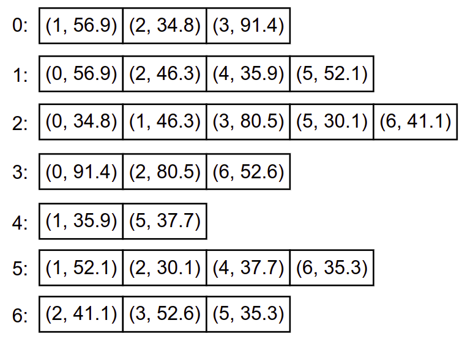

Представљање графова у рачунару
===============================

Два најчешћа начина представљања графова су преко *матрице суседства*
и преко *листа суседства*.

Матрица повезаности (суседства)
-------------------------------

Нека је :math:`V=\{v_1,v_2,\ldots,v_n\}`.  **Матрица повезаности**
тј. **матрица суседства** графа :math:`G = (V, E)` је квадратна
матрица :math:`A=(a_{ij})` реда :math:`n`, са елементима
:math:`a_{ij}` који су једнаки 1 ако и само ако :math:`(v_i,v_j)\in
E`; остали елементи матрице :math:`A` су једнаки 0. Уместо јединица и
нула могу се користити логичке вредности тачно и нетачно. Врста
:math:`i` ове матрице је дакле низ дужине :math:`n` чија је
:math:`j`-та координата једнака :math:`1` (или :math:`\top`) ако из
чвора :math:`v_i` постоји грана ка чвору :math:`v_j`, односно
:math:`0` (или :math:`\bot`) у противном.

Размотримо представљање графа пријатељстава на једној друштвеној мрежи
матрицом повезаности.

.. figure:: ../../_images/4_grafovski/fejsbuk.png
    :width: 300px
    :align: center
            
    Праћења на мрежи Фејсбук
    
Ако претпоставимо да су чворови нумерисани на следећи начин: `0 -
Пера`, `1 - Мика`, `2 - Ана`, `3 - Јована`, тада се граф пријатељства
приказан на слици може представити матрицом

.. math::

   \left(
   \begin{array}{cccc}
   0 & 1 & 1 & 0\\
   1 & 0 & 1 & 1\\
   1 & 1 & 0 & 1\\
   0 & 1 & 1 & 0
   \end{array}
   \right)

Ако је граф неусмерен (као у претходном примеру), матрица :math:`A` је
симетрична (око главне дијагонале) и у том случају је могуће памтити
само једну њену половину (горњи или доњи троугао).

Матрицом се могу представљати и усмерени графови. Размотримо поново
пример графа којим се представљају праћења на једној друштвеној мрежи.

.. figure:: ../../_images/4_grafovski/instagram1.png
    :width: 300px
    :align: center
    
    Праћења на мрежи Инстаграм

Он се може представити наредном матрицом (која није симетрична):

.. math::

   \left(
   \begin{array}{cccc}
   0 & 1 & 1 & 0\\
   0 & 0 & 0 & 1\\
   0 & 1 & 0 & 1\\
   1 & 0 & 1 & 0
   \end{array}
   \right)

Ако је :math:`n` број чворова графа, и ако користимо логичке
вредности, у језику C# можемо употребити следећу меморијску
репрезентацију матрице повезаности (без озбира на то да ли је она
симетрична или није).

.. activecode:: MatricaPovezanosti
    :passivecode: true
    :coach:

    bool[,] A = new bool[n, n];

Претпоставимо да се матрица учитава са стандардног улаза, тако што се
прво учитава њена димензија, а затим и матрица задата нулама и
јединицама раздвојеним по једним размаком. На пример,

.. code::

   4 
   0 1 0 1
   1 0 1 0
   0 1 0 1
   1 0 1 0
   

Матрица се тада може учитати помоћу следеће функције.

.. activecode:: MatricaPovezanostiUcitavanje1
    :passivecode: true
    :coach:

    static bool[,] UcitajGraf()
    {
       int n = int.Parse(Console.ReadLine());
       bool[,] A = new bool[n, n];
       for (int i = 0; i < n; i++)
       {
           string[] str = Console.ReadLine().Split();
           for (int j = 0; j < n; j++)
              A[i, j] = int.Parse(str[j]) == 1;
       }
       return A;
    }

Уместо задавања графа матрицом на улазу, граф се често задаје тако што
се наведу његове гране. На пример, ако се претпостави да су чворови
нумерисани бројевима од :math:`1` до :math:`n`, тада се оријентисани
граф праћења може представити на следећи начин (прво се задаје број
чворова, затим број грана и на крају подаци о појединачним гранама).

.. code::

   4
   7
   1 2
   1 3
   2 4
   3 1
   3 4
   4 0
   4 2

Прикажимо сада функцију која на основу оваквог улаза у меморији креира
матрицу повезаности усмереног графа.

.. activecode:: MatricaPovezanostiUcitavanje2
    :passivecode: true
    :coach:

    static bool[,] UcitajGraf()
    {
       int n = int.Parse(Console.ReadLine()); // broj cvorova
       int m = int.Parse(Console.ReadLine()); // broj grana
       bool[,] A = new bool[n, n]; // sve je inicijalizovano na false
       for (int i = 0; i < m; i++)
       {
           string[] str = Console.ReadLine().Split();
           int a = int.Parse(str[0]);
           int b = int.Parse(str[1]);
           A[a-1, b-1] = true;
       }
       return A;
    }

Приметимо да смо због нумерације чворова која почиње од 1, а не од 0,
учитане индексе чворова грана ``a`` и ``b`` умањивали за 1 пре
приступа пољу матрице. У задацима се често среће и нумерација која
креће од 0 и нумерација која креће од 1, па је потребно обратити пажњу
на овај детаљ.
    
Ако се претпоставља да је граф неусмерен, тада за сваку учитану
неусмерену грану два симетрично постављена елемента матрице треба
поставити на вредност ``true`` (за сваку неусмерену грану додају се
обе усмерене гране које јој одговарају).

.. activecode:: MatricaPovezanostiUcitavanje2neusmeren
    :passivecode: true
    :coach:

    static bool[,] UcitajGraf()
    {
       int n = int.Parse(Console.ReadLine()); // broj cvorova
       int m = int.Parse(Console.ReadLine()); // broj grana
       bool[,] A = new bool[n, n]; // sve je inicijalizovano na false
       for (int i = 0; i < m; i++)
       {
           string[] str = Console.ReadLine().Split();
           int a = int.Parse(str[0]);
           int b = int.Parse(str[1]);
           A[a-1, b-1] = true;
           A[b-1, a-1] = true;
       }
       return A;
    }

Сложеност основних операција
............................

Основна лоша страна коришћења матрица повезаности је то што оне увек
заузимају простор величине :math:`O(|V|^2)`, где је :math:`|V|` број
чворова графа, независно од тога колико грана има граф. Ако је број
грана у графу мали (за такве графове кажемо да су ретки), већина
елемената матрице повезаности биће нуле и ова репрезентација је
изразито меморијски неефикасна (јако велике графове уопште није могуће
репрезентоватаи на овај начин).

Сложеност операције испитивања да ли су два чвора у графу повезана је
:math:`O(1)`, јер се она одређује провером једног елемента матрице.

Са друге стране, сложеност одређивања свих суседа датог чвора, која је
у применама веома честа, је :math:`O(|V|)`, јер се она реализује
проласком кроз одговарајућу врсту или колону матрице.

.. activecode:: SviSusedi
    :passivecode: true
    :coach:

    // ispis svih suseda cvora i
    for (int j = 0; j < n; j++)
        if (A[i, j])
           Console.WriteLine(j);

Сложеност операција додавања и уклањања неке гране из графа је
:math:`O(1)`, јер се оне реализују изменог једног елемента матрице.

Операције које захтевају пролазак кроз све елементе матрице су веома
неефикасне (сложеност им је :math:`O(|V|^2)`). Као што је то обично
случај у раду са матрицама, обилазак врсту по врсту је често
ефикаснији него колону по колону (захваљујући томе што се у меморији
рачунара матрице најчешће чувају по врстама и томе што се наредни
елементи текуће врсте често налазе у кеш-меморији којој се брзо
приступа).

Пример обраде графа представљеног матрицом повезаности
......................................................

.. questionnote::

   Претпоставимо да је (усмерени) граф праћења на једној друштвеној
   мрежи задат матрицом повезаности. Елемент :math:`a_{ij}` има
   вредност тачно ако и само ако особа :math:`i` прати особу
   :math:`j`. Дефинисати функцију које одређује листу редних бројева
   корисника са највише пратилаца, и функцију која одређује листу
   редних бројева корисника који прате највише других.

Да бисмо одредили кориснике који имају највише пратилаца, прво
одређујемо број пратилаца сваког појединачног корисника (рачунамо
излазне степене чворова). Те податке можемо да чувамо у једном
низу. Све елементе низа иницијализујемо на нулу, затим угнежђеним
петљама пролазимо кроз све елементе матрице суседства и за сваку везу
од особе :math:`i` до особе :math:`j` увећавамо број пратилаца особе
:math:`j`. Након одређивања броја пратилаца сваке особе одређујемо
максимум тог низа тј. максималан број пратилаца неког
корисника. На крају, одређујемо оне кориснике који имају тај
максималан број пратилаца. Пошто њих може бити више, све их смештамо у
листу коју враћамо као резултат функције.
   
.. activecode:: KorisniciSaNajvisePratilaca
    :passivecode: true
    :coach:

    static List<int> KorisniciSaNajvisePratilaca(bool[,] A, int n)
    {
        // odredjujemo broj pratilaca svakog korisnika
        int[] brojPratilaca = new int[n];
        for (int i = 0; i < n; i++)
            for (int j = 0; j < n; j++)
                if (A[i, j])
                    brojPratilaca[j]++;
        // odredjujemo najveci broj pratilaca nekog korisnika
        int maks = brojPratilaca.Max();
        // izdvajamo sve korisnike koji imaju taj maksimalni broj pratilaca
        var korisnici = new List<int>();
        for (int i = 0; i < n; i++)
            if (brojPratilaca[i] == maks)
                korisnici.Add(i);
        return korisnici;
    }

Друга функција је веома слична првој. Једина разлика је што се за
сваку особу не одређује број пратилаца, већ број корисника које она
прати. 
    
.. activecode:: KorisniciKojiNajvisePrate
    :passivecode: true
    :coach:

    static List<int> KorisniciKojiNajvisePrate(bool[,] A, int n)
    {
        int[] brojPracenih = new int[n];
        for (int i = 0; i < n; i++)
            for (int j = 0; j < n; j++)
                if (A[i, j])
                    brojPracenih[i]++;
        int maks = brojPracenih.Max();
        var korisnici = new List<int>();
        for (int i = 0; i < n; i++)
            if (brojPracenih[i] == maks)
                korisnici.Add(i);
        return korisnici;
    }
                
Нагласимо да се у овом задатку претпостављало да је граф већ
представљен матрицом у меморији рачунара. Задаци који се своде на
анализу степена чворова се често могу решити и без експлицитног
представљања графа, јер се степени чворова могу израчунати током
учитавања графа (приликом учитавања података о грани која спаја
чворове :math:`a` и :math:`b` увећава се излазни степен чвора
:math:`a` и улазни степен чвора :math:`b`).

    
Предстваљање тежинских графова матрицом тежина
----------------------------------------------

Матрична репрезентација се веома често користи и за представљање
тежинских графова тако што се на месту :math:`(i, j)` поставља
вредност :math:`a_{ij}` која представља тежину гране између чворова
:math:`i` и :math:`j` (претпостављамо да су чворови нумерисани
вредностима од :math:`0` до :math:`n-1`). Ако између два чвора не
постоји грана у матрицу се описује нека специјална вредност која
обично представља :math:`\infty` (то може бити 0, -1, највећи број
који се може представити помоћу одговарајућег целобројног типа ако су
тежине целобројне или вредност :math:`+\infty` ако се користи реални
тип који обично има могућност експлицитног представљање те вредности).

.. figure:: ../../_images/4_grafovski/vojvodina_deo.png
    :width: 500px
    :align: center
    
    Део мреже путева у Војводини

Претпоставимо да смо места у Војводини обележили редом бројевима `0 -
Суботица`, `1 - Сомбор`, `2 - Бачка Топола`, `3 - Кикинда`, `4 -
Оџаци`, `5 - Врбас` и `6 - Бечеј`. Део мреже путева између ових
градова се тада може представити следећом матрицом.

.. math::

   \left(
   \begin{array}{ccccccc}
   0,0 & 56,9 & 34,8 & 91,4 & +\infty & +\infty & +\infty\\
   56,9 & 0,0 & 46,3 & +\infty & 35,9 & 52,1 & +\infty\\
   34,8 & 46,3 & 0,0 & 80,5 & +\infty & 30,1 & 41,1 \\
   91,4 & +\infty & 80,5 & 0,0 & +\infty & +\infty & 52,6 \\
   +\infty & 35,9 & +\infty & +\infty & 0,0 & 37,7 & +\infty\\
   +\infty & 52,1 & 30,1 & +\infty & 37,7 & 0,0 & 52,6\\
   +\infty & +\infty & 41,1 & 52,6 & +\infty & 52,6 & 0,0
   \end{array}
   \right)

Пошто је граф неусмерен, матрица је симетрична.

Сложеност основних операција
............................

Све особине коришћења матрице повезаности се преносе и на случај
тежинских графова. Меморијска сложеност ове репрезентације је
:math:`O(|V|^2)`, без обзира на број грана. Обилазак целе матрице
захтева време :math:`O(|V|^2)`. Проналажење свих суседа датог чвора
захтева анализу целе врсте (или колоне) и сложености је :math:`O(|V|)`.
Са друге стране, читање или измена тежине било које појединачне гране
је операција сложености :math:`O(1)`.

Пример обраде графа представљеног матрицом тежина
.................................................

.. questionnote::

   Авиони лете између аеродрома и позната су времена летова између
   аеродрома. За сваки аеродром одредити време најкраћег лета до неког
   другог аеродрома (без преседања). Претпоставити да су времена
   летова задата матрицом неусмереног тежинског графа.

Илустрације ради, прикажимо прво део програма који учитава податке о
летовима и формира матрицу тежинског графа. Претпоставићемо да се подаци
учитавају у следећем формату:

.. code::

   5
   4
   0 1 1:25
   0 2 2:13
   1 4 3:17
   2 4 2:53

Прво се учитава број аеродрома, затим број летова, а затим подаци о
појединачним летовима: редни бројеви полазног и долазног аеродрома и
време трајања лета. Претпоставићемо да се у матрицу уписује -1 за све
аеродроме између којих не постоји лет. Једноставности ради уместо
времена лета у сатима и минутима, у матрици ћемо памтити само времена
летова у минутима. Дакле, од учитаних података треба формирати наредну
матрицу:

.. math::

   \left(
   \begin{array}{ccccc}
   -1 & 85 & 133 & -1 & -1\\
   85 & -1 & -1 & -1 & 197\\
   133 & -1 & -1 & -1 & 173\\
   -1 & -1 & -1 & -1 & -1\\
   -1 & 197 & 173 & -1 & -1
   \end{array}
   \right)

   
.. activecode:: NajkraciLetoviUcitavanje
    :passivecode: true
    :coach:

    static int[,] UcitajLetove()
    {
        int n = int.Parse(Console.ReadLine());
        int[,] A = new int[n, n];
        for (int i = 0; i < n; i++)
            for (int j = 0; j < n; j++)
                A[i, j] = -1;
        int m = int.Parse(Console.ReadLine());
        for (int i = 0; i < m; i++) {
            string[] str = Console.ReadLine().Split(' ', ':');
            int a = int.Parse(str[0]);
            int b = int.Parse(str[1]);
            int hh = int.Parse(str[2]);
            int mm = int.Parse(str[3]);
            int t = hh*60 + mm;
            A[a, b] = t;
            A[b, a] = t;
        }
        return A;
    }
       

Прикажимо сада функцију којом се за сваки аеродром одређује најкраћи
лет. Ово се заснива на томе да се у свакој врсти матрице одреди
најмања бројевна вредност која је различита од -1. Пошто је матрица
симетрична, уместо врста је могуће обрађивати и колоне (али то је по
правилу неефикасније).

    
.. activecode:: NajkraciLetovi
    :passivecode: true
    :coach:
   
    static int[] NajkraciLetovi(int[,] A, int n)
    {
        int[] letovi = new int[n];
        for (int i = 0; i < n; i++) {
            int mint = -1;
            for (int j = 0; j < n; j++)
                if (A[i, j] != -1)
                    if (mint == -1 || A[i, j] < mint)
                        mint = A[i, j];
            letovi[i] = mint;
        }
        return letovi;
    }

Представљање графа помоћу листа суседа чворова
----------------------------------------------

Уместо да се и све непостојеће гране експлицитно представљају у
матрици повезаности, за сваку врсту :math:`i=1,2,\ldots,n` може се
формирати повезана листа оних позиција из :math:`i`-те врсте на којима се
налазе јединице. Дакле, сваком чвору придружује се листа (или низ),
која садржи бројеве чворова који су суседни том чвору (односно гране
ка суседним чворовима). Граф је представљен низом листа
(тј. низова). Овај начин представљања графа зове се представљање
помоћу **листа суседа**, односно **листа повезаности**.

На пример, усмерен граф приказан на слици се може представити
следећим листама суседа.

.. figure:: ../../_images/4_grafovski/liste_povezanosti.png
    :width: 400px
    :align: center

    Представљање усмереног графа листама суседа
            
Треба напоменути да иако име тако сугерише, имплементација овакве
репрезентације графа не мора бити заснована на листама, већ се уместо
повезаних листи може користити низ или нека врста балансираних
бинарних дрвета или пак хеш табела (чиме се омогућава ефикасна
претрага свих суседа).

У језику C# можемо употребити следећу имплементацију засновану на
коришћењу проширивих низова (``List<int>``). Наредни кôд гради празне
листе суседа.

.. activecode:: ListeSusedaAlokacija
    :passivecode: true
    :coach:
   
    List<int>[] susedi = new List<int>[n];
    for (int cvorOd = 0; cvorOd < n; cvorOd++)
         susedi[cvorOd] = new List<int>();

Нову усмерену грану која спаја два чвора (``cvorOd`` и ``cvorDo``)
тада можемо додати помоћу:

.. activecode:: ListeSusedaDodavanjeGrane
    :passivecode: true
    :coach:

    susedi[cvorOd].Add(cvorDo);

Ако је граф неусмерен, тада се за сваку неусмерену грану која спаја
два чвора (``cvorA`` и ``cvorB``) додају два податка:

.. activecode:: ListeSusedaDodavanjeGraneNeusmereno
    :passivecode: true
    :coach:

    susedi[cvorA].push_back(cvorB);
    susedi[cvorB].push_back(cvorA);

Итерацију кроз све суседе чвора можемо остварити помоћу:

.. activecode:: ListeSusedaIteracija
    :passivecode: true
    :coach:
   
    foreach (int cvorDo in susedi[cvorOd])
        ...

Прикажимо сада функцију која на основу учитаног списка грана
оријентисаног графа формира његову репрезентацију у облику листа
суседа. Претпоставићемо да се прво учитава број чворова, затим број
грана и након тога подаци о појединачним гранама. На пример:

.. code::

   4
   7
   1 2
   1 3
   2 4
   3 1
   3 4
   4 0
   4 2

Функција која учитава граф би се тада могла дефинисати на следећи начин:

.. activecode:: ListeSusedaUcitavanje
    :passivecode: true
    :coach:
   
    static List<int>[] UcitajGraf()
    {
       int n = int.Parse(Console.ReadLine());
       List<int>[] susedi = new List<int>[n];
       for (int cvorOd = 0; cvorOd < n; cvorOd++)
          susedi[cvorOd] = new List<int>();
       int m = int.Parse(Console.ReadLine());
       for (int i = 0; i < m; i++)
       {
          string[] str = Console.ReadLine().Split();
          int cvorOd = int.Parse(str[0]);
          int cvorDo = int.Parse(str[1]);
          susedi[cvorOd].Add(cvorDo);
       }
       return susedi;
    }

Да је у питању неусмерен граф, за сваку грану (a,b) би требало додати
елементе у две листе (чвор a у листу суседа чвора b и чвор b у листу
суседа чвора a)
        
Сложеност основних операција
............................
        
Меморијска сложеност репрезентације помоћу листа суседа је
:math:`O(|V| + |E|)`, где је :math:`|V|` број чворова, а :math:`|E|`
број грана графа (чувамо :math:`|V|` листа које укупно садрже
:math:`|E|` елемената). У случају ретких графова (графова код којих је
број грана мали) ово може бити много ефикасније него у случају матрица
суседа. Ретки графови се веома често срећу у пракси. На пример, иако
друштвене мреже имају стотине милиона, па и милијарде корисника, сваки
корисник обично остварује везе тек са неколико десетина или стотина
других, па је укупан број грана баш много мањи од квадрата броја
чворова. Такве графове заправо није ни могуће репрезентовати помоћу
матрице и за њих се користи репрезентација помоћу листа повезаности.

Најдужа листа суседа неког чвора може бити дужине :math:`|V|` (ако су
сви чворови суседи неког чвора). Зато је сложеност провере да ли су
два задата чвора повезана :math:`О(|V|)` (ова операција се обично врши
линеарном претрагом листе суседа једног од датих чворова).

.. activecode:: ListeSusedaProveraPovezanosti
    :passivecode: true
    :coach:

    // provera da li su cvorovi i i j povezani
    bool povezani(int i, int j)
    {
        foreach (int sused in susedi[i])
           if (sused == j)
              return true;
        return false;
    }

Приметимо да је то спорије него код матрице, где је то операција
константне сложености. Са друге стране сложеност итерације кроз све
суседе неког чвора, што је често основни корак алгоритама за обраду
графова има сложеност :math:`O(|S|)`, где је :math:`S` скуп суседа тог
чвора. Када је број суседа мали, ово може бити значајно ефикасније
него :math:`O(|V|)`, што је сложеност ове операције у случају
коришћења матрице суседа.

Репрезентација тежинског графа листама повезаности
--------------------------------------------------

И тежински графови могу бити ретки и тада их је боље представити
листама повезаности него матрицом. У том случају листа повезаности
сваког чвора садржи уређени пар који садржи индекс суседног чвора и
тежину гране. На пример, граф путева између градова `0 - Суботица`,
`1 - Сомбор`, `2 - Бачка Топола`, `3 - Кикинда`, `4 - Оџаци`, `5 -
Врбас` и `6 - Бечеј` би се могао представити листама на следећи начин.

.. figure:: ../../_images/4_grafovski/vojvodina_deo.png
    :width: 500px
    :align: center
    
    Део мреже путева у Војводини

    
    Листе повезаности тежинског графа

   
Прикажимо сада програм који учитава неусмерени тежински граф и формира
овакву репрезентацију. Можемо претпоставити да је сваки уређени пар
задат посебно дефинисаном структуром (а можемо употребити и тип
``Tuple``).  Претпоставићемо да је на улазу дат број чворова, број
грана и зати подаци о појединачним гранама. На пример:

.. code::

   7
   12
   0 1 56.9
   0 2 34.8
   0 3 91.4
   1 2 46.3
   1 4 35.9
   1 5 52.1
   2 3 80.5
   2 5 30.1
   2 6 41.1
   3 6 52.6
   4 5 37.7
   5 6 35.3
   

.. activecode:: UcitavanjeTezinskog
    :passivecode: true
    :coach:

    struct Grana
    {
        public int cvorDo;
        public double tezina;
    }

    List<Grana>[] UcitajGraf()
    {
        int n = int.Parse(Console.ReadLine());
        var susedi = new List<Grana>[n];
        for (int i = 0; i < n; i++)
           susedi[i] = new List<Grana>();
        int m = int.Parse(Console.ReadLine());
        for (int i = 0; i < m; i++)
        {
           string[] str = Console.ReadLine().Split();
           int cvorA = int.Parse(str[0]);
           int cvorB = int.Parse(str[1]);
           double tezina = double.Parse(str[2]);
           
           Grana granaDoB;
           granaDoB.cvorDo = cvorB;
           grana.tezina = tezina;
           susedi[cvorA].add(granaDoB);
           
           Grana granaDoA;
           granaDoA.cvorDo = cvorA;
           grana.tezina = tezina;
           susedi[cvorB].add(granaDoA);
        }
        return susedi;
    }

Имплицитна репрезентација
-------------------------

У неким примерима граф се не представља експлицитно, већ само
имплицитно. Најчећши примери тог типа су матрице. Наиме, свако поље
матрице се може представити неким чвором графа, док се гране графа
успостављају измећу оних чворова који представљају суседна поља
матрице (при чему свако унутрашње поље матрице може имати или четири
суседа или осам суседа, у зависности од тога да ли су дозвољени
дијагонални прелази). Уместо да се за сваки чвор експлицитно чувају
листе суседа, те листе се не памте у меморији рачунара, а обилазак
свих суседа се врши петљама које израчунавају координате суседних поља
на основу познатих координата текућег поља.

Набрајање 8 суседних поља се врши на следећи начин.

.. code::

   for (int dv = -1; dv <= 1; dv++)
      for (int dk = -1; dk <= 1; dk++) {
          if (dv == 0 && dk == 0)
             continue;
          int vv = v + dv;
          int kk = k + dk;
          if (0 <= vv && vv < m && 0 <= kk && kk < n)
              // polje (vv, kk) je sused polju (v, k)
      }

Ако се матрицом представе поља шаховске табле по којој се креће
скакач, тада се суседна поља могу обићи на следећи начин.

.. code::

   int[] dv = {-2, -2, -1, -1, +1, +1, +2, +2};
   int[] dk = {-1, +1, -2, +2, -2, +2, -1, +1};
   for (int i = 0; i < 8; i++)
   {
          int vv = v + dv[i];
          int kk = k + dk[i];
          if (0 <= vv && vv < m && 0 <= kk && kk < n)
              // polje (vv, kk) je sused polju (v, k)
   }
