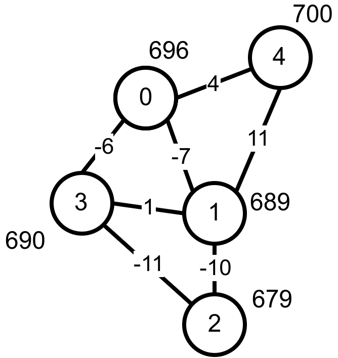
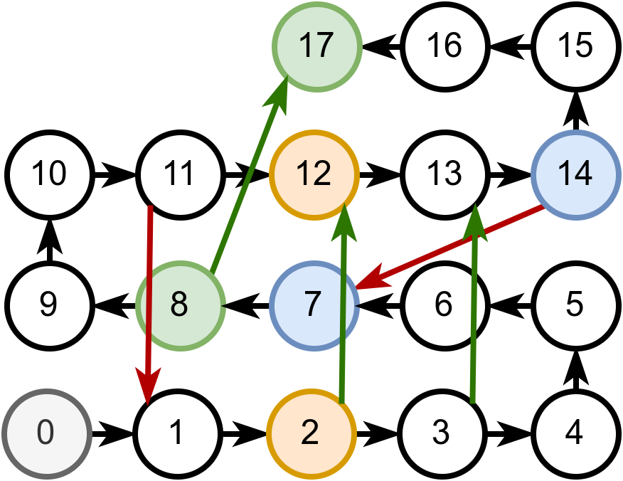
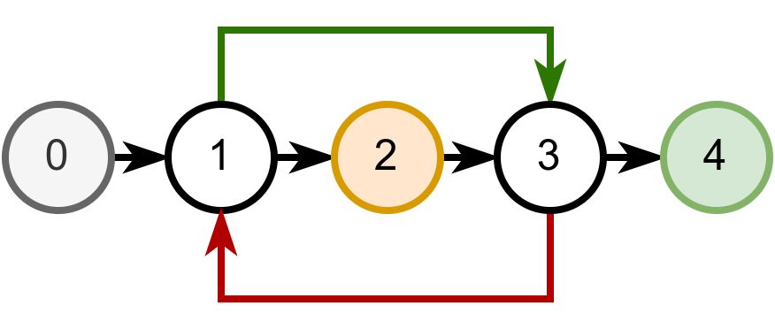
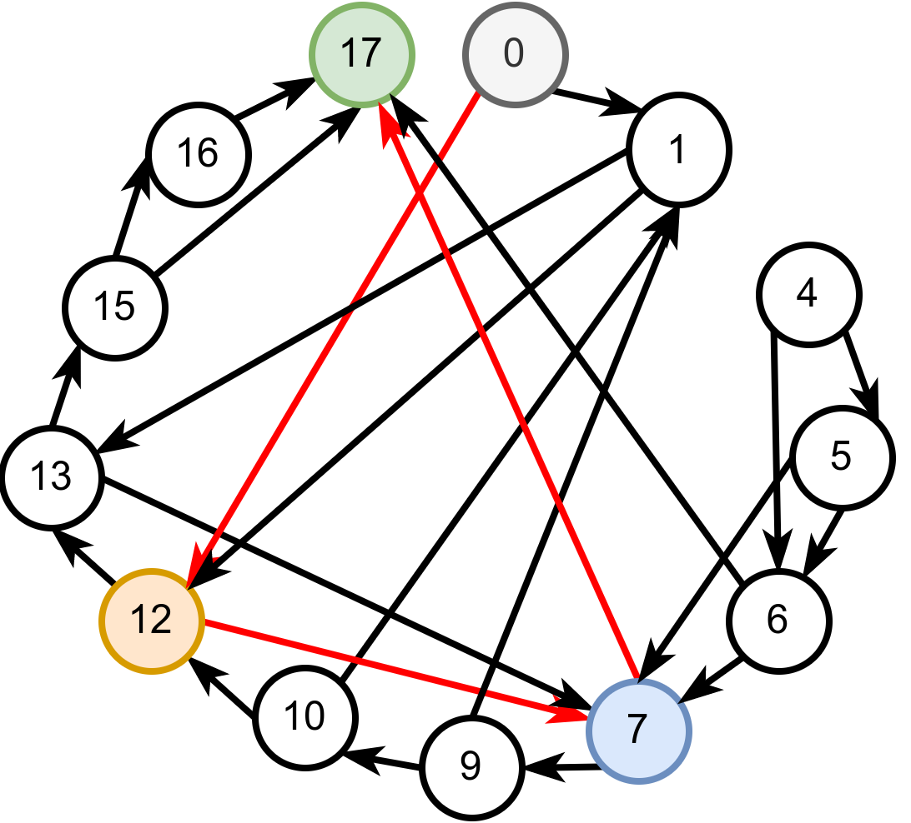
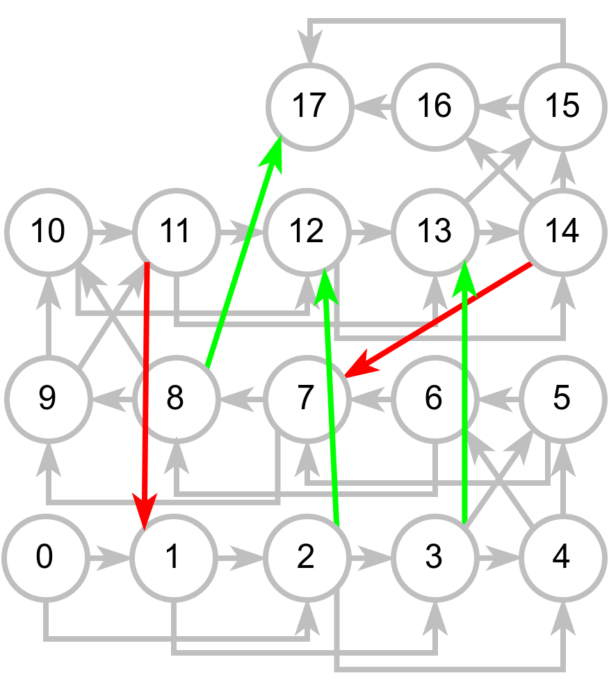

Обилазак графова – решени задаци
================================

У наставку ћемо приказати решења неколико задатака у којима се
примењује обилазак графа.

Пећине са тунелима
------------------

.. questionnote::

   Спелеолози се налазе у улазној дворани пећине, на висини тла, чија
   је надморска висина позната. Пећина има укупно :math:`n` дворана
   обележених бројевима од :math:`0` до :math:`n-1` (улазна дворана је
   обележена бројем :math:`0`) и до сваке од њих се може стићи
   коришћењем неког од многих тунела који их повезују. Сви тунели су
   двосмерни. Ако се за сваки тунел зна које две дворане повезује и
   колика је висинска разлика између њих, написати програм који
   одређује најнижу надморску висину на коју се спелеолози у пећини
   могу спустити.

   Са стандардног улаза се учитава висина тла (цео број), а затим, из
   следеће линије природни број :math:`n` који представља број дворана
   и затим природни број :math:`m` који представља број тунела. У
   наредних :math:`m` линија налазе се по три цела броја раздвојена
   размацима, која описују тунел: редни број полазне дворане, редни
   број долазне дворане и висинску разлику између полазне и долазне
   дворане (негативан број значи да је долазна дворана на мањој
   надморској висини).

   На стандардни излаз исписати цео број који представља најнижу
   надморску висину на којој се налази нека дворана.

Претпоставимо, на пример, да је дат следећи улаз:

.. code::

   696
   5
   7
   0 1 -7
   0 4 4
   0 3 -6
   1 2 -10
   1 3 1
   1 4 11
   3 2 -11

Распоред пећина и њихове надморске висине су приказане на следећој
слици:

Са слике се јасно види да је најнижа дворана број 2 која се налази на
надморској висини од 679 метара.
   
Обиласком графа тунела кренувши од улазне дворане можемо одредити и у
низ уписати надморску висину сваке дворане. Након тога тражену најмању
висину одређујемо као минимум тог низа. Обилазак можемо имплементирати
рекурзивном претрагом у дубину, где у сваком позиву функције
прослеђујемо тренутни број дворане и њену надморску висину. Да бисмо
избегли циклусе, морамо памтити и низ логичких вредности којим се
региструју посећене дворане. Приликом поновног уласка у већ посећену
дворану одмах прекидамо даљу претрагу.

У наставку приказујемо рекурзивну имплементацију претраге у дубину, а
вама за вежбу остављамо да направите решење које ће бити нерекурзивно
(и користиће стек). У питању је неоријентисани тежински граф који
представљамо листама суседа.

.. activecode:: pecine_sa_tunelima
    :passivecode: true
    :coach:
    :includesrc: _src/4_grafovski/pecine_sa_tunelima.cs
                 
Обилазак је могуће реализовати и у ширину (уз коришћење реда), што вам
такође остављамо за вежбу.

Пошто се овом функцијом сваки чвор обилази највише једном (само ако је
раније непосећен) и анализирају се сви његови суседи, укупна сложеност
је :math:`O(|V| + |E|)`.

„Змије и лестве“
----------------

.. questionnote::
   
   У популарној игри „Змије и лестве“ играч се креће од почетног поља
   бацајући коцкицу и померајући се онолико поља унапред колико
   коцкица покаже. Постоје две врсте посебних поља. Ако играч стане на
   неко поље на ком се налазе „лестве“, он се пење уз те лестве и
   прелази на оно поље са већим бројем до кога те лестве воде. Ако
   играч стане на неко поље на ком се налази змија, он се спушта и
   прелази на оно поље са мањим бројем до кога та змија води. Написати
   програм који одређује минималан број корака (бацања коцкице) којима
   играч може да стигне од почетног до завршног поља.

   *Напомена*: Ако играч стигне на неко поље које је део циклуса
   састављеног од лестви и змија, он моментално губи игру и не може да
   стигне до циља (таква поља се морају избегавати).

   Са стандардног улаза се учитава укупан број поља :math:`n`
   (:math:`5 \leq n \leq 200`). Поља су обележена бројевима од 0 до
   :math:`n-1`. У наредном реду се налази највећи број :math:`k` који
   се може добити бацањем коцкице (коцкицом се добијају бројеви од
   :math:`1` до :math:`k`). Након тога се учитава укупан број :math:`m` змија
   и лестви (:math:`0 \leq m \leq n`), а затим и подаци о њима (број
   полазног и број долазног поља).

   На стандардни излаз исписати тражени минимални број корака. Ако
   није могуће стићи до циља, исписати -1.

Размотримо неколико примера:

::

   18
   2
   5
   2 12
   3 13
   8 17
   11 1
   14 7

Добијањем броја 2, играч са поља 0 прелази на поље 2 и затим се
лествама пење до поља 12. Добијањем броја 2, долази на поље 14, одакле
се змијом спушта до поља 7. Добијањем броја 1, долази на поље 8,
одакле се лествама пење до циљног поља 17. Дакле, до циљног поља може
да се стигне у 3 бацања коцкице, што је, показује се и најмањи број
бацања. На наредној слици приказана је ова игра:

Размотримо и наредни пример:
            
::

   5
   2
   2
   1 3
   3 1

Играч не сме да стане на поље 1 или 3, јер ће тада изгубити због
циклуса на ком се налази. Зато му је најбоље да прво дође до поља 2,
па затим до поља 4 (на поље 4 не може одмах да дође, јер на коцкици
може да добије само 1 или 2). Дакле, до циља може да стигне у најмање
два бацања коцкице. На наредној слици приказана је ова игра.

**Формирање новог графа и његова претрага у ширину**

Проблем се може моделовати графом на неколико начина. Један начин је да
чворови графа буду поља на табли, а да гране буду прелази између поља
(за свако поље памтимо списак поља до којих можемо стићи након бацања
коцкице и исцрпног праћења свих лестви и змија (нема потребе правити
разлику између њих). Приликом одређивања грана таквог графа, за свако
полазно поље :math:`p` одређујемо све могуће исходе бацања коцкице и за
сваки исход коцкице од поља :math:`p+i` пратимо исцрпно лестве и змије
док год је то могуће или док не установимо да смо упали у циклус (тако
што смо се поново вратили на поље :math:`p+i`). Ако нисмо упали у циклус
и стигли смо до неког поља :math:`c` од којег даље не воде лестве нити
змије, у граф додајемо грану од :math:`p` до :math:`c`.

Претходно описани граф је могуће експлицитно формирати у меморији (и
представити га листама повезаности). Пошто се тражи најмањи број
корака да се стигне од почетног до крајњег чвора, природно је
применити класичну претрагу у ширину над овако формираним графом. За
свако поље памтимо и број корака који је био потребан да се до њега
стигне. Претрага у ширину се завршава када први пут одредимо број
корака потребних да стигнемо до поља :math:`n-1`.

На наредној слици је приказан тако формиран граф за игру приказану у
првом примеру, као и најкраћи пут од чвора 0 до чвора 17:

Имплементација овог алгоритма дата је у наредном програму:         

.. activecode:: zmije_i_lestve_ex1_cs
    :passivecode: true
    :coach:
    :includesrc: _src/4_grafovski/zmije_i_lestve-ex1.cs

Број чворова формираног графа једнака је броју поља :math:`n`, а свако
поље може да има :math:`k` суседа, па је број грана једнак
:math:`n\cdot k`. Обилазак овог графа зато захтева :math:`O(n\cdot k)`
корака. Неефикасност, међутим, може да наступи приликом формирања
графа. Наиме, ако има пуно змија и лестви, унутрашња петља која
исцрпно прати змије и лестве може често имати велики број
корака. Једна могућа оптимизација (која није реализована у коду) је да
се врши мемоизација – чим се за неко поље открије које је крајње поље
до ког се са њега стиже змијама и лествама, тај податак се памти, да
би се касније употребио без поновног покретања исцрпног обиласка
прелаза у склопу унутрашње петље. Остављамо вам да за вежбу
имплементирате ову оптимизацију.
                 
**Модификована бинарна претрага имплицитно представљеног графа**

Уместо да експлицитно креирамо граф прелаза измећу поља, можемо у
меморији памтити само граф који је формиран од змија и лестви, а
прелазе између поља доступних на основу бачене коцкице (без праћења
змија и лестви) представити имплицитно. Пошто свако поље има највише
један прелаз помоћу змије или лестви, тај граф се најбоље представља
речником који свако поље пресликава у поље на које се може стићи
помоћу змија или лестви (нема потребе правити разлику између њих).

Пошто се тражи најмањи број корака да се стигне од почетног до крајњег
чвора природно је применити претрагу у ширину. Међутим, пошто граф
овај пут представља само лестве и змије, а не коначне прелазе, та
претрага се мора мало прилагодити.

Од сваког поља :math:`p` бацањем коцкице можемо стићи на поља
:math:`p+1`, :math:`p+2`, :math:`\ldots`, :math:`p+k` (ти прелази нису
експлицитно представљени графом, али су имплицитно одређени). Када
стигнемо на неко поље :math:`p+i`, пратимо исцрпно лестве и змије све
док је могуће или док не установимо да смо направили циклус (тако што се
поново вратимо на поље :math:`p+i`). Ако нисмо направили циклус са поља
:math:`p` вршимо прелаз на поље :math:`c` које је било последње доступно
лествама и змијама и од којег даље не воде лестве нити змије (дакле, не
прелазимо на поље :math:`p+i`, већ на поље :math:`c`). За свако поље
памтимо и број корака који је био потребан да се до њега стигне.
Претрага у ширину се завршава када први пут одредимо број корака
потребних да стигнемо до поља :math:`n-1`.

На наредној слици је приказан тако формиран граф за игру приказану у
првом примеру (сиве гране су имплицитне и нису представљене у
меморији):

Имплементација овако модификованог алгоритма претраге у ширину дата је
у следећем C# програму:
            
.. activecode:: zmije_i_lestve_cs
    :passivecode: true
    :coach:
    :includesrc: _src/4_grafovski/zmije_i_lestve.cs
            
Временска сложеност овог приступа идентична је сложености
претходног. Наиме, циљно поље се одређује само једном за свако поље
графа чвор. И проблеми и могуће оптимизације су идентичне. Са друге
стране, меморијска сложеност је боља, јер се граф не памти
експлицитно.

                 
Провера бипартитности графа
---------------------------

.. questionnote::

   Пера je отишао на летњи спортски камп и када је тамо дошао видео је
   још неколико својих другара. И друга деца су знала
   понеког. Интересантно, Пера је свако дете знао посредно
   (знао је некога ко зна некога, ко зна некога… – ко зна то дете).

   Потребно је да се деца поделе у две групе, али пошто свако жели да
   упозна што више нових другара, потребно је да сваку групу чине
   међусобно непознате особе (две особе које се већ познају не могу
   бити у истој групи). Написати програм који одређује да ли је то
   могуће и ако јесте, која ће све деца бити у групи са Пером.

   Са стандардног улаза се учитава број деце n, а затим и број парова
   m деце која се већ познају, а затим и низ парова бројева од 0 до
   n-1 који представљају познанства.

   На стандардни излаз исписати редне бројеве деце који су у групи са
   Пером (кренувши од Пере који има редни број 0, па у растућем 
   поретку) или симбол `-` ако тражене две групе није могуће
   формирати.

Размотримо поново неколико примера:
   
::

  6
  6
  0 1
  1 2
  2 3
  3 4
  4 5
  5 0

Ако су у једној групи деца са бројевима 0, 2 и 4, у другој су деца са
бројевима 1, 3 и 5 и тада се ни у једној групи не налазе деца која се
међусобно познају.

::

  5
  5
  0 1
  1 2
  2 3
  3 4
  4 0

Пера (особа 0) не сме да буде у групи са особом 1, која не сме да буде
у групи са особом 2, што значи да 0 и 2 морају да буду у истој групи.
Особе 2 и 3 не могу да буду у истој групи, па су 1 и 3 у истој групи.
Особа 4 не сме да буде у групи са особом 3, па она мора бити у групи
са особама 0 и 2, међутим, то није допуштено, јер се особе 4 и 0
познају. Одатле следи да није могуће поделити децу на две тражене
групе.

Ако се чворови графа могу поделити у две групе, тако да не постоје
гране које спајају чворове из исте групе, каже се да је граф
**бипартитан** (двостран).

Ако неки чвор припада левој половини, тада сви његови суседи припадају
десној половини, њихови суседи левој половини, њихови суседи десној и
тако даље. Зато се задатак може решити обиласком графа (на пример у
дубину) обележавајући чворове наизменично (за сваки непосећени чвор се
обележава да ли припада левој или десној половини). Ово обележавање
можемо схватити као бојење чворова помоћу две боје (на пример, чворове
леве половине бојимо плаво, а десне половине црвено). Ако се приликом
обиласка наиђе на чвор чији је сусед већ обележен тако да припада
истој половини као текући, тада граф није бипартитан. Ако се на такав
чвор не наиђе, тада граф јесте бипартитан.

*Напомена*: пошто граф не мора бити повезан, поступак претраге у
дубину и означавања чворова треба поновити за сваку компоненту
повезаности засебно (проналажење комонената повезаности је описано
засебно).

Наредна анимација приказује успешно бојење једног бипартитног графа.

.. gallery:: bipartitan_da
    :width: 200px
    :height: 100%
    :folder: ../../_images/4_grafovski/bipartitni
    :images: bip0.png, bip1.png, bip2.png, bip3.png, bip4.png, bip5.png, bip6.png, bip7.png

Наредна анимација приказује неуспешно бојење једног графа који није
бипартитан. Током бојења догађа се да чвор има суседа који је обојен у
исту боју.

.. gallery:: bipartitan_ne
    :width: 200px
    :height: 100%
    :folder: ../../_images/4_grafovski/bipartitni
    :images: bipA0.png, bipA1.png, bipA2.png, bipA3.png, bipA4.png, bipA5.png, bipA6.png, bipA7.png, bipA8.png

Наредни програм садржи имплементацију провере бипартитности графа која
је заснована на нерекурзивно имплементираном обиласку графа у дубину:
             
.. activecode:: da_li_je_bipartitan_cs
    :passivecode: true
    :coach:
    :includesrc: _src/4_grafovski/da_li_je_bipartitan.cs

Сложеност овог алгоритма потиче од сложености обиласка графа и једнака
је :math:`O(|V| + |E|)`.
                 
Провера бипартитности графа је еквивалентан проблем проблему
2-обојивости графа у ком се захтева да се чворови графа обоје са две
боје тако да нема суседних чворова обојених у исту боју. Уопштење овог
проблема је проблем k-обојивости. Покушај да имплементираш алгоритам
који проверава да ли се граф може обојити помоћу 3 боје (то је знатно
тежи проблем, јер захтева бектрекинг, тј. испитивање различитих
могућности за бојење текућег чвора).
             
