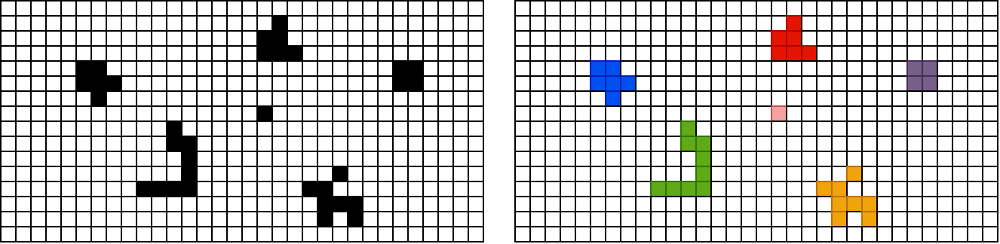
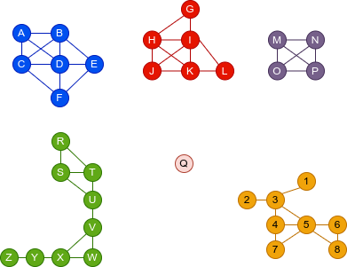

Компоненте повезаности
======================

У наставку ћемо решавати проблем одређивања компонената повезаности
неусмереног графа. Одређивање компонената повезаности се често захтева
у разним проблемима. Размотримо, на пример, следећи проблем. Дата је
слика на којој су под микроскопом снимљене неке бактерије. Слика је
обрађена тако да је уклоњен шум и остали су само црни и бели
пиксели. Потребно је направити програм који ће пребројати колико је
бактерија присутно на слици и сваку бактерију обојити у другу боју.

Ако црне пикселе представимо чворовима графа и суседне црне пикселе
повежемо гранама (суседи се рачунају хоризонтално, вертикално и
дијагонално), проналажење бактерија се своди на проналажење
компонената повезаности тог графа. Подсетимо се, компонента
повезаности је повезан подграф који нема чворове повезане са чворовима
ван те компоненте.

Одређивање компонената повезаности се веома једноставно решава
применом алгоритама за обилазак графова (било у дубину, било у
ширину). Основна идеја је да обилазак започнемо из произвољног чвора
графа и да бележимо чворове који су током тог обиласка посећени. То ће
бити тачно они чворови који се налазе у истој компоненти повезаности
као почетни чвор. Након тога гледамо да ли је остао неки чвор који је
непосећен и ако јесте, понављамо поступак обиласка графа од било ког
непосећеног чвора. Поступак се завршава када након неког обиласка нема
више непосећених чворова.

Иако би се можда могло помислити да је након сваког покретања
алгоритма претраге потребно изнова анализирати све чворове и
проверавати да ли међу њима има непосећених, то није случај. Наиме,
можемо у једној петљи пролазити кроз све чворове графа и сваки пут
када наиђемо на непосећени чвор позивати обилазак из тог чвора. У
псеудо коду, то би могло да изгледа овако.

.. code::

   za svaki čvor c
      ako c nije posećen
          pokreni obilazak grafa iz čvora c

У наредној анимацији је приказано једно извршавање овог
алгоритма. Спољна петља алгоритма која пролази кроз све чворове је
реализована помоћу бројача ``i``. У низ се уписује редни број
компоненте, који стоји у променљивој ``k``.

.. gallery:: komponente_povezanosti_anim
    :width: 450px
    :height: 100%
    :folder: ../../_images/4_grafovski/komponente
    :images: komponente0.png, komponente1.png, komponente2.png, komponente3.png, komponente4.png, komponente5.png, komponente6.png, komponente7.png, komponente8.png, komponente9.png, komponente10.png, komponente11.png, komponente12.png, komponente13.png, komponente14.png, komponente15.png, komponente16.png, komponente17.png, komponente18.png, komponente19.png, komponente20.png, komponente21.png, komponente22.png, komponente23.png, komponente24.png, komponente25.png, komponente26.png, komponente27.png, komponente28.png, komponente29.png

Када током тог поступка дођемо до неког чвора :math:`c` знамо да су
сви чворови пре њега посећени (јер ако нису били посећени у тренутку
када смо до њих дошли у петљи, тада смо покретали обилазак из њих и
тада смо их посећивали). Зато на крају рада петље знамо да су сви
чворови посећени, а пошто обилазак из било ког чвора :math:`c`
покрећемо само када експлицитно установимо да он раније није био
посећен, знамо да је на овај начин сваки чвор посећен тачно једном и
то током обиласка његове компоненте повезаности. Ово је
најједноставнији начин да се изврши обилазак сваког чвора графа, без
обзира на то да ли је граф повезан или не.

У наредном C# програму користимо ову идеју да бисмо сваком чвору графа
придружили редни број његове компоненте повезаности. Претпоставићемо
да се компоненте броје од 1 до k, при чему нам није битно која
компонента има који број (бројеве ћемо додељивати редом, како наиђемо
на нову компоненту). Претпоставићемо да одржавмо низ дужине :math:`n`
(где је :math:`n` број чворова графа) који ћемо иницијализовати
нулама. Тада не морамо да чувамо посебан низ у коме бележимо да ли је
чвор графа посећен, јер ћемо приликом посете сваком чвору њему
придружену нулу мењати у редни број његове компоненте повезаности тако
да ће се непосећени чворови јасно препознавати по нули која им је
придружена.

.. activecode:: komponente_povezanosti
    :passivecode: true
    :coach:
    :includesrc: _src/4_grafovski/komponente_povezanosti.cs
