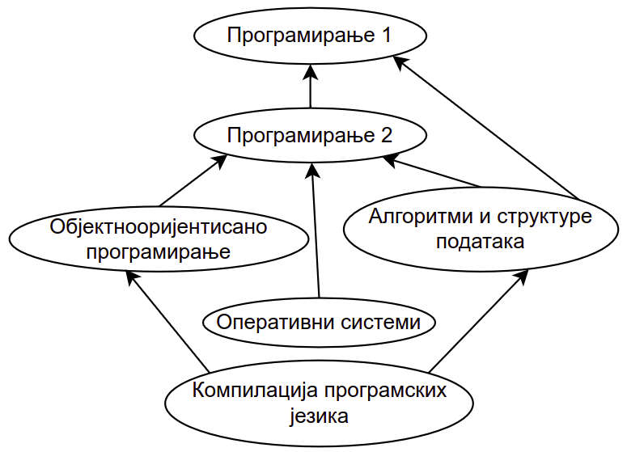
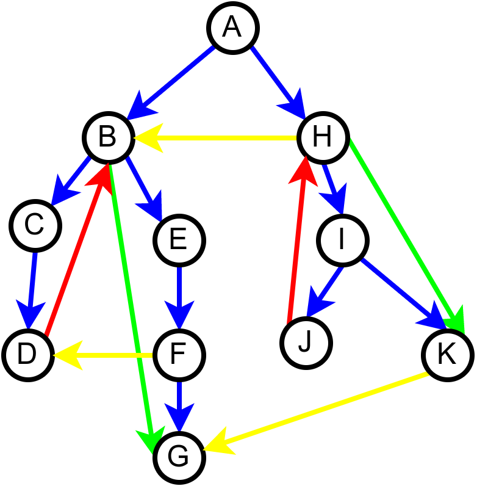
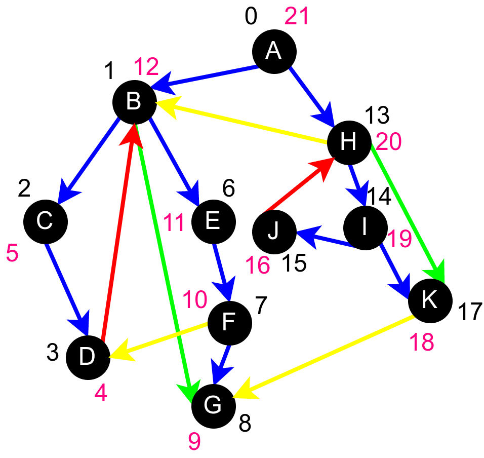

Тополошко сортирање
===================

У поглављу о примерима графова приказали смо граф који описује
зависности између предмета на факултету. Подсетимо се, зависности
између предмета се могу описати усмереним графом у коме постоји грана
од чвора :math:`x` до чвора :math:`y` ако и само ако слушање предмета
:math:`x` зависи од полагања предмета :math:`y` (краће ћемо рећи да
предмет :math:`x` зависи од предмета :math:`y`).

    
    Предуслови уписивања предмета на факултету

Међутим, за неке алгоритме је згодно посматрати и граф у коме су гране
обратно оријентисане тј. у коме постоји грана од чвора :math:`x` до
чвора :math:`y` ако и само ако предмет :math:`y` зависи од предмета
:math:`x`.

Прикажимо сада алгоритам којим се одређује бар један могући редослед
предмета који поштује све зависности међу њима. На пример, на
приказаном графу један могући редослед је *Програмирање 1****, *Програмирање
2*, *Објектнооријентисано програмирање*, *Алгоритми и структуре података*,
*Оперативни системи*, *Компилација програмских језика*. Алгоритам који
ћемо описати се примењује и у другим сличним проблемима. Редослед
чворова графа који је у складу са оријентацијом његових грана назива
се **тополошки редослед чворова** а алгоритам којим се одређује неки
тополошки редослед назива се **тополошко сортирање графа**.

Канов алгоритам
---------------

Задатак се може решити тако што се прво положи било који предмет који
се у том тренутку може слушати и полагати. Када се тај предмет положи,
он се избацује из графа, заједно са свим гранама између њега и
предмета који од њега зависе. Тиме се проблем редукује на проблем
истог облика и мање димензије који се даље решава на исти начин (у
питању је, дакле, индуктивно-рекурзивна конструкција). Бира се наредни
предмет који се у том тренутку може полагати и поступак се наставља,
све док се сви предмети не положе и не избаце из графа. Овај алгоритам
је познат под именом **Канов алгоритам**.

Предмет се може полагати ако и само ако не постоје до тада неположени
предмети од којих он зависи. Поставља се питање да ли је у сваком
кораку Кановог алгоритма могуће наћи бар један такав предмет. Одговор
је потврдан ако и само ако граф зависности не садржи циклусе. Циклус
би, на пример, постојао ако би први предмет зависио од неког другог,
други од трећег, а трећи од првог и јасно је да у том случају не би
постојао могући редослед полагања та три предмета. Видећемо касније и
да се Канов алгоритам успешно може употребити да би се испитало да ли
граф садржи циклусе.

Пошто је у сваком кораку Кановог алгоритма потребно одредити предмете
који зависе од предмета који се управо полаже, граф ћемо
репрезентовати обратно од оног приказаног на слици и за сваки предмет
:math:`x` ћемо чувати низ предмета који од њега зависе. У таквом графу
предмет се може полагати ако и само ако ни једна грана не улази у тај
чвор тј. ако и само ако му је улазни степен 0. Када се неки предмет
положи и избаци се, заједно са гранама које из њега воде, улазни
степени свих његових суседа се смањују за 1.

Наредна анимација приказује кораке приликом извршавања Кановог
алгоритма. Уз сваки предмет (чвор графа) приказан је и његов улазни
степен. Зеленом бојом су приказани они предмети који имају улазни
степен 0 тј. они предмети који се могу у том тренутку слушати
полагати, док су остали предмети обојени црвеном бојом.

.. gallery:: kanov_algoritam
    :width: 350px
    :height: 100%
    :folder: ../../_images/4_grafovski/kan
    :images: kan1.png, kan2.png, kan3.png, kan4.png, kan5.png, kan6.png, kan7.png

Опис алгоритма који смо дали за одређивање редоследа полагања предмета
на основу датих зависности међу њима се на идентичан начин примењује
за тополошко сортирање било ког усмереног ацикличког графа, па ћемо у
детаљном опису имплементације уместо предмета разматрати чворове
произвољног графа.
	     
**Наивна имплементација.** У наивној имплементацији претрагу за
наредним чвором у тополошком редоследу у сваком кораку вршимо
линеарном претрагом. То значи да редом испитујемо све чворове који до
тада нису избачени из графа и тражимо неки од њих који има улазни
степен 0. Уместо да изнова сваки пут израчунавамо степене чворова,
можемо формирати низ у коме се ти степени чувају и сваки пут када
уклонимо неки чвор, за један смањити степене његових суседа у том
низу. Међутим, то нам неће пуно помоћи, јер је оваква имплементација
веома неефикасна. Наиме, у сваком кораку се изнова пролази кроз низ
(преосталих) чворова тражећи оне са степеном нула, што за граф са
:math:`n` чворова даје сложеност :math:`O(n^2)` и главни је узрок
неефикасности. Такође, приликом сваког избацивања гране из графа за
један се смањује улазни степен неког чвора, па ће укупан број корака
потребан за ажурирање низа улазних степена свих чворова бити
сложености :math:`O(m)`. Наравно, потребно је :math:`O(n+m)` корака да
се учита и складишти граф и иницијално израчунају улазни
степени. Дакле, укупна сложеност овакве имплементације је
:math:`O(n^2+m)`.

**Имплементација уз помоћ реда.** Имплементација се значајно може
убрзати ако све чворове за које већ знамо да су степена 0 чувају у
тзв. *радној листи* (енгл. work list) из које ћемо узимати чворове
који могу бити додати у тополошки редослед. Радну листу ћемо
имплементирати као ред (а уместо реда може се користити и стек, или
било која друга структура података која омогућава ефикасно додавање и
уклањање елемената). Након израчунавања почетних улазних степена
чворова, у радну листу стављамо све оне чворове који имају степен 0
(њих можемо одредити линеарном претрагом). Узимамо затим један по
један чвор из радне листе, умањујемо улазне степене свим његовим
суседима и ако детектујемо да се степен неког чвора тиме редукује на
0, тај чвор одмах додајемо у радну листу.

И у овом случају, потребно је :math:`O(n+m)` корака да се учита и
складишти граф, и да се израчунају улазни степени полазног графа, као
и :math:`O(m)` корака да се ажурирају вредности степена чворова током
избацивања свих грана. Сваки предмет (чвор графа) највише једном бива
стављен у радну листу и уклоњен из ње, па је укупна сложеност
идентификације предмета који се наредни слушају и полажу
:math:`O(n)`. Укупна сложеност је, дакле, :math:`O(n+m)`.

Ефикасна имплементација Кановог алгоритма тополошког сортирања је
приказана у наставку.

.. activecode:: kanov_algoritam_cs
    :passivecode: true
    :coach:
    :includesrc: _src/4_grafovski/kanov_algoritam.cs

Алгоритам заснован на обиласку графа у дубину (ДФС)
---------------------------------------------------

Одређивање редоследа предмета тј. тополошко сортирање графа може бити
засновано и на обиласку графа у дубину. Пошто не знамо унапред из
којих чворова треба позвати обилазак, покушаћемо из сваког чвора
редом, у складу са произвољном (датом) нумерацијом чворова. Ово је
веома слично ономе што је рађено у алгоритму којим је вршен обилазак
целог графа тј. алгоритму који је обилазио једну по једну компоненту
повезаности.

Могуће су две варијанте тополошког сортирања у зависности од тога како
су оријентисане гране у графу.

Претпоставимо прво да су гране y графу зависности предмета
оријентисане тако да грана од :math:`x` ка :math:`y` означава да
предмет :math:`x` зависи од предмета :math:`y`. Ако у овако
оријентисано графу претрагу у дубину покренемо из неког предмета
(чвора графа), обићи ћемо све оне предмете који морају бити положени
пре њега. Ако се током излазне обраде сваког предмета он додаје на
крај редоследа полагања, по обиласку целог графа добићемо исправан
редослед полагања свих предмета. Наиме, у тренутку када се врши
излазна обрада неког предмета знамо да је већ извршена излазна обрада
свих предмета који су из њега достижни. То су сви они предмети који
морају бити положени пре њега, па пошто су они тада већ додати у
редослед полагања, безбедно је додати и текући предмет иза њих.

Овај алгоритам се може описати наредним псеудокодом.

.. code::

   obidji(cvor):
      obelezi da je cvor posecen
      za sve susede cvora:
         ako sused nije posecen:
	     obidji(sused)
      dodaj cvor u topoloski redosled
   
   za svaki cvor grafa:
      obidji(cvor)

Прикажимо анимацију овог поступка. Обилазак у дубину покрећемо из
чвора 0 (ООП) и том приликом се посећују чворови 5 (П2) и 2
(П1). Редослед изласка из ових чворова је П1, П2 и на крају ООП. Након
тога се покреће претрага у дубину из чвора 1 (АСП). Пошто су оба
суседна чвора (5 и 2) већ раније посећена, обилазак се одмах прекида и
приликом изласка одређује се да је следећи предмет АСП. Пошто је чвор
2 већ посећен обилазак у дубину се не покреће из њега. Обилазак у
дубину се покреће из чвора 3 (КПЈ), али се поново одмах завршава јер
су сви суседи (0 и 1) већ раније посећени и приликом изласка се КПЈ
проглашава за наредни предмет. На крају се обилазак у дубину покреће
из чвора 4 (ОС) и пошто је једини сусед 5 већ посећен, одмах се
завршава, пријављујући приликом изласка ОС као наредни предмет. Чвор 5
је већ посећен, па се обилазак из њега не покреће.

.. gallery:: topsort_dfsA
    :width: 600px
    :height: 100%
    :folder: ../../_images/4_grafovski/topsort_dfsA
    :images: topsort_dfsA0.png, topsort_dfsA1.png, topsort_dfsA2.png, topsort_dfsA3.png, topsort_dfsA4.png, topsort_dfsA5.png, topsort_dfsA6.png, topsort_dfsA7.png, topsort_dfsA8.png, topsort_dfsA9.png, topsort_dfsA10.png, topsort_dfsA11.png, topsort_dfsA12.png

На крају, прикажимо и имплементацију овог алгоритма.

.. activecode:: topsort_dfsA_cs
    :passivecode: true
    :coach:
    :includesrc: _src/4_grafovski/topsort_dfsA.cs

             
Претпоставимо сада да су гране оријентисане тако да грана од :math:`x`
ка :math:`y` означава да предмет :math:`y` зависи од предмета
:math:`x` (исто као у имплементацији Кановог алгоритма). Приликом
обиласка оваквог графа у дубину, кренувши од било ког предмета обилазе
се сви предмети који зависе од њега. Ако бисмо тај предмет додали у
тополошки редослед одмах приликом његове улазне обраде, то би значило
да тај предмет треба да буде положен пре оних предмета који од њега
зависе, што је сасвим у реду. Међутим, то не смемо да урадимо, јер
нисмо сигурни да ли тај предмет зависи од неких других предмета, који
још нису обрађени. Стога ћемо да поступимо мало другачије. Шта би било
када бисмо га додавали у тополошки редослед приликом његове излазне
обраде?  Тада би сваки предмет био постављен након свих предмета који
од њега зависе, што је баш потпуно супротно од онога што желимо да
постигнемо. На овај начин не бисмо добили исправан редослед полагања,
већ бисмо добили редослед који је обратан у односу на исправан
редослед. Да бисмо од њега добили исправан редослед, довољно је
обрнути га, а то можемо урадити тако што ћемо током излазне обраде
чворове стављати на помоћни стек и на крају исписати садржај тог
помоћног стека (од врха ка дну). Пошто ће предмет бити додаван на стек
тек када су већ на стеку сви предмети који од њега зависе, предмети на
стеку ће бити у складу са исправним редоследом (што предмет раније
треба слушати и полагати, он ће се налазити ближе врху стека). Ако
предмет из ког је покренут обилазак графа (који се након тог обиласка
налази на врху стека) зависи од неких других предмета, они ће бити
додати изнад њега на стек када се посете током неког наредног
покретања обиласка у дубину. Предмети који су раније посећени и
обрађени (постављени на стек) а на које се поново наиђе током обиласка
се просто прескачу (јер они зависе од текућег предмета који ће бити
стављен на стек изнад њих).

Овај алгоритам се може описати наредним псеудокодом.

.. code::

   obidji(cvor):
      obelezi da je cvor posecen
      za sve susede cvora:
         ako sused nije posecen:
	     obidji(sused)
      dodaj cvor na vrh steka

   za svaki cvor grafa:
      obidji(cvor)
   dok stek nije prazan:
       premesti cvor sa vrha steka u topoloski redosled

Прикажимо анимацију овог поступка. Покрећемо обилазак из чвора 0
(ООП). Током обиласка се долази једино још до чвора 3 (КПЈ) тако да се
на стек ставља прво КПЈ, па затим ООП што нам гарантује да ће ООП бити
положен пре КПЈ. Након тога покрећемо нови обилазак и то овај пут из
чвора 1 (АСП). Он је раније непосећен, али једини чвор до ког се из
њега може стићи (чвор 3, КПЈ) јесте посећен тако да се он не посећује
поново и на врх стека се додаје АСП. Тиме је обезбеђено да ће АСП бити
положен пре КПЈ (који је већ на стеку). Након тога покрећемо обилазак
из чвора 2 (П1), од њега се може стићи до чвора 5 (П2), па из њега до
чвора 2 (ОС). Достижни су и чворови 1 (АСП) и 0 (ООП), али они су већ
раније обрађени, па их не посећујемо поново. Пошто чворове ређамо на
стек у редоследу излазне обраде, на стек се ставља прво ОС, па затим
П2, па затим П1. Овим је обезбеђено да се ОС полаже после П2, а да се
П2 полаже после П1. Обезбеђено је и да се ООП и АСП полажу после П2 и
П1 (јер су ООП и АСП већ на стеку, а П1 и П2 се тек стављају на стек).
Након овога сви чворови су посећени, па се сваки наредни обилазак одмах
прекида. На стеку се налази један исправан тополошки редослед чворова.

.. gallery:: topsort_dfsB
    :width: 600px
    :height: 100%
    :folder: ../../_images/4_grafovski/topsort_dfsB
    :images: topsort_dfsB0.png, topsort_dfsB1.png, topsort_dfsB2.png, topsort_dfsB3.png, topsort_dfsB4.png, topsort_dfsB5.png, topsort_dfsB6.png, topsort_dfsB7.png, topsort_dfsB8.png, topsort_dfsB9.png, topsort_dfsB10.png, topsort_dfsB11.png, topsort_dfsB12.png

На крају, прикажимо и имплементацију овог алгоритма.

.. activecode:: topsort_dfsB_cs
    :passivecode: true
    :coach:
    :includesrc: _src/4_grafovski/topsort_dfsB.cs
             
Примећујемо да је друга варијанта алгоритма компликованија, јер
захтева коришћење помоћног стека. Зато је, када имамо слободу креирања
графа приликом решавања задатка боље и једноставније користити прву
варијанту. Са друге стране, некада је граф унапред задат и ако су
гране оријентисане од чворова који прво треба да буду обрађени до
чворова који касније треба да буду обрађени, тада смо принуђени да
користимо другу варијанту алгоритма.

Детектовање циклуса у графу
---------------------------

Тополошко сортирање се може употребити да би се утврдило да ли граф
садржи циклусе. Наиме граф садржи циклус ако и само ако се приликом
извршавања Кановог алгоритма установи да не постоји ни један чвор
степена 0, пре него што су сви чворови обрађени. Заиста, ако сваки
чвор има улазни степен већи од нуле, онда можемо кренути од неког
произвољног чвора у графу и наћи његовог претходника (јер у текући
чвор улази бар једна грана, иначе би му улазни степен био једнак
нули). Овај прелазак са чвора на претходника не може трајати у
недоглед, јер граф има коначан број чворова, па се у неком тренутку
морамо вратити на чвор који смо већ обишли. У том тренутку детектован
је циклус. Обратно, када се уклоне све гране графа осим грана неког
циклуса, тада сваки чвор има улазни степен 1 (јер у циклусу у сваки
чвор улази тачно једна грана).

Ако се користе алгоритми засновани на обиласку у дубину, тада се
постојање циклуса може испитати и након одређивања (у том случају
некоректног) тополошког редоследа. Наиме, граф је ациклички ако и само
ако су све гране у складу са одређеним редоследом, тј. ако је за сваку
грану предмет који зависи наведен у тополошком редоследу после предмета 
од кога зависи. Дакле, након одређивања тополошког редоследа, треба 
проверити да ли су све гране у складу са тим редоследом. 

Покушајте самостално да напишете програм који на овај начин проверава
да ли учитани граф садржи циклус.

Класификација грана на основу обиласка у дубину
...............................................

Циклуси могу да буду детектовани и током извођења
обиласка у дубину. Овај приступ се заснива на **класификацији грана на
основу обиласка у дубину**. Наиме, у односу на обилазак у дубину, све
гране усмереног графа можемо поделити на:

- **гране DFS дрвета** којима се током обиласка у дубину прелази са
  посећеног на непосећени чвор тј. оне повезују оца са сином,
- **директне гране** које воде од претка ка потомку,
- **повратне гране** које воде од потомка ка претку и
- **попречне гране** које повезују чворове из разних делова дрвета
  тј. чворове измећу којих не постоји јасан однос предак/потомак.

Односи отац/син, предак/потомак се разматрају у односу на DFS дрво.
  
На наредној слици је илустрована класификација грана једног усмереног
графа.

    
    Класификација грана усмереног графа. Плаве гране су гране дрвета,
    зелене гране су директне гране, црвене гране су повратне гране,
    док су жуте гране попречне гране.

Напоменимо да код неусмерених графова не могу да постоје попречне
гране (размисли зашто је то тако).
    
Граф је цикличан ако и само ако постоји нека повратна грана. Опишимо
зато алгоритам који детектује повратне гране током обиласка у дубину.
Током рекурзивне имплементације DFS обиласка у сваком тренутку се на
стеку налазе чворови на путањи од корена дрвета до текућег чвора. То
су чворови поддрвета које се тренутно анализира тј. чворови за које је
анализа започета, али није још завршена. Повратну грану можемо
детектовати тако што она води од текућег чвора до неког другог чвора
на тој путањи тј. до неког чвора који се тренутно налази на
стеку. Тиме је експлицитно пронађен и циклус (јер знамо да од сваког
чвора на стеку постоји путања до текућег изграђена од грана DFS
дрвета, па ова повратна грана гради циклус заједно са том путањом).

Имплементација DFS алгоритма остаје практично неизмењена, осим што у
посебном низу региструјемо чворове који су обиђени током тренутног
ланца рекурзивних позива тј. који се налазе на програмском стеку током
извршавања рекурзије. На почетку рекурзивне функције, као део улазне
обраде, означавамо да се текући чвор налази на том стеку, а на крају,
као део излазне обраде означавамо да се више не налази. Анализирамо
суседе текућег чвора и ако пронађемо неки који се тренутно налази на
стеку пронашли смо повратну грану и циклус. У супротном, анализирамо
све гране ка непосећеним чворовима и из сваке од њих настављамо
рекурзивни обилазак. Директне и попречне гране просто игноришемо (то
су гране од текућег до посећених чворова који више нису на стеку).
Овај се алгоритам у псеудокоду може описати на следећи начин:

.. code::

   obidji(cvor):
       obelezi da je cvor na steku
       obelezi da je cvor posecen
       za sve susede cvora:
           ako je sused na steku, tada postoji ciklus
           ako sused nije posecen
               obidji(sused)
       obelezi da cvor vise nije na steku

Уместо да се користе два низа којима региструјемо посећене чворове и
чворове на стеку, овај алгоритам можемо реализовати и додељивањем боја
чворовима. Сви чворови су у почетку беле боје (непосећени). На почетку
рекурзивне функције, као део улазне обраде, чвор бојимо у сиво, чиме
означавамо да је у питању чвор који се тренутно налази на стеку
тј. чвор такав да је анализа његових потомака у DFS дрвету започета,
али још није завршена (у претходној имплементацији тај чвор би био
означен као посећен и налазио би се на стеку). Повратне гране
тј. циклусе детектујемо као гране од текућег до неког сивог
чвора. На крају рекурзивне функције, као део излазне обраде, текући
(сиви) чвор бојимо у црно, чиме означавамо да је то чвор чија се
анализа завршава и који се више не налази на стеку (то су посећени
чворови који нису више на стеку).

Наредна анимација илуструје како ово бојење функционише и како се
помоћу њега откривају повратне гране (то су гране које воде од текућег
сивог, до неког другог сивог чвора).

.. gallery:: dfsgrane
    :width: 350px
    :height: 100%
    :folder: ../../_images/4_grafovski/dfsgrane
    :images: dfsgrane0.png, dfsgrane1.png, dfsgrane2.png, dfsgrane3.png, dfsgrane4.png, dfsgrane5.png, dfsgrane6.png, dfsgrane7.png, dfsgrane8.png, dfsgrane9.png, dfsgrane10.png, dfsgrane11.png, dfsgrane12.png, dfsgrane13.png, dfsgrane14.png, dfsgrane15.png, dfsgrane16.png, dfsgrane17.png, dfsgrane18.png, dfsgrane19.png, dfsgrane20.png, dfsgrane21.png, dfsgrane22.png, dfsgrane23.png, dfsgrane24.png, dfsgrane25.png, dfsgrane26.png, dfsgrane27.png, dfsgrane28.png, dfsgrane29.png

Приметимо да се гране дрвета лако детектују, као оне гране које воде
од сивог до белог чвора (након проласка тим гранама се бели чвор боји
у сиво). Већ смо рекли да су повратне гране оне које воде од једног до
другог сивог чвора. Међутим, и попречне и директне гране воде од сивог
до црног чвора. За детектовање циклуса битно је једино детектовање
повратних грана, тако да није превише битно то што нисмо описали како
разликовати директне од попречних грана, међутим, пошто у неким другим
задацима то може бити важно, опишимо сада поступак којим се исправно
може извршити класификација све четири врсте грана. Основна идеја је
да сваком чвору :math:`u` доделимо време уласка
:math:`\mathit{ulaz}(u)` и време изласка :math:`\mathit{izlaz}(u)` из
њега. Та "времена" могу бити природни бројеви који се редом увећавају,
сваки пут када се доделе. Приликом улазне обраде, као време уласка,
чвору додељујемо текуће време, које се затим увећава за
један. Приликом излазне обраде, као време изласка, чвору додељујемо
текуће време, које се затим увећава за један.

.. code::
   
   vreme = 0

   obidji(cvor):
       ulaz[cvor] = vreme
       vreme = vreme + 1
       za sve susede cvora:
          ako ulaz[sused] nije postavljeno
              obidji(sused)
       izlaz[cvor] = vreme
       vreme = vreme + 1

На наредној слици приказана су времена уласка и времена изласка сваког
чвора приликом обиласка графа у дубину.

    
    Поред сваког чвора написано је њему придружено време уласка (црном
    бојом) и њему придружено време изласка (ружичастом бојом).

Ако граф није повезан обилазак у дубину се може поновити за сваки
непосећени чвор (слично као приликом одређивања компонената
повезаности, чворове можемо обилазити редом и позивати обилазак за
сваки непосећени чвор тј. сваки чвор коме нису придружена времена
улаза и излаза).
    
Примећујемо да гране дрвета и директне гране воде од чворова са мањим,
до чворова са већим временом уласка, док повратне и попречне гране
воде од чворова са већим, до чворова са мањим временом уласка. Са
друге стране, једино повратне гране воде од чворова са мањим до
чворова са већим временом изласка, док гране дрвета, директне и
попречне гране воде од чворова са већим временом изласка до чворова са
мањим временом изласка. Ово омогућава једнозначну класификацију грана:

- грана од :math:`u` до :math:`v` је директна акко је
  :math:`\mathit{ulaz}(u) < \mathit{ulaz}(v)` и
  :math:`\mathit{izlaz}(u) > \mathit{izlaz}(v)`.

- грана од :math:`u` до :math:`v` је повратна акко је
  :math:`\mathit{ulaz}(u) > \mathit{ulaz}(v)` и
  :math:`\mathit{izlaz}(u) < \mathit{izlaz}(v)`.

- грана од :math:`u` до :math:`v` је попречна акко је
  :math:`\mathit{ulaz}(u) > \mathit{ulaz}(v)` и
  :math:`\mathit{izlaz}(u) > \mathit{izlaz}(v)`.

Заиста, чвор :math:`y` је потомак чвора :math:`x` у дрвету ако и само
ако је :math:`\mathit{ulaz}(x) < \mathit{ulaz}(y)` и
:math:`\mathit{izlaz}(x) > \mathit{izlaz}(y)`. Зато је на основу
изречених услова у случају повратне гране чвор :math:`u` потомак чвора
:math:`v`, па грана води од потомка ка претку, док је у случају
директне гране (али и гране дрвета) :math:`v` потомак чвора :math:`u`,
па грана води од претка ка потомку. У случају попречне гране не постоји
однос предак-потомак.

Класификацију грана је могуће вршити током извршавања обиласка у
дубину, док још нису додељена сва времена чворовима. Док се обрађују
суседи :math:`v` чвора :math:`u`, важи следеће:

- ако чвор :math:`v` није посећен, тј. није постављено
  :math:`\mathit{ulaz}(v)`, тада је грана од :math:`u` до :math:`v`
  грана дрвета.
- ако чвор :math:`v` посећен, али не и обрађен у потпуности, тј. ако
  је постављено :math:`\mathit{ulaz}(v)`, али не и
  :math:`\mathit{izlaz}(v)`, тада је грана од :math:`u` до :math:`v`
  повратна грана.
- ако је чвор :math:`v` у потпуности обрађен, а у њега смо ушли након
  чвора :math:`u`, тј. ако су постављени и :math:`ulaz(v)` и
  :math:`izlaz(v)` и важи :math:`ulaz(v) > ulaz(v)`, тада је грана од
  :math:`u` до :math:`v` директна грана.
- ако је чвор :math:`v` у потпуности обрађен, а у њега смо ушли пре
  чвора :math:`u`, тј. ако су постављени и :math:`ulaz(v)` и
  :math:`izlaz(v)` и важи :math:`ulaz(v) < ulaz(v)`, тада је грана од
  :math:`u` до :math:`v` попречна грана.
