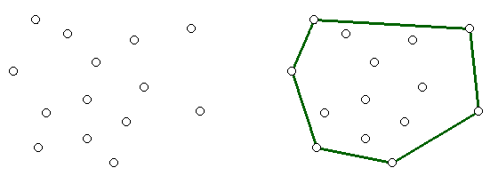

Конвексан омотач
================

Претпоставимо да су темена простог многоугла :math:`Q` сортирана тако да је обилазак у позитивном смеру. 
Да би тај многоугао био конвексан, потребно је да ниједна тројка узастопних тачака не чини заокрет 
надесно. Прецизније, дозвољене су колинеарне тројке код којих је средња од три тачке између остале две, 
као и заокрети налево. Оваквим колинеарним тројкама одговарају опружени углови, а заокретима налево 
углови мањи од опруженог (тј. оштри, прави или тупи).

У случају да многоугао :math:`Q` није конвексан, од интереса је да се одреди најмањи конвексан многоугао 
који садржи сва темена многоугла :math:`Q`. Такав многоугао се назива конвексан омотач многоугла :math:`Q`.
Општије, конвексан омотач можемо да дефинишемо на исти начин и за било какав скуп тачака. 

    Скуп тачака и конвексан омотач тог скупа

Интуитивно, конвексан омотач скупа тачака је облик гумице која је прво растегнута тако да обухвати 
све те тачке, а затим пуштена да се затегне око њих.

.. questionnote::

    Покушајте да набројите неке примене конвексног омотача. Потражите на интернету информације о 
    таквим применама.

Алгоритам
---------

Овде ћемо објаснити један од неколико познатих ефикасних алгоритама за налажење конвексног омотача. 
Алгоритам се зове `Грејамово скенирање <https://sr.wikipedia.org/wiki/Грејамово_скенирање>`_ (енгл. 
`Graham scan <https://en.wikipedia.org/wiki/Graham_scan>`_) и ради тако што одржава листу темена, која 
су кандидати за конвексан омотач. Идеја се састоји у томе да обилазимо темена одређеним редом (о 
редоследу у коме тачке треба да буду ће још бити речи), посматрајући у сваком тренутку последње три 
виђене тачке. Ако те три тачке чине заокрет надесно, средња од њих припада унутрашњости конвексног 
омотача и није једно од његових темена, па је треба избацити из листе. Уколико су последње три тачке 
колинеарне, средњу по распореду такође можемо да избацимо из листе, да бисмо доблили једноставнији 
резултат. Овај поступак треба понављати док год има узастопних тројки које не чине заокрет налево. 

На следећој галерији можете да видите кораке скицираног алгоритма (на претходни или следећи корак 
прелазите помоћу стрелица испод слике). Црвеном бојом су означене дужи које са претходном дужи не 
чине заокрет налево, када избацујемо претходну тачку из листе кандидата за конвексан омотач.

.. gallery:: convex_hull
    :width: 400px
    :height: 100%
    :folder: ../../_images/52_geometrijski
    :images: hull_01.png, hull_02.png, hull_03.png, hull_04.png, hull_05.png, hull_06.png, hull_07.png, hull_08.png, hull_09.png, hull_10.png, hull_11.png, hull_12.png, hull_13.png

Да бисмо добили одговарајући редослед тачака, потребно је да прво нађемо једну тачку која сигурно 
припада конвексном омотачу. То, на пример, може да буде најнижа тачка (тачка са најмањом :math:`y` 
координатом). Ако има више тачака са најмањом :math:`y` координатом, можемо да међу њима изаберемо 
ону са најмањом :math:`x` координатом. Ову тачку ћемо означити са :math:`P_0` (и у претходној 
илустрацији та тачка је означена нулом). 

Када одредимо тачку :math:`P_0`, остале тачке :math:`P_i` треба сортирати тако да (оријентисани) 
углови које полуправе :math:`P_0P_i` заклапају са позитивним смером :math:`x` осе буду у неопадајућем 
редоследу. Ако постоје тачке код којих је овај угао исти, можемо да задржимо само ону од њих која 
је најдаља од тачке :math:`P_0` (остале сигурно нису темена конвексног омотача), или да их задржимо 
све, али да буду уређене по растојању од тачке :math:`P_0` (на тај начин ће све осим последње бити 
елиминисане током обиласка).

Сада комплетан поступак можемо да опишемо следећим псеудокодом:

|

- нека је :math:`P_0` најнижа тачка многоугла :math:`Q`, односно, крајња лева таква тачка, ако има више најнижих
- нека су :math:`P_1, P_2, ..., P_m` остале тачке многоугла :math:`Q`, уређене у позитивном смеру при обиласку 
  око :math:`P_0` (секундарни критеријум уређивања је растуће по растојању од тачке :math:`P_0`)
- нека је :math:`S` празан стек
- стави тачку :math:`P_0` на стек
- стави тачку :math:`P_1` на стек
- стави тачку :math:`P_2` на стек
- за свако :math:`i` од 3 до :math:`m`

  - док претпоследња тачка стека, последња тачка стека и тачка :math:`P_i` не чине заокрет налево
  
    - избаци тачку са врха стека
    
  - стави тачку :math:`P_i` на стек

- на стеку су тачке које чине конвексан омотач

Овде се налази и комплетан програм који израчунава конвексан омотач датог скупа тачака (тачке могу да 
буду дате у било ком редоследу).
  
.. reveal:: convex_hull_source_code
    :showtitle: Програм за налажење конвексног омотача
    :hidetitle: Сакриј програм

    .. activecode:: konveksan_omotac_graham
        :passivecode: true
        :coach:
        :includesrc: _src/2_geometrijski/konveksan_omotac_graham.cs

Временска сложеност алгоритма
-----------------------------

Анализирајмо и временску сложеност датог алгоритма. 

- Време потребно за налажење тачке :math:`P_0` је :math:`O(n)`
- Време потребно за сортирање осталих тачака је :math:`O(n \log n)`
- Време потребно за обилазак тачака је :math:`O(n)`

Сложеност прва два корака би требало да је јасна (подразумева се употреба неког ефикасног алгоритма 
сортирања), али за сложеност последњег корака вероватно је потребно појашњење. Наиме, због двоструке 
петље у том делу алгоритма (спољна по новим тачкама, унутрашња која избацује виђене тачке са стека), 
на први поглед делује да је сложеност овог дела алгоритма :math:`O(n^2)`. Да бисмо се уверили да је 
сложеност линеарна, користимо такозвану амортизовану анализу. То значи да не процењујемо горње 
ограничење трајања унутрашње петље у сваком проласку кроз тело спољне петље засебно, него укупан 
број извршавања најдубље угнежђеног дела алгоритма, а то је у овом алгоритму избацивање тачака са 
стека. Са стека не можемо да избацимо више тачака него што смо их на стек ставили, па ова наредба не 
може да се изврши више од :math:`n` пута укупно. Због тога је и сложеност овог дела алгоритма ипак 
линеарна.

Сабирајући сложености појединих корака, долазимо до закључка да је сложеност комплетног алгоритма 
Грејамовог скенирања :math:`O(n \log n)`.

.. comment
   
   Задаци
   ------
    
   ?
