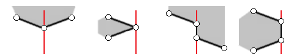

Припадност тачке простом многоуглу
==================================

Задатак којим ћемо се овде бавити је утврђивање да ли дата тачка припада датом простом многоуглу. 
Подсетимо се, многоугао је прост ако његове странице немају заједничких тачака, осим што суседне 
странице имају заједничко теме. Краће речено, многоугао је прост ако нема самопресека. 

    
    Прост многоугао (лево) и сложен многоугао (десно)

Код многих проблема рачунарске геометрије човеку је прилично једноставно да врло брзо види одговор 
када му се улазни подаци представе у облику слике. На пример, у већини примера одмах видимо да ли 
је заокрет налево, да ли је тачка у троуглу, да ли се дате дужи секу, да ли је многоугао конвексан, 
која су темена конвексног омотача, да ли се конвексни многоуглови секу и слично. Међутим, проблем 
припадности тачке многоуглу је један од проблема, код којих ни човеку није једноставно да одмах 
види одговор.

    
    Проблем припадности тачке многоуглу
    
Покушајте за сваки од многоуглова да што брже одговорите која од две црвене тачке је унутар, а 
која изван многоугла. Вероватно сте на трећој слици бар мало застали. Можемо да замислимо и много 
сложеније многоуглове од ових приказаних на слици. Зато је разумно поставити питање: који је 
ефикасан начин да се одговори на постављено питање? 

За слике које нису сувише сложене, склони смо да оком пратимо путању од дате тачке као када тражимо 
излаз из лавиринта. Међутим, ако многоугао изгледа као прави лавиринт и има раскрсница и слепих 
крајева, овај начин решавања може да постане компликован. 

До боље идеје можемо да дођемо ако приметимо да нам је на свакој од три дате слике једноставно да 
закључимо да је једна од црвених тачака унутар, а друга изван многоугла, мада можда не знамо одмах 
која од њих је која. Лако примећујемо да су тачке са разних сртана многоугаоне линије, зато што се 
у свим случајевима између црвених тачака налази само једна страница многоугла. Идеја која одавде 
произилази се састоји у томе да почнемо да се удаљавамо од дате тачке у било ком изабраном смеру 
(дуж неке полуправе) и бројимо пресеке са контуром многоугла (многоугаоном линијом). Када се удаљимо 
довољно од многоугла, тако да је очигледно да смо ван њега, по парности броја пресека са контуром 
можемо да одредимо да ли полазна тачка припада многоуглу: ако је број пресека паран, полазна тачка 
је ван многоугла, а ако је непаран, полазна тачка је у многоуглу.

Размислимо како овај алгоритам можемо да прилагодимо извршавању на рачунару. Као прво, потребно је 
да изаберемо смер у коме се удаљавамо. Због једноставности даљег рачунања, можемо да изаберемо 
смер вертикално наниже. Даље, потребно је да знамо које странице многоугла се секу са изабраном 
полуправом, означимо је са :math:`p`. Ради тога можемо да потражимо пресек сваке странице са 
полуправом :math:`p` и одредимо парност броја пресека.

    
    Бројање пресека страница са полуправом наниже из тачке
    и утврђивање припадности многоуглу на основу парности броја пресека

Ово је већ поступак који даје тачан одговор када полуправа :math:`p` не садржи ни једно од темена 
многоугла. Да би поступак давао исправан одговор за сваки многоугао и сваку тачку, погледајмо и 
неколико карактеристичних случајева у којима полуправа :math:`p` садржи једно или више темена 
многоугла.

    
    Припадност тачке многоуглу, специјални случајеви

Јасно је да у првом случају желимо да бројимо један, а у другом нула или два пресека. Слично томе, 
у трећем случају треба бројати непаран, а у четвртом паран број пресека.

Правило којим то можемо да постигнемо је да се крајња тачка странице броји као пресек са полуправом 
само онда, када је :math:`x` координата те тачке већа од :math:`x` координате друге крајње тачке те 
странице. На тај начин бисмо у случајевима са слике имали редом 1, 2, 1 и 2 пресека са полуправом, 
што одговара потребама. Специјално, за вертикалну страницу чије крајње тачке припадају полуправој се 
не броји ниједан пресек, јер :math:`x` координата ниједне крајње тачке те странице није већа од 
:math:`x` координате друге крајње тачке (:math:`x` координате су исте).

Сложеност алгоритма је очигледно линеарна, јер се постојање пресека са сваком од страница многоугла 
утврђује у константном времену.

Сада имамо детаљно описан комплетан поступак, на основу кога може да се напише програм. Овога пута, 
писање програма остављамо читаоцима за вежбу.

Задатак
-------

- Напишите програм, који описаним поступком проверава да ли је дата тачка унутар датог простог многоугла, 
  чија су темена дата редом. Није познато да ли је редослед темена у позитивном или негативном смеру. 
  Све координате су целобројне и по апсолутној вредности не прелазе милијарду. У решењу треба користити 
  само сабирање, одузимање и множење целих бројева (не користити реалне бројеве, дељење, или математичке 
  функције попут :math:`\sqrt{x}, \sin{x}, \cos{x}` и сличне).
