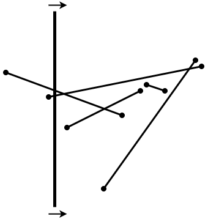
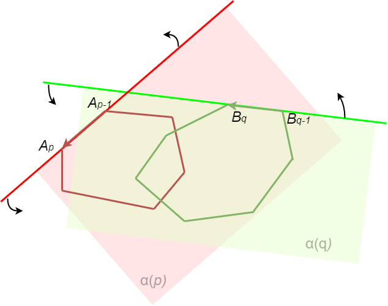

Још неки геометријски алгоритми
===============================

На овом месту ћемо да поменемо још неке значајне проблеме рачунарске геометрије, као и алгоритме 
помоћу којих они могу да буду решени. Нећемо се упуштати у све детаље описа алгоритама јер је то 
ван оквира овог курса, али ћемо упутити читаоце који су посебно заинтересовани за ову област.

Друга решења проблема конвексног омотача
----------------------------------------

.. comment

    https://en.wikipedia.org/wiki/Convex_hull_algorithms

Поред раније изложеног алгоритма `Грејамовог скенирања <https://sr.wikipedia.org/wiki/Грејамово_скенирање>`_, 
постоји још неколико алгоритама вредних пажње, који налазе конвексан омотач датог коначног скупа 
тачака. Један од једноставнијих и старијих је алгоритам `увијања поклона <https://sr.wikipedia.org/wiki/Алгоритам_увијања_поклона>`_, 
познат и као Џарвисов марш. Идеја овог алгоритма је следећа:

.. infonote::

    **Псеудокод алгоритма увијања поклона:**

    | - нађи једну тачку :math:`P_0`, која сигурно припада конвексном омотачу (нпр. тачка са највећом :math:`x` 
    |   координатом, а ако има више таквих, онда она међу њима која има и највећу :math:`y` координату)
    | - понављај
    |   - нађи следећу тачку :math:`P_{i+1}` конвексног омотача, као ону од тачака полазног скупа
    |     за коју је оријентисани угао између вектора :math:`P_iP_{i+1}` и позитивног смера :math:`x` осе
    |     најмањи
    |   док не добијеш да је следећа тачка конвексног омотача једнака тачки :math:`P_0`

Лако се уочава да је сложеност алгоритма увијања поклона :math:`O(nk)`, где је :math:`n` број тачака 
полазног скупа, а :math:`k` број темена конвексног омотача. Због тога у неповољним случајевима овај 
алгоритам може да захтева и број операција (а тиме и време) реда :math:`n^2`. 

**Задатак:** Опишите скуп тачака за који је алгоритму увијања поклона потребно квадратно време да 
израчуна конвексан омотач тог скупа.

С обзиром на ову ману, значај алгоритма увијања поклона није толико у директној примени, већ више у 
упознавању идеје, ради лакшег разумевања других, новијих алгоритама, као што је нпр. `алгоритам монотоног ланца 
<https://en.wikibooks.org/wiki/Algorithm_Implementation/Geometry/Convex_hull/Monotone_chain>`_, или 
`Чанов алгоритам <https://en.wikipedia.org/wiki/Chan%27s_algorithm>`_.

Постојање пресека међу више дужи
--------------------------------

.. questionnote::

    Дато је :math:`n` дужи у равни. Одредити да ли се неке две од тих дужи секу, или су сваке две дисјунктне.

Овај проблем може да се реши алгоритмом бришуће (чистеће) линије 
(`sweep line algorithm <https://en.wikipedia.org/wiki/Sweep_line_algorithm>`_) 
у времену :math:`O(n \log n)`. Идеја алгоритма је да се замисли линија, која се помера преко равни, 
заустављајући се у крајњим тачкама датих дужи. Обично се узима да је линија вертикална и да се помера 
слева надесно. Осим ове бришуће линије, потребно је да се води евиденција о тзв **активним дужима**, 
тј. дужима на чији почетак смо бришућом линијом већ наишли, а на крај још нисмо. Другим речима, активне 
дужи су оне које секу бришућу линију. За вођење евиденције користи се нека колекција активних дужи, 
која се ажурира сваким наиласком бришуће линије на неку од крајњих тачака датих дужи. Колекцију замишљамо 
као да су активне дужи стално уређене по тачки пресека са бришућом линијом, тј. да датој активној дужи 
у колекцији претходи активна дуж која је непосредно изнад дате, а следи активна дуж која је непосредно 
испод дате.

    
    Бришућа линија у проблему постојања пресека неких од датих дужи

.. infonote::

    **Псеудокод алгоритма бришуће линије:** 

    | Сортирај низ :math:`P` свих крајњих тачака датих дужи, растуће по :math:`X` координати
    | креирај празну колекцију сегмената :math:`T` 
    | за сваку од :math:`2n` тачака низа :math:`P` (слева надесно):
    |     ако је текућа тачка :math:`P_i` лева тачка своје дужи :math:`L`:
    |         убаци дуж :math:`L` у колекцију :math:`T`
    |         ако се дуж :math:`L` сече са претходном или следећом дужи у колекцији :math:`T`
    |             врати ``true``
    |     иначе (ако је текућа тачка :math:`P_i` десна тачка своје дужи :math:`L`):
    |         ако се међусобно секу дуж која претходи и дуж која следи дужи :math:`L` у колекцији :math:`T`:
    |             врати ``true``
    |         уклони дуж :math:`L` из колекције :math:`T` 
    | врати ``false``

Приметимо да нема потребе да се проверава постојање пресека дужи :math:`L` са осталим (активним) дужима. 
Заиста, ако се дуж :math:`L` сече са било којом дужи која јој је на почетку претходила, то значи да у тренутку 
када бришућа линија дође до краја дужи :math:`L`, :math:`y`, координата дужи :math:`L` постаје већа од 
:math:`y` координате те дужи, па је зато већа и од :math:`y` координате најближе претходне дужи, тј. има пресек 
и са непосредно претходном дужи. Исто важи и за пресеке са дужима које су на почетку биле испод (тј. следиле) 
дужи :math:`L`. Такође, нема потребе да се проверава постојање пресека осталих дужи међусобно, јер ће пресеци 
сваке дужи (са двема њој суседним, што је довољно) бити проверени када та дуж престане да буде активна.

Из описа идеје алгоритма и псеудокода је јасно да је за ефикасност целог алгоритма веома битно да 
колекција сегмената :math:`T` буде имплементирана тако да има следеће две особине:

- омогућава да се за дату активну дуж ефикасно одреди активна дуж непосредно изнад или непосредно 
  испод дате активне дужи (претходна, односно следећа дуж)
- убацивање дужи у колекцију и избацивање из ње треба да буду ефикасне операције

Структура која има обе поменуте особине је самобалансирано `бинарно стабло претраге 
<https://sr.m.wikipedia.org/sr-ec/Бинарно_стабло>`_. 
Неке познате имплементације самобалансираног бинарног стабла претраге су 
`АВЛ-стабло <https://sr.wikipedia.org/wiki/АВЛ-стабло>`_, 
`црвено-црно стабло <https://sr.wikipedia.org/wiki/Црвено-црно_стабло>`_ и 
`Б-стабло <https://sr.wikipedia.org/wiki/Б-стабло>`_.

Налажење свих пресека међу више дужи
------------------------------------

.. questionnote::

    Дато је :math:`n` дужи у равни. Одредити све пресеке дужи по паровима. 

Овај проблем је сличан претходном и може да се реши модификацијом претходно описаног алгоритма чистеће 
линије. Једна таква модификација је алгоритам Бентли-Отмана, који налази све пресечне тачке 
у времену :math:`O((n + k) \log n)`, где је :math:`k` број пресечних тачака. У односу на класичан 
приступ тражења пресека за сваки пар дужи, овај алгоритам је побољшање у случају да је :math:`k` 
довољно мало. Прецизније, да би алгоритам Бентли-Отмана био асимптотски бржи класичног алгоритма 
квадратне сложености, потребно је да важи :math:`k=o\left({\frac {n^2}{\log n}}\right)`.

Заинтересовани читаоци могу да нађу опис алгоритма, псеудокод, анализу сложености и друге детаље нпр. 
на википедији (`Bentley–Ottmann algorithm <https://en.wikipedia.org/wiki/Bentley%E2%80%93Ottmann_algorithm>`_).

Пресек два конвексна многоугла
------------------------------

.. questionnote::

    Дата су два конвексна многоугла својим теменима, наведеним у редоследу обиласка у позитивном смеру. 
    Наћи многоугао који представља њихов пресек. 

Можда помало неочекивано, овај проблем може да се реши у линеарном времену. Једна од идеја, до које 
су 1981. године дошли Џозеф О’Рурк и сарадници (Joseph O’Rourke, Chi-Bin Chien, Thomas Olson, David 
Naddor: `A New Linear Algorithm for Intersecting Convex Polygons`), у суштини је сложени пример технике 
два показивача. Наиме, за сваки од два многоугла се уведе по једна бројачка променљива, која представља 
индекс текућег темена многоугла. Нека је то променљива :math:`p` за многоугао :math:`P=A_1A_2...A_m`, 
а променљива :math:`q` за многоугао :math:`Q=B_1B_2...B_n`. Подразумеваћемо да су темена дата у 
смеру супротном од смера казаљке на сату (позитиван смер) и да се индекси темена у многоугловима 
узимају по одговарајућем модулу (тј. да је :math:`A_m=A_0, A_{m+1}=A_1, \ldots, B_n = B_0, B_{n+1} = B_1, \ldots`).

Са :math:`\alpha(p)` ћемо означавати затворену полураван која садржи многоугао :math:`P` и ограничена 
је правом :math:`A_{p-1}A_p`. Формалније, :math:`\alpha(p)` је скуп свих тачака :math:`T` дате равни, 
таквих да тројка :math:`A_{p-1}A_pT` чини заокрет налево, или је колинеарна. Слично, са :math:`\alpha(q)` 
означавамо затворену полураван која садржи многоугао :math:`Q` и ограничена je правом :math:`B_{q-1}B_q`. 
На следећој слици је полураван :math:`\alpha(p)` означена црвеном бојом, а полураван :math:`\alpha(q)` 
зеленом. 

    
    Алгоритам за одређивање пресека два конвексна многоугла

Дужи :math:`A_{p-1}A_p` и :math:`B_{q-1}B_q`  називаћемо текућим дужима многоуглова :math:`P` и 
:math:`Q` редом. У свакој итерацији се проверава да ли се текуће дужи два многоугла секу, а пронађене 
пресечне тачке се додају у резултат. Алгоритам напредује преласком на следеће теме у једном од 
многоуглова, тј. повећавањем једне од променљивих :math:`p, q` за 1. Најосетљивији део алгоритма је 
управо критеријум одлучивања у којем многоуглу треба напредовати.

Циљ алгоритма је да нађе пар текућих дужи које имају пресек. Неформално говорећи, алгоритам настоји 
да изабере такво :math:`q` да вектор :math:`\overrightarrow{\rm B_{q-1}B_q}` сече граничну праву полуравни 
:math:`\alpha(p)`, а да истовремено вектор :math:`\overrightarrow{\rm A_{p-1}A_p}` сече граничну праву 
полуравни :math:`\alpha(q)`. Да би се дошло до таквог пара индекса :math:`p, q`, користи се следећа 
идеја: 

- ако је зелени вектор :math:`\overrightarrow{\rm A_{p-1}A_p}` усмерен ка црвеној правој, а црвени вектор 
  :math:`\overrightarrow{\rm A_{p-1}A_p}` од зелене праве (као на слици), напредује се у зеленом многоуглу
- ако је зелени вектор :math:`\overrightarrow{\rm A_{p-1}A_p}` усмерен од црвене праве, а црвени вектор 
  :math:`\overrightarrow{\rm A_{p-1}A_p}` ка зеленој правој, напредује се у црвеном многоуглу
- иначе (ако су оба вектора усмерена ка правама супротне боје, или оба од тих правих), напредује се у 
  многоуглу који је споља. Када су вектори у оваквом положају, са слике може да се интуитивно разуме 
  који многоугао је споља.
  
Када се на овај начин бира многоугао у коме се напредује, заиста се долази до пара дужи које се секу, 
ако такав пар постоји. Након проналажења једне пресечне тачке двеју многоугаоних линија, у темена 
пресечног многоугла се додају и темена једне многоугаоне линије, и то она која се налазе унутар друге 
многоугаоне линије. 
  
Итерације (напредовање у једном од два многоугла) се понављају све док се не понови прва пресечна 
тачка, или док се не изврши :math:`2(m+n)` итерација. У случају да се понови прва пресечна тачка, 
пресек је већ у целости одређен. У супротном саме многоугаоне линије немају пресечних тачака, али 
пресек многоугаоних површи може да постоји ако је једна од њих подскуп друге. Лако може да се 
провери који од случајева је наступио, тако што се испита да ли се једно теме једног многоугла 
налази у унутрашњости другог и обрнуто (види `алгоритам провере припадности тачке многоуглу 
<23_pripadnost_prostom_mnogouglu.html>`_). 

Овај неформалан опис је дат пре свега ради интуитивног разумевања идеје алгоритма. Прецизнији опис 
алгоритма је дат ниже у псеудокоду. Напомињемо да се припадност тачке полуравни и знак оријентисаног 
угла утврђују користећи појам оријентације тројке тачака. 
Овако изложен алгоритам претпоставља да међу тачкама :math:`A_1, A_2, \ldots, A_m, B_1, B_2, \ldots, B_n` 
нема колинеарних тројки. Специјално, пресек страница које припадају различитим многоугловима никад није 
један од крајева неке од тих страница. У оригиналном раду аутора алгоритма описана је и модификација, 
која исправно обрађује и специјалне случајеве за колинеарним тројкама тачака. 

.. comment

    https://www.cs.jhu.edu/~misha/Spring16/ORourke82.pdf

.. infonote::

    Псеудокод алгоритма за одређивање пресечног многоугла: 

    |        Изабери произвољно теме :math:`A_p` многоугла :math:`P` и теме :math:`B_q` многоугла :math:`Q`
    |        **унутрашњи многоугао** на почетку није ниједан
    |        **резултат** је на почетку празна листа
    |        понављај
    |            ако се :math:`A_{p-1}A_p` и :math:`B_{q-1}B_q` секу:
    |                ако је пресечна тачка једнака првој пресечној тачки:
    |                    врати **резултат** и заустави се
    |                иначе: 
    |                    додај пресечну тачку у **резултат**
    |                    // `дефиниши унутрашњи многоугао`
    |                    ако је :math:`P \in \alpha(q)`: **унутрашњи многоугао** је :math:`P`
    |                    иначе: **унутрашњи многоугао** је :math:`Q`
    |            // `напредуј у једном од многоуглова`
    |            ако је оријентисани угао између праваца :math:`B_{q-1}B_q` и :math:`A_{p-1}A_p` позитиван:
    |                ако је :math:`A_p \in \alpha(q)`: Напредуј у :math:`Q`
    |                иначе: Напредуј у :math:`P`:
    |            иначе:
    |                ако је :math:`B_q \in \alpha(p)`: Напредуј у :math:`P`:
    |                иначе Напредуј у :math:`Q`
    |        док се не изврши :math:`2(m+n)` итерација
    |        // `саме многоугаоне линије немају пресек, проверити да ли је један многоугао подскуп другог`
    |        Изабери произвољно теме :math:`A_p` многоугла :math:`P` и теме :math:`B_q` многоугла :math:`Q`
    |        ако је :math:`A_p \in Q`: врати :math:`P` као резултат
    |        иначе, ако је :math:`B_q \in P`: врати :math:`Q` као резултат
    |        иначе: врати празну листу као резултат
    |   
    | **функција** Напредуј у :math:`P`:
    |        ако је :math:`P` **унутрашњи многоугао**, додај :math:`A_p` у резултат
    |        увећај :math:`p`
    |
    | **функција** Напредуј у :math:`Q`:
    |        ако је :math:`Q` **унутрашњи многоугао**, додај :math:`B_q` у резултат
    |        увећај :math:`q`
