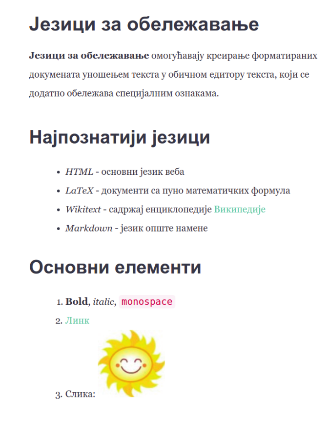

Формат Markdown
===============

Постоји велики број језика за обележавање који се користе за различите
намене. Иако су рани језици били прилично богати, а самим тим и
компликовани, данас су велику популарност стекли такозвани **лаки
језици за обележавање** (енгл. lightweight markup), којима је циљ да
буду пре свега једноставни за употребу. Овде ћемо навести неке од
најпопуларнијих.

- За **HTML** се може рећи да је најпознатији језик за обележавање јер се
  користи за обележавање веб-страна и тако представља основу
  веба. HTML је веома богат језик и подржава богати скуп елемената
  који могу бити присутни на веб-странама. За прегледање стране
  описане на језику HTML довољан је прегледач веба (који не мора бити
  повезан на интернет).

- **LaTeX** је језик за припрему докумената за штампу, пре свега научних и
  техничких чланака који садрже сложене математичке формуле. Да би се
  од LaTeX описа креирао PDF документ, потребно је да се инсталира
  LaTeX преводилац (најпознатије слободне дистрибуције су MikTeX и
  TeXLive), а може се употребити и неко онлајн развојно окружење
  (нпр. latexbase, sharelatex или overleaf).

- **MediaWiki** (познат и као wikitext или wiki markup) јесте језик за
  облежавање који се користи за обележавање садржаја
  Википедије. Знатно је једноставнији од језика HTML, па је доступнији
  ширем кругу аутора чланака у овој слободној енциклопедији. MediaWiki
  се најбоље може испробати директно на веб-сајту Википедије.


- **Markdown** је веома популаран језик за обележавање, пре свега због
  своје једноставности и добре софтверске подршке (текст описан на
  овом језику веома се лако преводи у друге формате, пре свега у HTML,
  чиме постаје спреман за објављивање на вебу, и у PDF-у, чиме постаје
  спреман за штампу). **Pandoc** је најпознатији конвертор којим се
  Markdown може превести на разне друге формате. Он је такође слободно
  доступан. Markdown садржај може се унети и прегледати и на
  специјализованим веб-сајтовима (најпознатији су
  https://dillinger.io/ и https://stackedit.io/).

Прикажимо неке основне елементе језика Markdown на једном једноставном
примеру. Прикажимо како се изглед наредне веб-странице може описати
помоћу језика Markdown.



::

   # Језици за обележавање

   **Језици за обележавање** омогућавају креирање форматираних
   докумената уношењем текста у обичном едитору текста, који се
   додатно обележава спе- цијалним ознакама.
   
   ## Најпознатији језици

   - *HTML* - основни језик веба
   - *LaTeX* - документи са пуно математичких формула
   - *Wikitext* - садржај енциклопедије [Википедије](https://wikipedia.org)
   - *Markdown* - језик опште намене
     
   ## Основни елементи
   
   1. **Bold**, *italic*, `monospace`
   1. [Линк](http://petlja.org)
   1. Слика:    
      

      
Главни наслови се обележавају помоћу ``#``, а поднаслови помоћу
``##``. Подебљан текст се обележава помоћу ``**...**``, искошен помоћу
``*...*``, а рачунарски код помоћу ```...```. Ставке ненумерисане
листе се обележавају помоћу цртица (обично се увуку два размака), док
се ставке нумерисане листе обележавају помоћу 1. (приликом превођења
број 1 се замењује редним бројем ставке). Линкови се обележавају у
формату ``[tekst](link)``, где је ``tekst`` оно што се приказује, а
``link`` адреса на који се одлази када корисник кликне на линк. Слике
се описују веома слично (једина разлика је ускличник на почетку).
Математичке формуле се уносе помоћу ``$$...$$``, а сам формат записа
математичких формула је преузет из језика LaTeX (покушај да на
интернету пронађеш примере записа неких једноставним математичких
формула).

Пример: генерисање садржаја
---------------------------

Једна од основних предности текстуалних језика за обележавање у односу
на бинарне формате записа података који су најчешће генерисани помоћу
неких WYSIWYG алата је то што се текстуални садржај лако може
програмски обрађивати. За то се користе једноставни програми
(тзв. скриптови) који су раније најчешће писани у неким
специјалнизованим програмским језицима (нпр. AWK, Perl), а данас се
често пишу у језику Python. У наставку ћемо видети како је прилично
једноставно могуће употребити и програмски језик C# да би се направили
скриптови који врше неку једноставну анализу и обраду форматираног
текстуалног садржаја записаног у неком од језика за обелешавање (ми
ћемо претпоставити да је у питању Markdown).

Претпоставимо да желимо да на основу садржаја Markdown датотеке
генеришемо садржај који ће садржати све наслове и поднаслове који су
уз то аутоматски нумерисани. На пример, ако је дата датотека:

::

   # Језици за обележавање

   ## HTML
   HTML је језик који се користи за обележавање веб-страница.

   ## Markdown
   Markdown је лаки језик за обележавање који се једноставно
   може конвертовати у разне формате (HTML, LaTeX, ...)

   # Софтвер

   ## Pandoc
   Најпознатији софтвер за превођење текстуалних формата је
   [Pandoc](http://pandoc.org)
   ### Инсталација
   Софтвер се може слободно преузети са интернета и лако се
   инсталира.

Наш програм треба да прочита ову датотеку и да на основу ње генерише
наредни садржај.

::

   1.....................Језици за обележавање
   1.1....................................HTML
   1.2................................Markdown
   2...................................Софтвер
   2.1..................................Pandoc
   2.1.1...........................Инсталација

Након што корисник унесе путању до Markdown датотеке отворићемо је и
читати линију по линију, покушавајући да препознамо линије које садрже
наслове и поднаслове. Они се могу препознати тако што почињу са једном
или више тарабица (карактера ``#``), након чега иде нула или више
размака и текст наслова који се простире до краја те линије. За ово
можемо употребити регуларни израз ``^\s*(#+)\s*(.*)`` (почетак реда
``^``, затим нула или више белина ``\s*``, једна или више тарабица
``(#+)``, нула или више белина ``\s*`` и на крају произвољни карактери
све до краја реда ``(.*)``). У заграде смо ставили тарабице и текст
наслова, да бисмо могли да им касније приступимо (број тарабица ће нам
рећи ниво наслова, а текст наслова морамо да знамо да бисмо га
исписали у садржају).

У сваком тренутку треба чувамо низ бројача (по један бројач за сваки
ниво наслова). Када наиђе нови наслов, потребно је да за један увећамо
бројач на последњем нивоу тј. нивоу који одговара том наслову. Заиста,
ако је низ бројача чувао број ``3.1.2`` када наиђе нови поднаслов на
трећем нивоу, последњи бројач се увећава и долази се до броја
``3.1.3``. Ако тренутно у низу има више бројача, оне последње
избацујемо. Наиме, када се започне ново поглавље, бројачи потпоглавља
из старог поглавља више нису релевантни. На пример, ако у претходној
ситуацији уместо поднаслова нивоа 3 наиђе поднаслов нивоа 2, скида се
последњи бројач, долази се до ``3.1`` након чега се последњи бројач
увећава и долази се до броја ``3.2`` који заиста одговара том новом
поднаслову нивоа 2. Ако има мање бројача него што је тренутни ниво
наслова, потребно је низ бројача проширити допуњавањем нулама. На
пример, ако после поднаслова ``3.1`` наиђе поднаслов нивоа 3, тада се
у низ додаје бројач чија је вредност нула и добија се ``3.1.0`` након
чега се извршава увећање и долазимо до броја ``3.1.1`` што је управо
број који треба доделити том новом поднаслову нивоа 3. Ако на улазу
није било прескакања нивоа поднаслова, биће додата само једна нула
која ће се одмах увећати на један) Приметимо да се овај низ заправо
понаша као стек (бројачи се додају и скидају само са десног краја и
само се увећава онај бројач који је на врху), међутим, чуваћемо га као
обичну листу, јер ће нам приликом генерисања садржаја бити потребно да
све бројаче спојимо тачкицама (што није дозвољена операција код
стека). Поравнавање садржаја вршимо уз помоћ функције ``PadRight``,
веома слично као што је то приказано у ранијим примерима генерисања
садржаја.

Скренимо за сваки случај пажњу на нешто што вероватно и од раније
знаш. Читање појединачних линија датотеке најједноставније можеш данас
у језику C# урадити помоћу методе ``File.ReadLines``.

На основу претходне дискусије није тешко написати и програм у језику
C#.

.. activecode:: markdown_sadrzaj_kod
    :passivecode: true
    :coach:
    :includesrc: _src/3_tekstualni/md_sadrzaj.cs

Пример: разрешавање линкова
---------------------------

Претпоставимо да постоји велика количина међусобно повезаних Markdown
датотека (на пример, збирке на порталу ``petlja.org`` су прављене баш
на тај начин). Пошто је датотека пуно, оне су организоване у велики
број директоријума и поддиректоријума. Да би линкови радили, свака
путања унутар тог линка треба да буде направљена тако да представља
или апсолутну путању циљне датотеке унутар система датотека или тако
да предтавља релативну путању од тренутне до циљне датотеке. Пожељно
је и да текст линка одговара главном наслову циљне датотеке
(претпоставићемо да свака Markdown датотека има јединствен главни
наслов). На пример, претпоставимо да су дате две повезане датотеке.

Прва је у кореном директоријуму и назива се ``index.md``, а друга је у
поддиректоријуму ``uvod`` и назива се ``uvod.md``. Нека је садржај
датотеке ``index.md`` следећи:

::

   # Повезане датотеке

   Погледај [Увод](uvod\uvod.md).

Нека је садржај датотеке ``uvod.md`` следећи:

::

   # Увод

   Више о овоме се може видети у делу [Повезане датотеке](..\index.md).

Ручно одржавање овакве колекције датотека је веома тешко. Сваки пут
када се нека датотека премести или када се промени њен главни наслов,
потребно је пронаћи и ажурирати све линкове ка њој. Стога ћемо
направити скрипт који ће ово аутоматски радити. Довољно је да корисник
само наведе имена циљних Markdown датотека (а не пуне путање), а наш
скрипт ће аутоматски пронаћи пуне путање до њих и наслове уписане у
њима (претпоставићемо да су називи свих датотека јединствени).

Основна идеја је да кроз све датотеке прођемо два пута. Једном да
бисмо их индексирали тј. да бисмо направили речник који пресликава
јединствено име датотеке у уређени пар који садржи пуну путању до ње и
наслов прочитан из датотеке. Након тога, у другом пролазу кроз
датотеке вршимо разрешавање линкова. За препознавање наслова и линкова
ћемо користити регуларне изразе. На пример, линкове препознајемо
помоћу израза ``\[([^]]*)\]\(([^)]+)\)`` који каже да се линк састоји
од низа карактера наведених између ``[...]`` заграда, при чему тај низ
не сме да садржи нови карактер ``]``, након чега следи низ карактера
наведених између ``(...)`` заграда, при чему тај низ не сме да садржи
нови карактер ``)``. Приметимо да је ово одређени облик ограничења,
јер текст линка не може да садржи угласте, а адреса линка не може да
садржи обичне заграде, али помоћу регуларних израза боље не можемо
постићи. Сваки пут када препознамо линк, из адресе издвајамо само
назив датотеке и на основу тог назива из речника читамо пуну путању и
наслов, формирамо нови линк и стари замењујемо њиме. Након што текст
изменимо заменом свих линкова на овај начин, нови текст уписујемо у
полазну датотеку. Приметимо да се на овај начин често креирају само
благо измењене копије могуће веома дугачких стрингова (јер се цео
садржај сваке Markdown датотеке учитава у један стринг) па покушај да
извршиш потребне оптимизације да се ово не дешава.

Пре него што прикажемо комплетан код, срећемо ти пажњу на веома
корисне класе ``File``, ``Directory`` и ``Path`` које значајно помажу
у писању скриптова тј. програма који обрађују датотеке. Ево објашњења
неких статичких метода које ти могу бити корисне за решавање тренутног
задатка.

- ``File.ReadAllText`` учитава комплетан садржај датотеке у један
  стринг.
- ``File.WriteAllText`` уписује дати стринг у датотеку (стари садржај,
  ако постоји, се брише)
- ``Directory.GetFiles`` проналази све датотеке чије се име уклапа у
  дати шаблон унутар датог директоријума (и евентуално његових
  поддиректоријума, ако се то експлицитно тражи).
- ``Path.GetFileName`` издваја само назив датотеке из пуне путање
  (нпр. од ``C:\Users\Pera\markdown\index.md`` издваја само ``index.md``).
- ``Path.GetDirectoryName`` издваја назив тј. путању до директоријума
  из пуне путање (нпр. од ``C:\Users\Pera\markdown\index.md`` издваја само
  ``C:\Users\Pera\markdown``).
- ``Path.GetRelativePath`` одређује релативну путању од датог
  директоријума за наведену апсолутну путању (нпр. ако је полазни
  директоријум ``C:\Users\Pera\markdown`` а апсолутна путања је
  ``C:\Users\Pera\markdown\uvod\uvod.md``, релативна путања је
  ``uvod\uvod.md``).

Погледај детаљне описе ових метода у званичној документацији (веома
важна вештина сваког програмера је сналажење у документацији).


.. activecode:: markdown_linkovi_kod
    :passivecode: true
    :coach:
    :includesrc: _src/3_tekstualni/md_linkovi.cs

Провери како се овај програм понаша приликом различитог облика
неисправног улаза и покушај да га дорадиш тако да буде користан и у
тим ситуацијама (ако ништа друго, оно бар да пријављује грешке и
упозорења).
