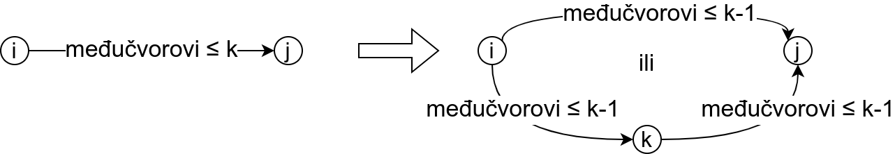
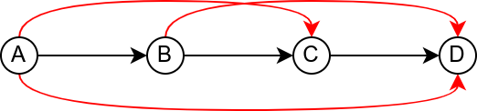

Најкраћи путеви у графу
=======================

Већ смо видели да тежински графови могу да представе мрежу
путева. Питања која се природно постављају над таквим графовима су
одређивање најкраћих путева. Можемо разматрати следеће задатке:

- Одредити најкраћи пут измећу чворова A и Б;
- Одредити најкраће путеве између чвора А и свих осталих чворова у
  графу (енгл. single source shortest paths);
- Одредити најкраће путеве између свих парова чворова у графу
  (енгл. all-pairs shortest paths).

Приликом решавања ових задатака често се претпоставља да су растојања
између чворова (тј. тежине грана у графу) ненегативни бројеви. Ако најкраћи
пут између чворова A и Б пролази преко чвора Ц, тада се он састоји од
најкраћег пута од А до Ц и најкраћег пута од Ц до Б (у супротном би
неки од та два пута могао да буде скраћен, па би био скраћен и пут од
А до Б, што није могуће). То значи да је скоро немогуће одредити
најкраћи пут од чвора A до чвора Б, не разматрајући најкраће путеве до
осталих чворова. Стога се први наведени проблем често своди на други и
најкраћи пут између чворова А и Б се одређује тако што се одређују
најкраћи путеви између чвора А и осталих чворова, све док се не одреди
најкраћи пут до траженог чвора Б. Трећи проблем је могуће свести на
други тј. најкраће путеве између свих парова чворова је могуће
одредити тако што се за сваки чвор одреде најкраћи путеви до осталих
чворова. Ипак, постоји и директан алгоритам којим се ефикасно и
једноставно решава трећи наведени проблем. Стога ћемо у наставку
разматрати:

- **Дајкстрин алгоритам** за одређивање најкраћих путева од чвора А до
  свих осталих чворова у графу, у коме нема негативних тежина;
- **Флојд-Варшалов алгоритам** за одређивање најкраћих путева између
  свих парова чворова у графу у коме нема циклуса негативне тежине.

Поред Дајкстриног алгоритма, за одређивање најкраћих путева из једног
чвора користи се и Белман-Фордов алгоритам (он ради и када у графу
постоје гране негативне тежине), а за одређивање најкраћих путева
између свих парова чворова користи се и Џонсонов алгоритам.

  
Најкраћи путеви из једног чвора - Дајкстрин алгоритам
-----------------------------------------------------

Дајкстрин алгоритам одређује најкраће растојање од неког фиксног чвора
:math:`v_0` до свих осталих чворова у графу. Основна идеја алгоритма
је да се ти чворови обилазе у редоследу најкраћих растојања од
полазног чвора.

Алгоритам ради индуктивно, тако што се претпоставља да се након
:math:`k` корака извршавања алгоритма познају :math:`k` чворова који
су најближи почетном чвору (укључујући и њега), као и најкраћа
растојања од почетног чвора до њих. Нека они чине скуп чворова
:math:`V_k = \{v_0, \ldots, v_{k-1}\}`. Почетни чвор је сигурно
најближи сам себи и растојање до њега је једнако нули, па је база
индукције скуп :math:`V_1 = \{v_0\}` који садржи само почетни
чвор. Поставља се питање како извршити идуктивни корак тј. како да се
одреди наредни најближи чвор :math:`v_{k}`. Најкраћи пут од почетног
чвора :math:`v_0` до чвора :math:`v_k` може да садржи само чворове из
:math:`V_k` (на том путу не може постојати неки чвор ван :math:`V_k`,
јер би тај чвор био ближи почетном чвору од чвора :math:`v_k`). Према
томе, да бисмо пронашли чвор :math:`v_k`, треба проверити све гране
које спајају чворове из :math:`V_k` са чворовима који нису у
:math:`V_k` (остале гране се могу игнорисати). У сваком кораку се скуп
:math:`V_k` проширује чвором :math:`v_k \notin V_k` за који је најмања
вредност :math:`\min\{r(v_0, v_i) + d(v_i, v_k)\ |\ v_i \in V_k\}`,
где је :math:`r(v_0, v_i)` дужина најкраћег пута од почетног чвора
:math:`v_0` до :math:`v_i` (који је познат на основу индуктивне
хипотезе), а :math:`d(v_i, v_k)` дужина гране од чвора :math:`v_i` до
:math:`v_k`.

Овим је алгоритам у потпуности прецизиран и могуће је дати опис
алгоритма у псеудокоду. Вредности :math:`r(v_0, v_i)` најкраћих
растојања за чворове :math:`v_i` скупа :math:`V_k` које су већ
одређене се памте у низу ``r`` и обележавамо их са ``r[vi]``.

.. code::

   postavi Vk={v0}
   postavi najkrace rastojanje r[v0] = 0
   dok skup Vk ne sadrzi sve cvorove grafa:
       odaberi par corova vi ∈ Vk i vk ∉ Vk za koji se postiže
          najmanja vrednost r[vi] + d(vi, vk)
       ubaci cvor vk u Vk
       postavi najkrace rastojanje r[vk] = r[vi] + d(vi, vk)
   za svaki cvor vi najkrace rastojanje je r[vi]

Значајна неефикасност претходног алгоритма настаје због анализе свих
парова чворова :math:`(v_i, v_k)` у сваком кораку. Ефикаснија
имплементација се може добити ако се за сваки чвор :math:`v` ван
:math:`V_k` у једном низу памти вредност

.. math::

    r_v = \min\{r(v_0, v_i) + d(v_i, v)\ |\ v_i \in V_k\}

која процењује најкраће растојање од чвора :math:`v_0` до чвора
:math:`v` (али само преко чворова из :math:`V_k`). За чворове који
нису достижни на овај начин, у низу се памти вредност :math:`r_v =
+\infty`, док за чворове :math:`v_i \in V_k` важи да је :math:`r_{v_i}
= r(v_0, v_i)` тј. у низу се памте стварне вредности најкраћих
растојања од :math:`v_0`.

Вредност :math:`r_v` се може израчунавати инкрементално. Када се нови
чвор дода у :math:`V_k` потребно је ажурирати само вредности
:math:`r_v` њему суседних чворова. Претпоставимо да се у скуп
:math:`V_k` додаје чвор :math:`v_k` и тако добија :math:`V_{k+1}`. За
сваки чвор :math:`v` суседан чвору :math:`v_k` нова вредност
:math:`r'_v` једнака је

.. math::

  r_v' = \min\{r_v, r(v_0, v_k) + d(v_k, v)\} = \min\{r_v, r_{v_k} + d(v_k, v)\}.

Заиста, пошто је :math:`V_{k+1} = V_k \cup \{v_k\}` важи да је

.. math::

  \begin{eqnarray*}
   r_v' = \min\{r(v_0, v_i) + d(v_i, v)\ |\ v_i \in V_{k+1}\} &=&\\
   \min\{r(v_0, v_i) + d(v_i, v)\ |\ v_i \in V_{k} \vee v_i = v_k\} &=&\\
   \min\{\min\{r(v_0, v_i) + d(v_i, v)\ |\ v_i \in V_{k}\}, r(v_0, v_k) + d(v_k, v)\} &=&\\
   \min\{r_v, r_{v_k} + d(v_k, v)\}
  \end{eqnarray*}

Ова модификација се описује следећим псеудокодом (у претходном
алгоритму низ :math:`r` је садржао само најкраћа растојања до чворова
у :math:`V_k`, а у овом поред тога садржи и процене најкраћих
растојања до чворова ван :math:`V_k` које пролазе само преко чворова
из :math:`V_k`).

.. code::

   postavi r[v0]=0 i r[vi]=∞ za ostale cvorove vi
   postavi Vk={v0}
   dok skup Vk ne sadrzi sve cvorove grafa:
       odaberi k takvo da vk nije u Vk, za koje se postiže najmanja vrednost r[k]
       ubaci cvor vk u Vk
       za sve susede vj cvora vk:
          postavi r[vj] na min(r[vj], r[vk] + d(vk, vj)) 
   za svaki cvor vi najkrace rastojanje je r[vi]

У наредној анимацији је приказан рад овог алгоритма на једном примеру.
Свака врста табеле са десне стране садржи тренутну процену растојања
сваког чвора од почетног (почетни је чвор 0) и те процене се мало по
мало приближавају стварним вредностима најкраћих растојања од почетног
чвора. Чворови скупа :math:`V_k` су обојени зеленом бојом.

.. gallery:: dajkstra_1
    :width: 800px
    :height: 100%
    :folder: ../../_images/4_grafovski/dajkstra_1
    :images: dajkstra1_1.png, dajkstra1_2.png, dajkstra1_3.png, dajkstra1_4.png, dajkstra1_5.png, dajkstra1_6.png, dajkstra1_7.png, dajkstra1_8.png, dajkstra1_9.png, dajkstra1_10.png, dajkstra1_11.png, dajkstra1_12.png, dajkstra1_13.png, dajkstra1_14.png, dajkstra1_15.png, dajkstra1_16.png, dajkstra1_17.png, dajkstra1_18.png, dajkstra1_19.png, dajkstra1_20.png, dajkstra1_21.png, dajkstra1_22.png, dajkstra1_23.png

Ова анимација је креирана коришћењем `веб-апликације доступне на сајту <http://www.matf.bg.ac.rs/~filip/algoritmi/dajkstra.html>`_ Математичког факултета у Београду. Покушај да
коришћењем ове апликације тестираш своје досадашње разумевање алгоритма
(за граф који ти буде приказан попуни таблицу, па провери да ли си је
добро попунио/попунила)
             
   
У наставку дајемо опис алгоритма у оригиналном облику (онако како га
је описао Дајкстра). У сваком кораку алгоритма скуп чворова је подељен
на:

- скуп :math:`A` који садржи чворове до којих је познато најкраће
  растојање (то је скуп :math:`V_k` из претходног описа) и

- скуп :math:`B` који садржи чворове до којих још није познато
  најкраће растојање.

Скуп :math:`B` се може поделити на скуп :math:`B_1` који садржи
чворове који су помоћу једне гране повезани са чворовима из скупа
:math:`A` и скуп :math:`B_2` који садржи остале чворове скупа
:math:`B`.

Скуп грана се у сваком кораку алгоритма може разложити на:

- скуп :math:`I` који садржи гране на најкраћим путевима од почетног
  чвора до чворова из скупа :math:`A` (те гране су у претходној
  анимацији обојене зелено)
- скуп :math:`II` који повезује чворове из скупа :math:`A` са
  чворовима из скупа :math:`B_1` -- за сваки чвор из :math:`B_1` овај
  скуп садржи тачно једну грану и то ону која даје најкраћи пут до тог
  чвора узевши у обзир све чворове из :math:`A` (те гране су у
  претходној анимацији обојене наранџасто).
- скуп :math:`III` који садржи остале гране. То су гране које су или
  избачене из разматрања јер је закључено да нису део најкраћих путева
  (оне су у претходној анимацији обојене црвено) или још нису
  размотрене (оне су у претходној анимацији нацртане танко, црном
  бојом)

У старту су сви чворови у скупу :math:`B_2` а све гране у скупу
:math:`III`. Најближи чвор почетном је сам почетни чвор (до њега је
растојање 0). Зато се почетни чвор пребацује у скуп :math:`A` и
понављају се следећа два корака:

- корак 1: разматрају се све гране :math:`e` које повезују чвор
  :math:`u` који је управо убачен у :math:`A` са чворовима :math:`v` из
  скупа :math:`B`. Ако чвор :math:`v` припада скупу :math:`B_1`
  проверава се да ли је пут од почетног чвора до чвора :math:`v` краћи
  ако се иде преко чвора :math:`u` и преко гране :math:`e`, него ако се
  иде преко чвора :math:`u` и преко гране :math:`e'` из скупа :math:`II`
  која је повезивала :math:`v` са чворовима из :math:`A` (пре додавања
  чвора :math:`u` у скуп :math:`A`). Ако је нови пут краћи грана
  :math:`e` мења грану :math:`e'` у скупу :math:`II`, а у супротном
  грана :math:`e` се одбацује. Ако чвор :math:`v` припада скупу :math:`B_2`,
  тада он раније није био повезан са чворовима из :math:`A` и грана :math:`e`
  се додаје у скуп :math:`II`.

- корак 2: Сваки чвор у скупу :math:`B_1` се може повезати са почетним
  чвором на јединствен начин ако се разматрају само гране из скупова
  :math:`I` и :math:`II`. На тај начин је одређено јединствено
  растојање од почетног чвора до сваког чвора у скупу :math:`B_1`
  (растојање до чворова из :math:`B_2` се може сматрати
  :math:`+\infty`). Чвор из скупа :math:`B_1` са најкраћим растојањем
  од почетног чвора се пребацује у скуп :math:`A` а њему одговарајућа
  грана из скупа :math:`II` се пребацује у скуп :math:`I`. Након тога
  се понавља корак 1 и процес се понавља све док се циљни чвор не
  пребаци у скуп :math:`A`.
  
Наредна анимација приказује примену Дајкстриног алгоритма на
одређивање најкраћих путева од Суботице до осталих Војвођанских
градова. Градови до којих је одређено најкраће растојање су обојени у
зелено. Пошто су суседни градови релативно близу један другом, путеви
између њих су скоро прави и у већини случајева дужине путева
задовољавају неједнакост троугла. Стога се почетна процена дужине
најкраћег пута ретко када мења. Ипак, постоји један изузетак. Дужина
пута до Вршца се иницијално процењује на 227,4 km, узевши у обзир пут
преко Кикинде. Касније се та вредност смањује на 213,2 km, узевши у
обзир пут преко Бечеја и Зрењанина. Рецимо и да се у случају када је
познато да за све гране важи неједнакост троугла Дајкстрин алгоритам
може додатно оптимизовати, али се тиме нећемо бавити).

Чворови у скупу :math:`A` обојени су зеленом бојом (до њих је познато
најкраће растојање од почетног чвора тј. од Суботице). Бели чворови
припадају скупу :math:`B`. Чворови из скупа :math:`B_1` су они који
имају коначно растојање и повезани су жутим гранама, а чворови из
скупа :math:`B_2` су они који имају бесконачно растојање. Гране из
скупа :math:`I` су обојене зеленом бојом, гране из скупа :math:`II`
жутом, док су одбачене гране из скупа :math:`III` црвене или сиве
(црвене спајају зелене и беле чворове, а сиве гране два зелена чвора).
Неразмотрене гране из скупа :math:`III` су означене танким, црним
линијама. У анимацији се наизменично приказује стање након извршавања
корака 1, па затим корака 2 и тако док се не одреде најкраћа растојања
до свих градова (на првој слици је приказано убацивање почетног града
у скуп :math:`A`, након тога се извршава корак 1 и три гране се додају
у скуп :math:`B`, након тога се извршава корак 2 којим се Бачка Топола
пребацује у скуп :math:`A`, а грана која је спаја са Суботицом у скуп
:math:`I`, након тога се понавља корак 1 који анализира гране од Бачке
Тополе до њој суседних градова из скупа :math:`B`, након тога корак 2
у ком се Сомбор убацује у скуп :math:`A` итд.).

.. gallery:: dajkstra_vojv
    :width: 650px
    :height: 100%
    :folder: ../../_images/4_grafovski/dajkstra
    :images: dajkstra_vojv0.png, dajkstra_vojv1.png, dajkstra_vojv2.png, dajkstra_vojv3.png, dajkstra_vojv4.png, dajkstra_vojv5.png, dajkstra_vojv6.png, dajkstra_vojv7.png, dajkstra_vojv8.png, dajkstra_vojv9.png, dajkstra_vojv10.png, dajkstra_vojv11.png, dajkstra_vojv12.png, dajkstra_vojv13.png, dajkstra_vojv14.png, dajkstra_vojv15.png, dajkstra_vojv16.png, dajkstra_vojv17.png, dajkstra_vojv18.png, dajkstra_vojv19.png, dajkstra_vojv20.png, dajkstra_vojv21.png, dajkstra_vojv22.png, dajkstra_vojv23.png, dajkstra_vojv24.png, dajkstra_vojv25.png, dajkstra_vojv26.png, dajkstra_vojv27.png, dajkstra_vojv28.png, dajkstra_vojv29.png

Прикажимо сада и имплементацију Дајкстриног алгоритма у језику
C#. Претпостављамо да је у питању редак граф, који представљамо
коришћењем листама суседа. За сваки чвор се памти листа грана у облику
уређених парова који се састоје од дужине гране (реалан број) и редног
броја суседног чвора (природан број). Након учитавања графа учитавају
се и редни број почетног и циљног чвора. Низ ``duzinaPuta`` садржи
дужину најкраћег до тада пронађеног пута до сваког чвора (то је низ
:math:`r_v` из теоријског објашњења). Пошто желимо да поред дужине
пута одредимо и сам најкраћи пут (тј. чворове на том путу), у помоћном
низу ``roditelji`` за сваки чвор памтимо претходни чвор на најкраћем
путу до њега. Тада најкраћи пут до било ког чвора можемо одредити
праћењем родитеља од циља према старту и обртањем редоследа добијеног
низа чворова. Чворове до којих је одређена дужина најкраћег пута
(решене чворове, тј. чворове из скупа :math:`V_k`) региструјемо помоћу
низа логичких вредности ``resen``. Главна петља Дајкстриног алгоритма
се извршава све док циљни чвор не постане решен (или док се не реше
сви чворови ако не постоји неки посебно истакнути циљни чвор). У
унутрашњој петљи анализом свих чворова проналазимо онај нерешени чвор
``cvorMin`` који је тренутно најближи почетном (ако такав чвор не
постоји, онда циљ није достижан). Тај чвор проглашавамо решеним
(додајемо га у скуп :math:`V_k`). Ако је у питању циљни чвор,
алгоритам се прекида јер је одређено растојање од почетног до циљног
чвора. У супротном анализирамо све суседе чвора ``cvorMin`` и
ажурирамо дужине најкраћих путева до његових суседа, ако је то
потребно. Након завршетка петље, коришћењем помоћног низа
``roditelji`` можемо реконструисати пут од циља до старта. Пошто нам
је потребан пут од старта до циља, користимо помоћни стек да бисмо
обрнули редослед чворова.

.. activecode:: dajkstra_kod
    :passivecode: true
    :coach:
    :includesrc: _src/4_grafovski/dajkstra.cs

Имплементација која је приказана је елементарна, али није
најефикаснија могућа. Наиме, у сваком кораку се пролазе сви чворови да
би се пронашао онај нерешени чвор који је у том тренутку најближи
почетном чвору. Ако је :math:`|V|` број чворова графа, спољна петља се
извршава :math:`|V|` пута, док унутрашња петља такође увек прави
:math:`|V|` корака, што само по себи генерише квадратну сложеност у
односу на број чворова :math:`|V|`. Чак иако би се у унутрашњој петљи
анализирали само нерешени чворови, сложеност би остала квадратна.

Ефикасније имплементације овог алгоритма користе ред са приоритетом, у
ком се чувају нерешени чворови уређени по тренутном растојању од
почетног чвора, који омогућава да се најближи чвор пронађе у времену
:math:`O(1)`. Ту се подразумева да чвор који има најмању вредност
растојања има заправо највећи приоритет и да ће први бити избачен из
реда. Убацивање елемената у ред са приоритетом и избацивање елемената
из њега је могуће у времену :math:`O(\log(k))`, где је :math:`k`
тренутни број елемената у реду, што даје могућност да се направи
имплементација чија је сложеност :math:`O((|E| + |V|)\log
|V|)`. Заинтересоване читаоце упућујемо на Методичку збирку задатака
на порталу petlja.org у ком је та имплементација детаљно описана.

Сви најкраћи путеви
-------------------

Најкраће путеве између свих парова чворова можемо одредити тако што из
сваког чвора покренемо Дајкстрин алгоритам. Уз ефикасну имплементацију
Дајкстриног алгоритма у ретким графовима (код којих је број грана пре
у линеарној, а не квадратној вези са бројем чворова) сложеност тог
приступа је :math:`O(|V|^2\log(|V|)`. Међутим, у густим графовима овај
приступ даје сложеност :math:`O(|V|^3\log(|V|)` и тада је чак боље
користити наивну имплементацију Дајкстриног алгоритма, која је
сложености :math:`O(|V|^2)` и која даје укупну сложеност
:math:`O(V^3)`. У наставку ћемо видети два још једноставнија алгоритма
који решавају овај проблем у сложености :math:`O(|V|^3)` без обзира на
број грана у графу. За разлику од Дајкстриног, ове алгоритме је могуће
применити и на граф који садржи гране негативне дужине док год не
садржи циклусе негативне дужине, што је још један значајан аргумент у
њихову корист. Ово је заправо најопштији могући случај, јер чим граф
садржи циклус негативне дужине, дужина најкраћег пута није јасно
дефинисана (можемо се кретати тим циклусом и тиме произвољно смањивати
дужину). Ако нема циклуса негативне дужине, најкраћи путеви не садрже
циклусе (нема чворова који се понављају). Наиме, уклањање циклуса
тј. дела пута од неког поновљеног чвора :math:`i` до тог истог чвора
:math:`i` не може да повећа дужину пута, па уклањањем циклуса из
путева добијају краћи путеви (или бар путеви исте дужине).

Рецимо и да свих парова чворова има :math:`|V|^2`, па се дужине свих
најкраћих путева најбоље репрезентују матрицом димензије :math:`|V|
\times |V|`. Ако је граф неусмерен, онда је довољно памтити само горњи
(или само доњи) троугао те матрице.

Додавање чворова у граф
.......................

Пре него што опишемо Флојд-Варшалов алгоритам, опишимо један алгоритам
који је можда лакше осмислити и разумети, али теже га је програмски
реализовати. Претпоставимо да су тежине свих грана
позитивне. Употребљавамо индуктивно-рекурзивну конструкцију по
чворовима графа (градовима). Индуктивна претпоставка је да умемо да
одредимо све најкраће путеве у графу од :math:`n` чворова.

Приликом додавања новог чвора :math:`i` у граф, одређујемо најкраће
путеве од сваког чвора :math:`j` који је међу :math:`n` већ обрађених
чворова до новог чвора :math:`i`. Ти путеви су или директни или се
последња деоница у њима остварује тако што се од неког већ обрађеног
чвора :math:`k` стигне до чвора :math:`i`. Дужина од :math:`j` до
:math:`i` преко чвора :math:`k` једнака је збиру дужине најкраћег пута
од чвора :math:`j` до чвора :math:`k` и дужини гране од чвора
:math:`k` до чвора :math:`i`. Притом, пошто нема негативних циклуса,
најкраћи путеви не садрже циклусе тј. поновљене чворове, па пут од
чвора :math:`j` до чвора :math:`k` не садржи чвор :math:`i` (јер би се
онда чвор :math:`i` понављао). Најкраћи пут од :math:`j` до :math:`k`
који не укључује :math:`i` већ знамо на основу индуктивне
хипотезе. Дакле, поредимо дужину директне гране од :math:`j` до
:math:`i` и збирове дужина путева од :math:`j` до :math:`k` и гране од
:math:`k` до :math:`i` за свако могуће :math:`k` из скупа већ
обрађених чворова и минимум тих растојања представља најкраћи пут од
:math:`j` до :math:`i`.

Дужину најкраћег пута од новог чвора :math:`i` до сваког чвора
:math:`j` који је међу :math:`n` раније обрађених чворова у графу
одређујемо аналогно.

На крају, додавање новог чвора :math:`i` у граф можда скраћује дужину
неког пута од раније обрађеног чвора :math:`j` до раније обрађеног
чвора :math:`k`. Потребно је за све такве парове упоредити дужину
тренутно најкраћег пута (који не укључује чвор :math:`i`) и збир
дужина најкраћих путева од :math:`j` до :math:`i` и од :math:`i` до
:math:`k` (које смо у првој фази након додавања чвора :math:`i`
одредили).

Додавање сваког новог чвора захтева :math:`O(|V|^2)` корака, па је
укупна временска сложеност :math:`O(|V|^3)`.

У наставку је приказана програмска реализација овог алгоритма у језику
C#. Граф је представљен матрицом тежина.

.. activecode:: svi_najkraci_dodavanje_cvorova_kod
    :passivecode: true
    :coach:
    :includesrc: _src/4_grafovski/svi_najkraci_putevi_dodavanje_cvorova.cs

Флојд-Варшалов алгоритам
........................

Овај елегантан алгоритам су независно открили Роберт Флојд, Стивен
Варшал, Бертран Рој, Питер Ингерман и у мало специфичном облику Стивен
Клини.

Основна идеја Флојд-Варшаловог алгоритма је да се у сваком кораку
:math:`k` пронађу најкраћа растојања између свих парова чворова, али
само преко путева који осим почетног и крајњег чвора садрже
међучворове који припадају неком скупу чворова :math:`V_k`. Тај скуп
је иницијално празан и у сваком наредном кораку се проширује неким
новим чвором, све док на крају не обухвати све чворове графа (у том
тренутку не постоје никаква ограничења на допуштене путеве и знамо да
су пронађена тражена најкраћа растојања). Редослед додавања чворова у
скуп :math:`V_k` није битан и обично се чворови додају у унапред датом
редоследу њихове нумерације.

Базу индукције чини следеће разматрање. Када је скуп :math:`V_k`
празан, путеви не смеју да садрже ниједан међу чвор, па је су
допуштени само директни путеви (гране графа). To значи да се матрица
свих најкраћих путева може иницијализовати матрицом тежина грана.

Опишимо сада и шта се дешава током индуктивног корака тј. приликом
додавања неког чвора :math:`k` скупу :math:`V_k = \{0, 1, \ldots,
k-1\}`. Размотримо шта се дешава са најкраћим путем између нека два
чвора :math:`i` и :math:`j`.  Постоје две могућности:

1. Најкраћи пут између :math:`i` и :math:`j` који сме да садржи
   чворове скупа :math:`V_k \cup {k}` не садржи чвор :math:`k` (он
   садржи само неке од чворова из скупа :math:`V_k = \{0, 1, \ldots,
   k-1\}`).

2. Најкраћи пут између :math:`i` и :math:`j` који сме да садржи
   чворове скупа :math:`V_k \cup {k}` садржи чвор :math:`k`. Тада се
   чвор :math:`k` на том путу налази само једном (јер најкраћи путеви
   у графу без негативних циклуса не садрже поновљене чворове). Тај се
   пут онда разлаже на најкраћи пут од :math:`i` до :math:`k` и
   најкраћи пут од :math:`k` до :math:`j`, при чему оба та најкраћа
   пута као међучворове садрже само чворове из скупа :math:`V_k` и
   зато их на основу индуктивне хипотезе већ знамо.

   
Ако са :math:`w_{ij}` означимо тежину гране између чворова :math:`i` и
:math:`j`, а са :math:`d^k(i, j)` означимо дужину најкраћег пута
између чворова :math:`i` и :math:`j` који користе само међучворове из
скупа :math:`V_k = \{0, 1, \ldots, k-1\}`, тада важе следеће
рекурентне везе:

      
.. math::

   d^0(i, j) = w_{ij}

.. math::

   d^{k+1}(i, j) = \min(d^k(i, j), d^k(i, k) + d^k(k, j))

Прикажимо сада рад овог алгоритма на једном примеру.

.. gallery:: flojdVarsal_primer
    :width: 900px
    :height: 100%
    :folder: ../../_images/4_grafovski/FlojdVarsal
    :images: FV1.png, FV2.png, FV3.png, FV4.png, FV5.png, FV6.png, FV7.png

Ова анимација је креирана коришћењем `веб-апликације <http://www.matf.bg.ac.rs/~filip/algoritmi/flojdVarsal.html> доступне на сајту`_ Математичког факултета у Београду. Покушај
да коришћењем ове апликације учврстиш своје разумевање рада овог
алгоритма.
             
Имплементација алгоритма је веома једноставна и у њој се матрица
најкраћих растојања ажурира у три угнежђене петље. Јако је важно
нагласити да се у спољној петљи врши итерација кроз допуштене
међучворове, а да се у унутрашњим петљама врши итерација кроз поља
матрице (међучвор мора да буде у спољашњој петљи и ако је он означен
са ``k``, а ако су чворови између којих се ажурира пут обележени са
``i`` и ``j``, тада редослед петљи треба да буде ``k-i-j``, а не
``i-j-k``).
   
.. activecode:: flojdVarsal_kod
    :passivecode: true
    :coach:
    :includesrc: _src/4_grafovski/flojd_varsal.cs

Из ове имплементације је сасвим јасно да је сложеност овог алгоритма
:math:`O(|V|^3)`.
                 
Пробајте за вежбу да модификујете претходни програм тако да осим дужина
путева, за сваки пар чворова испише и саме најкраће путеве.

Транзитивно затворење
.....................

Флојд-Варшалов алгоритам се може употребити и за проналажење
транзитивног затворења релације. Подсетимо се, бинарна релација
:math:`\rho` на скупу :math:`A` је било који подскуп :math:`A \times
A`. Транзитивно затворење дате релације :math:`\rho` је најмања
релација :math:`\rho^+` која садржи дату релацију (важи :math:`\rho
\subseteq \rho^+`), а која је транзитивна. Другим речима, потребно је
постојећој релацији додати што мањи број нових уређених парова, тако
да се добије транзитивна релација.

На наредној слици је графом представљена једна једноставна релација и
њено транзитивно затворење.  Гране које је потребно додати да би
релација постала транзитивна су обојене црвеном бојом. Пошто је A у
релацији са B, а B је у релацији са C, да би релација била транзитивна
потребно је и да A буде у релацији са C. Слично, пошто је B у релацији
са C, а C у релацији са D, мора да важи и да је B у релацији са D. На
крају, пошто је након додавања гране A у релацији са C и пошто је C у
релацији са D, мора да важи и да је A у релацији са D (исти закључак
следи и због тога што је A у релацији са B и B у релацији са D). Након
додавања три гране, релација је постала транзитивна.

У транзитивним релацијама сви достижни чворови су достижни директно,
преко једне гране. Стога је за одређивање транзитивног затворења за
сваки чвор потребно одредити који су чворови из њега достижни. Ово се
може свести на проблем свих најкраћих путева тако што се гранама
вештачки доделе дужине 1 и у тако формираном графу одреде дужине свих
најкраћих путева Флојд-Варшаловим алгоритмом. Достижне чворове ћемо
препознати као оне чворове код којих је најкраће растојање коначно
(код недостижних чворова остаће иницијална вредност
бесконачно). Можемо отићи и један корак даље - пошто нас занима само
да ли постоји пут, а не и која је његова дужина, можемо формирати
логичку матрицу коју ћемо иницијализовати тако што ћемо на места која
одговарају чворовима који су повезани граном стављати вредност тачно,
а на остала места нетачно. Пут између чворова :math:`i` и :math:`j`
преко међучворова из скупа :math:`\{0, \ldots, k\}` постоји ако и само
ако постоји пут преко међучворова из скупа :math:`\{0, \ldots, k-1\}`
или постоји пут од :math:`i` до :math:`k` и од :math:`k` до :math:`j`
преко чворова из скупа :math:`\{0, \ldots, k-1\}`.  Тако модификована
варијанта Флојд-Варшаловог алгоритма је заснована на следећим
рекурентним релацијама (:math:`A_{ij}` је елемент матрице повезаности,
док :math:`t^k(i, j)` значи да постоји пут од :math:`i` до :math:`j`
преко чворова скупа :math:`\{0, \ldots, k-1\}`).

.. math::

   t^0(i, j) = A_{ij}

.. math::

   t^{k+1}(i, j) = t^k(i, j) \vee (t^k(i, k) \wedge t^k(k, j))
   
Ове везе се веома се једноставно преводе у програм (опет са три
угнежђене петље).
