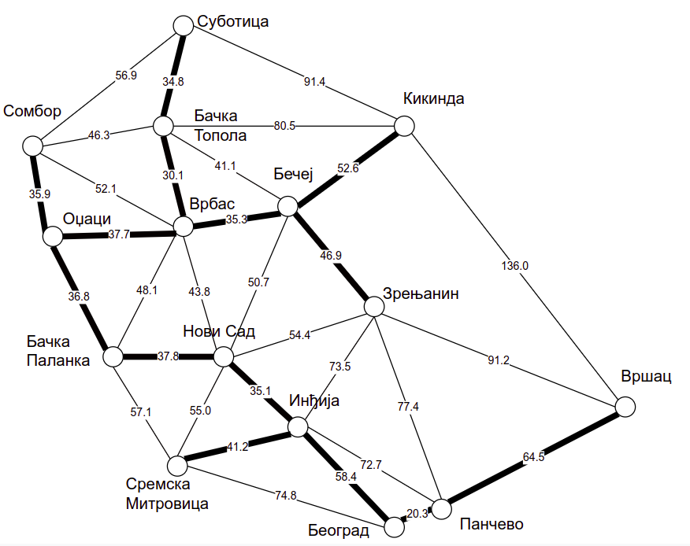
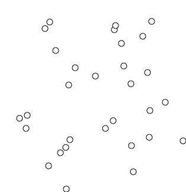

Минимално разапињуће дрво
=========================

Размотримо задатак у коме је што повољније потребно саградити мрежу
путева тако да је тим путевима могуће путовати између било која два
града на некој територији. Претпоставимо да је дат неусмерен тежински
граф чији чворови представљају градове, а гране потенцијалне путеве
које је могуће саградити (где тежине грана означавају, на пример, цене
изградње тих путева). Јасно је да изграђена мрежа путева представља
повезан подграф датог графа, као и да она не сме да садржи циклус (јер
ако се нека грана циклуса уклони, подграф и даље остаје
повезан). Дакле, путеви које треба изградити чине дрво. То дрво се
назива **минимално повезујуће дрво**, или минимално разапињуће дрво.

    Минимално повезујуће дрво градова у Војводини.

Да би задатак могао да се реши, полазни граф потенцијалних путева мора
бити повезан (у супротном је једино могуће пронаћи минималну
повезујућу шуму, која повезује чворове унутар сваке појединачне
компоненте повезаности). Нагласимо и да минимално повезујуће дрво не
мора бити јединствено, али да његова дужина (збир дужина грана дрвета)
јесте јединствена.

У наставку ћемо описати два ефикасна алгоритма за одређивање
минималног разапињућег дрвета: Примов и Краскелов. Оба ова алгоритма
спадају у групу грамзивих алгоритама.

Примов алгоритам
----------------

Примов алгоритам конструише минимално разапињуће дрво тако што креће
од произвољног чвора и у сваком кораку дрво које се конструише
проширује тачно једним новим чвором и граном која тај чвор спаја са
раније конструисаним дрветом. Претпоставимо да је конструисано поддрво
траженог минималног разапињућег дрвета и размотримо скуп грана
:math:`E_k` које спајају чворове тог поддрвета са чворовима графа који
су ван њега. Ако је полазни граф повезан и ако поддрво не садржи све
чворове графа, тада је тај скуп грана увек непразан. Једна од тих
грана сигурно мора бити укључена у крајњи резултат. Наиме, све гране
ван тог скупа или повезују чворове унутар већ конструисаног поддрвета
или повезују чворове који нису у њему, па је у циљу постизања
повезаности јасно да је потребно одабрати бар једну грану из скупа
:math:`E_k`, која спаја ове две за сада раздвојене компоненте. Примов
алгоритам дрво проширује најкраћом граном :math:`e` скупа :math:`E_k`
(ако има више грана исте дужине, могуће је узети било коју), јер је
она сигурно део неког најмањег повезујућег дрвета. Ако би неко
минимално повезујуће дрво садржало неку дужу грану :math:`e'` скупа
:math:`E_k`, тада би се њеним избацивањем оно раздвојило на два
повезана поддрвета.  Грана :math:`e` повезује та два поддрвета и њеним
убацивањем би се добило поново повезујуће стабло, које би било строго
краће од минималног, што је, јасно, немогуће. Дакле, свако минимално
повезујуће стабло мора да укључи бар једну грану скупа :math:`E_k`, а
то не може бити ниједна грана која је дужа од најкраће гране тог
скупа.

Наредна анимација илуструје примену Примовог алгоритма. Дрво које је у
сваком кораку изграђено обележено је плавом бојом (и његови чворови и
његове гране). Гране скупа :math:`E_k` су обојене зеленом
бојом. Црвене гране повезују чворове дрвета и оне неће бити додане у
дрво (њих је могуће елиминисати из сваког даљег разматрања). Танке,
црне гране су оне које још нису размотрене.

.. gallery:: prim
    :width: 650px
    :height: 100%
    :folder: ../../_images/4_grafovski/prim
    :images: prim1.png, prim2.png, prim3.png, prim4.png, prim5.png, prim6.png, prim7.png, prim8.png, prim9.png

Ова анимација је направљена помоћу веб-апликације која је бесплатно
доступна на сајту Математичког факултета Универзитета у Београду
(http://www.matf.bg.ac.rs/~filip/algoritmi/prim.html). Употреби ову
апликацију да провериш колико добро разумеш како функционише овај
алгоритам.

И наредна анимација открива како Примов алгоритам функционише.

.. figure:: ../../_images/4_grafovski/PrimAlgDemo.gif
    :align: center

    Анимација рада Примовог алгоритма, преузета са сајта https://en.wikipedia.org/wiki/Prim%27s_algorithm#/media/File:PrimAlgDemo.gif

Наредни C# код представља једну могућу имплементацију Примовог
алгоритма. Примећујемо да је имплементација добијена модификовањем
имплементације Дајкстриног алгоритма -- једина разлика је то што у
низу ``rastojanja`` не памтимо растојања сваког чвора од почетног, већ
растојања сваког чвора од тренутног стабла.

.. activecode:: prim_kod
    :passivecode: true
    :coach:
    :includesrc: _src/4_grafovski/prim.cs

Сложеност унутрашње петље која тражи чвор који није у стаблу а
најближи му је је :math:`O(|V|)`. Пошто се спољна петља извршава
:math:`O(|V|)` пута, сложеност централног дела алгоритма је
:math:`O(|V|^2)` (сложеност учитавања графа је :math:`O(|V| + |E|)`).

Слично као код Дајкстриног алгоритма, ефикаснија имплементација се
може добити ако се гране скупа :math:`E_k` чувају у реду са
приоритетом (он омогућава да се гране ефикасно додају у скуп, да се
ефикасно пронађе најкраћа међу њима и да се она ефикасно избаци из
скупа). Сложеност такве имплементације је :math:`O((|E| + |V|) \log
|V|)`.
                 
Краскелов алгоритам
-------------------

За разлику од Примовог алгоритма који минимално разапињуће дрво гради
све време одржавајући неко његово поддрво, Краскелов алгоритам одржава
његов подрграф који не мора бити дрво већ шума. Док Примов алгоритам
бира најмању међу гранама које спајају дрво са остатком чворова,
Краскелов алгоритам истовремено разматра све гране и међу њима бира
најкраћу неодабрану грану која са до тада одабраним гранама не затвара
циклус. Гране се на самом почетку сортирају по дужини (од најкраће до
најдуже), обилазе се редом и за сваку се проверава да ли затвара
циклус. Ако не, додаје се у шуму, а ако да, просто се
прескаче. Алгоритам се завршава када се сви чворови повежу тј. када се
дода :math:`n-1` грана (где је :math:`n` број чворова графа).

Докажимо коректност овог алгоритма.

Јасно је да алгоритам производи повезујуће дрво (пошто се експлицитно
проверава да ниједна додата грана не чини циклус, а алгоритам се
зауставља када се сви чворови повежу).

То дрво је минимално. Заиста, све време током извршавања алгоритма
важи да постоји неко минимално разапињуће дрво које садржи до тада
формирану шуму и не садржи ниједну грану која је до тада одбачена.

То важи у почетку (јер је почетна шума празна, нема одбачених грана,
па било које минимално повезујуће дрво задовољава
услов).

Претпоставимо да то важи у неком кораку тј. нека постоји неко такво
дрво :math:`T` и докажимо да важи и у следећем. Ако се у следећем
кораку одбацује нека грана, она сигурно није део дрвета :math:`T` (јер
затвара циклус са гранама шуме, које су део дрвета :math:`T`, па би зато
затварала циклус и у дрвету :math:`T`). Претпоставимо зато да се у
следећем кораку додаје нека грана :math:`e`. Ако је она део дрвета
:math:`T` услов је задовољен (дрво :math:`T` садржи и проширену
шуму). Ако грана :math:`e` није део дрвета :math:`T`, тада она затвара неки 
циклус у дрвету :math:`T`. Тај циклус мора да садржи неку грану која није део
шуме. Заиста, ако су све гране циклуса поред гране :math:`e` део шуме,
она би затварала циклус и у шуми, а то смо проверили да није случај.
Нека је :math:`e'` нека грана тог циклуса, различита од :math:`e`,
која не припада шуми. Заменом те гране граном :math:`e` поново се
добија разапињуће дрво. Грана :math:`e'` припада дрвету :math:`T` па
није одбачена, а пошто није део шуме, алгоритам је није
размотрио. Пошто алгоритам разматра гране у неопадајућем поретку
дужина, грана :math:`e'` није краћа од гране :math:`e`, па је дрво
добијено заменом гране :math:`e'` граном :math:`e` такође минимално.

Наредна анимација приказује рад алгоритма на једном примеру.
  
.. gallery:: kraskell
    :width: 600px
    :height: 100%
    :folder: ../../_images/4_grafovski/kraskel
    :images: kraskel1.png, kraskel2.png, kraskel3.png, kraskel4.png, kraskel5.png, kraskel6.png, kraskel7.png, kraskel8.png, kraskel9.png, kraskel10.png, kraskel11.png, kraskel12.png, kraskel13.png, kraskel14.png

Ова анимација је направљена помоћу веб-апликације која је бесплатно
доступна на сајту Математичког факултета Универзитета у Београду
(http://www.matf.bg.ac.rs/~filip/algoritmi/kraskel.html). Употреби ову
апликацију да провериш колико добро разумеш како функционише овај
алгоритам.

И наредна анимација открива како Краскелов алгоритам функционише.

    Анимација рада Примовог алгоритма, преузета са сајта https://en.wikipedia.org/wiki/Kruskal%27s_algorithm#/media/File:KruskalDemo.gif

Главно питање за имплементацију је како детектовати да ли додавање
гране затвара циклус. У анимацији смо видели да је чворовима сваке
компоненте повезаности у односу на до тада додате гране (сваког дрвета
у шуми и сваког изолованог чвора) могуће доделити боје. Грана затвара
циклус ако и само ако спаја чворове исте боје.

Боје, наравно, могу бити представљене бројевима. Боју сваког чвора је
могуће чувати у низу. Провера да ли грана затвара циклус тј. да ли
спаја чворове исте боје је тада тривијална (само из из низа прочитају
боје два краја те гране). Међутим, спајање две компоненте захтева да
се сви чворове једне од њих обоје у боју друге од њих. Иако се
релативно једноставно технички реализује, та операција је неефикасна
(сложеност јој је :math:`O(|V|)` јер захтева пролазак кроз цео низ
боја). Она се понавља у најгорем случају :math:`E` пута (јер спољна
петља пролази кроз низ грана), па је ова фаза сложености
:math:`O(|E||V|)`, што може бити веома неефикасно. Иницијално
сортирање грана је сложености :math:`O(|E|\log |E|)`.

.. activecode:: kraskel_kod
    :passivecode: true
    :coach:
    :includesrc: _src/4_grafovski/kraskel.cs

Скренимо пажњу на један технички детаљ. Спајање група (тј. промена
боја) помоћу наредног кода не би радило како треба (пробај да
одговориш зашто).

.. activecode:: kraskel_kod_greska
    :passivecode: true

     for (int j = 0; j < n; j++)
           if (grupa[j] == grupa[c1])
                grupa[j] = grupa[c2];
                 
Сложеност спајања компоненти се може поправити коришћењем посебне
структуре за представљање дисјунктних скупова (енгл. dijsoint-set,
union-find). Опис ове структуре података превазилази овај курс, али
заинтересоване ученике упућујемо да на интернету истраже како се она
користи. Сложеност алгоритма у том случају може бити :math:`O(|E|
\log{|V|})`.
