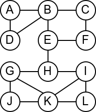
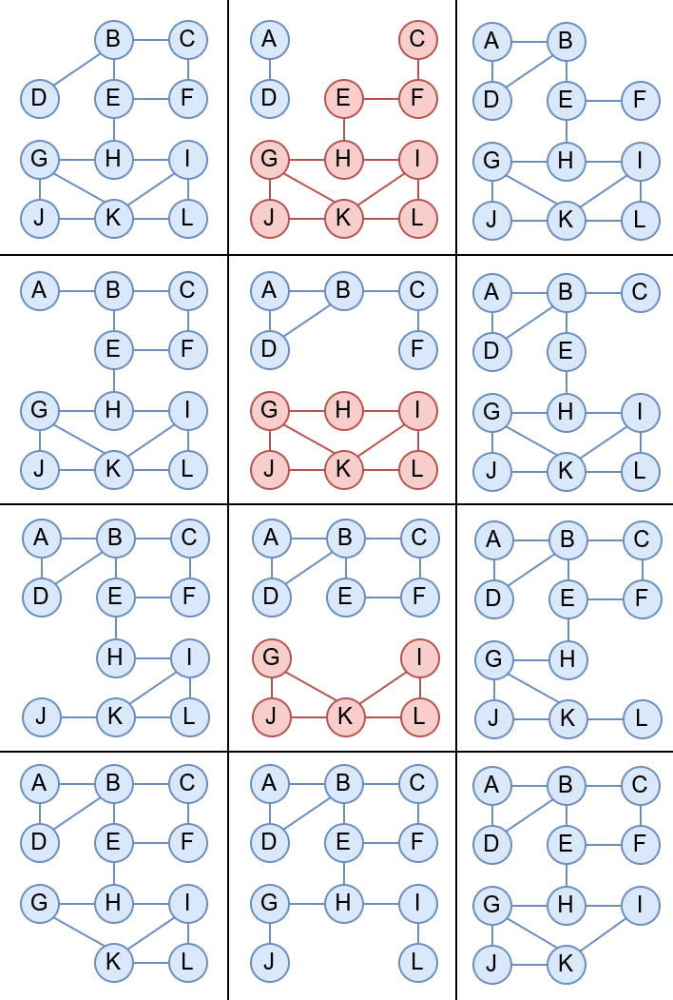
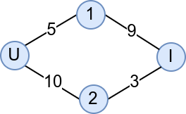
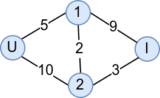
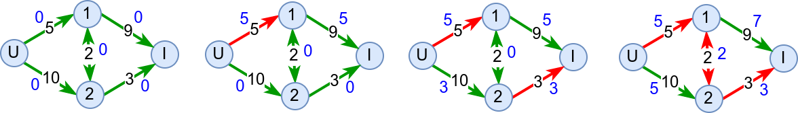
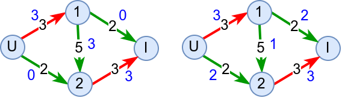

Још неки графовски проблеми и алгоритми
=======================================

До сада смо се већ прилично детаљно упознали са графовима и видели смо
широк дијапазон алгоритама за рад са графовима. Ипак, графови су
толико богата тема да постоји заиста велики број практичних питања над
графовима које до сада још нисмо размотрили, као и велики број
напредних алгоритама који их решавају. У овом курсу нећемо детаљно
описивати те алгоритме, али ћемо бар да набројимо још
неколико чувених графовских проблема.

Одређивање мостова и артикулационих тачака
------------------------------------------

Размотримо мрежу рачунара која је представљена неусмереним графом
приказаним на слици.

Која би по вашем мишљењу могла да буде њена најважнија грана? Који
кабл је најопасније пресећи? Размислите из овог угла: када се грана
уклони, да ли је и даље могуће послати поруку од било ког до било ког
другог чвора у мрежи? Ако сте одговорили са ``E-H``, онда сте у
праву. То је једина грана након чијег избацивања граф постаје
неповезан.

Такве гране се називају **мостови** у графу (прецизније, то су гране
чијим се избацивањем повећава број компонената повезаности графа). У
графу са :math:`n` чворова може постојати највише :math:`n-1` мостова
(јер :math:`n-1` грана повезује граф, а свака додатна грана затвара 
неки циклус). Једини графови са
:math:`n-1` мостова су дрвета, док су шуме једини графови код којих је
свака грана мост. Постоје, наравно, и графови у којима нема мостова
(узмимо, на пример, троугао).

Наивни алгоритам за одређивање мостова би избацивао једну по једну
грану и затим експлицитно бројао компоненте повезаности. Сложеност би
била лоша (:math:`O(|V|(|V| + |E|))`).

За одређивање мостова у графу се може употребити ефикаснији Тарџанов
(енгл. Robert Tarjan) алгоритам, заснован на обиласку графа у дубину,
а чија је сложеност :math:`O(|V| + |E|)`. 

~~~~

Сродан појам мостовима представљају **артикулационе тачке** (каже се и
**артикулациони чворови**). То су чворови графа чијим се уклањањем из
графа (заједно са суседним гранама) граф разбија, тј. повећава се број
компонената повезаности. Размотримо шта би се десило да се у нашој
мрежи неки рачунар поквари? Да ли би отказ неког од рачунара
онемогућио слање порука између осталих? Када размотримо све
могућности, видимо да су једине артикулационе тачке чворови ``B``,
``E`` и ``H``, јер се једино њиховим уклањањем добијају графови са по
две компоненте повезаности (означене плавом и црвеном бојом), док се
уклањањем било ког од осталих чворова добија повезан граф (код кога је
једина компонента повезаности означена плавом бојом).

Артикулационе тачке се одређују на веома сличан начин као и мостови
(најчешће Тарџановим алгоритмом).

Више о мостовима и артикулационим чворовима можеш сазнати овде:

- https://en.wikipedia.org/wiki/Bridge_(graph_theory)
- https://en.wikipedia.org/wiki/Biconnected_component

Ојлерови и Хамилтонови путеви и циклуси
---------------------------------------

У уводу смо рекли да савремена теорија графова почиње са Ојлеровим
проучавањем Кенингсбершких мостова. Овај проблем се уопштава на
тзв. проблем проналажења Ојлерових путева. Проблем се најчешће
разматра на неусмереним графовима. **Ојлеров пут** у графу је пут који
пролази кроз сваку грану графа тачно једном (док кроз чворове сме да
прође и више пута). Ако се тражи да се на крају обиласка вратимо у
полазни чвор, тј. ако се тражи циклус који садржи сваку грану графа
тачно једном, онда говоримо о **Ојлеровом циклусу**.

Наредне две теореме дају јасну карактеризацију када постоје Ојлерови
путеви и циклуси.

.. infonote::

   Ојлеров пут у повезаном графу постоји ако и само ако постоје
   највише два чвора непарног степена (и тада они морају бити почетни и
   завршни чвор).

.. infonote::

   Ојлеров циклус у повезаном графу постоји ако и само ако су сви чворови
   парног степена (и тада било који чвор може бити почетни и истовремено завршни).

У наредној анимацији је приказан један Ојлеров пут. Приметимо да су
сви чворови парног степена, осим чворова A и B, па пут мора да почне у
једном од та два чвора и заврши се у другом.

.. gallery:: ojlerov_put
    :width: 150px
    :height: 100%
    :folder: ../../_images/4_grafovski/ojlerov_put
    :images: ojlerov_put0.png, ojlerov_put1.png, ojlerov_put2.png, ojlerov_put3.png, ojlerov_put4.png, ojlerov_put5.png, ojlerov_put6.png, ojlerov_put7.png, ojlerov_put8.png, ojlerov_put9.png, ojlerov_put10.png

Интересантно, постојање Ојлеровог пута нам говори и то да се граф може
нацртати и из једног потеза, без дизања оловке са папира.
   
На основу датих теорема можемо да за дати граф испитамо да ли постоји
Ојлеров пут или циклус, али чак и када знамо да постоји, не умемо да
га конструишемо. Постоји неколико алгоритама који у полиномијалном
времену могу да конструишу Ојлеров пут или циклус.

**Флуријев алгоритам** датира још са краја 19. века. У питању је један
елегантан, али неефикасан алгоритам. Основна идеја је да се крене од
чвора са непарним степеном (или од било ког чвора ако су степени свих
чворова парни) и да се у сваком бира она грана којом до сада нисмо
прошли, а чијим би избацивањем граф остао повезан тј. грана која није
мост у графу. Грана која јесте мост се бира само код оних чворова код
којих је она једини преостали избор. Алгоритам је неефикасан, јер
захтева одређивање мостова у сваком кораку (обично новим покретањем
Тарџановог алгоритма). Чак иако се то избегне (постоје варијанте које
инкрементално одређују мостове), постоје ефикаснији алгоритми од
Флуријевог.

**Хијерхолцеров алгоритам** гради Ојлеров циклус тако што креће од
произвољног чвора :math:`v` и на произвољан начин прати гране док се
не врати у чвор :math:`v`. Нагласимо да није могуће да се заглавимо у
било ком другом чвору јер паран степен чворова осигурава да ћемо кад
год уђемо у неки други чвор моћи да из њега и изађемо неком
неискоришћеном граном. Ако на тој путањи постоји неки чвор код кога
нису искоришћене све гране, тада понављамо поступак од њега, а затим
спајамо циклусе који се у том чвору сусрећу (просто надовезујемо
њихове гране). Поступак се понавља све док се не исцрпе све
гране. Сложеност овог алгоритма је :math:`O(|E|)`.

Више о Ојлеровим путањама можеш сазнати овде:

- https://en.wikipedia.org/wiki/Eulerian_path

За разлику од Ојлерових путева, **Хамилтонови путеви** и **Хамилтонови
циклуси** пролазе кроз сваки чвор графа тачно једанпут, а не морају да 
прођу сваком граном. Проблем може да се разматра и на неусмереним и на 
усмереним графовима. Наредна анимација приказује један Хамилтонов пут. 

.. gallery:: hamiltonov_put
    :width: 150px
    :height: 100%
    :folder: ../../_images/4_grafovski/hamiltonov_put
    :images: hamiltonov_put0.png, hamiltonov_put1.png, hamiltonov_put2.png, hamiltonov_put3.png, hamiltonov_put4.png, hamiltonov_put5.png, hamiltonov_put6.png

За разлику од Ојлерових путева и циклуса који имају веома једноставне
карактеризације на основу степена чворова, постојање Хамилтонових
путева тј. циклуса није уопште једноставно окарактерисати. Постоје
разни довољни услови (нпр. сваки потпуни граф је Хамилтонов) и
потребни услови (нпр. у Хамилтоновим графовима не могу постојати
артикулациони чворови), али нема једноставних потребних и довољних
услова. До сада није пронађен ниједан алгоритам полиномијалне
сложености који би за дати граф испитао да ли има Хамилтонов пут или
циклус (без обзира на то да ли је граф усмерен или не) и мало је
вероватно да такав алгоритам постоји.

.. infonote::

   Проблем испитивања постојања Хамилтонових путева и проблем
   испитивања постојања Хамилтонових циклуса (без обзира на то да ли
   је граф усмерен или не) спада у класу тзв. **NP проблема**
   (недетерминистички полиномијалних), што значи да се за дато решење у
   полиномијалном времену може проверити да је исправно (заиста, за
   дати пут или циклус је прилично лако проверити да ли јесте
   Хамилтонов), али и у категорију **NP-тешких** проблема што значи да
   још није откривен полиномијални алгоритам за њихово решавање. Мада
   није доказано да такав алгоритам не постоји, мало је вероватно да
   је то случај. Проблеми који су истовремено и у класи NP и у класи
   NP-тешких проблема су тзв. **NP-комплетни** проблеми. Ако би неко
   успео да реши било који NP-комплетан проблем било тако што пронађе
   полиномијални алгоритам за његово решавање или тако што докаже да
   такав алгоритам не постоји, добио би милион долара од Клејовог
   института (и још важније, стекао огромну светску славу).

Више о Хамилтоновим путањама може сазнати овде:

- https://en.wikipedia.org/wiki/Hamiltonian_path

   
Проблем трговачког путника
--------------------------

Проблем проналажења Хамилтоновог пута тј. циклуса се природно дефинише
и на усмереним графовима, при чему је тада сасвим природно тражити
најкраћи Хамилтонов пут тј. циклус. Овај проблем се назива **проблем
трговачког путника**, јер се природно јавља када је потребно
организовати обилазак већег броја градова, тако да се сваки град
посети тачно једном и да се пређе што краћи укупан пут. Овај проблем
је, сасвим јасно, тежи од проблема тражења Хамилтоновог пута или
циклуса, јер није довољно наћи било који пут већ онај најкраћи.

.. infonote::

   Проблем трговачког путника јесте NP-тежак, али не и NP, па самим
   тим није ни NP-комплетан. Наиме, чак и кад имамо решење, не умемо у
   полиномијалном времену да проверимо да ли је исправно (за дати пут
   умемо брзо да проверимо да ли сваки град посећује тачно једном, али
   не умемо да брзо проверимо да ли је он заиста најкраћи од свих
   таквих путева).

Пошто овако тешке проблеме није могуће потпуно тачно решити (и то већ
за графове од неколико десетина чворова), задовољавамо се приближним
решењима. Уместо егзактних алгоритама који проналазе стварно најкраћи
пут, али за то им је потребно недопустиво пуно времена, примењују се
**хеуристике** које траже пут који не мора бити заиста најкраћи (али
је прилично кратак) и то раде веома брзо.

Једна једноставна хеуристика која прва пада на памет је да се из
сваког града оде у њему најближи још непосећени град. Нажалост,
постоје примери на којима ова хеуристика даје веома лоше решење
(тј. пут који је много дужи од најкраћег). С временом је развијен
заиста велики број добрих хеуристика за решавање овог и сродних
проблема. Неке су засноване на **локалној претрази**, што значи да до
све бољих и бољих решења долазе малим, локалним изменама до тада
познатих решења (код овог проблема то значи да се мења распоред
обилазака тек неколико градова унутар познатог циклуса).

Одличан видео о разним стратегијама решавања овог проблема је доступан
овде:

- https://www.youtube.com/watch?v=GiDsjIBOVoA
   
Проток кроз мрежу
-----------------

Саобраћајни инжењери често имају задатак да направе мрежу
саобраћајница тако да се саобраћај кроз град може одвијати ефикасно.
Замислимо да је дата мрежа која има један чвор који представља улаз
(сви аутомобили улазе у саобраћај на том месту), један чвор који
представља излаз (сви аутомобили имају циљ да дођу до излаза) и већи
број повезаних унутрашњих чворова које представљају локације преко
којих аутомобили могу да пролазе. За сваку грану у овако одређеном
графу познат је капацитет тј. број аутомобила који могу да прођу у
некој јединици времена. Ако нема загушења, у свим унутрашњим чворовима
важи да број аутомобила који уђу у тај чвор у некој јединици времена
мора да буде једнак броју аутомобила који изађу у јединици времена
(аутомобили се могу "створити" само на улазу и могу "нестати" само на
излазу).

Природно се поставља питање који је максимални проток целе мреже
тј. колики је број аутомобила у јединици времена може да дође на улаз,
да би без застајкивања прошао мрежу и изашао на излазу. Размотримо
неколико примера.

У мрежи на слици је улазни чвор означен словом U, а излазни
словом I. По јединици времена улаз теоријски може да "створи"
бесконачно возила, али без загушења из њега може да изађе 15
аутомобила (5 ће отићи горе, а 10 доле). Излаз теоријски може да
прихвати бесконачно аутомобила, међутим, нема потребе да прихвата више
од 12 (9 пристиглих од горе и 3 пристигла од доле). Ипак гледајући
мрежу у целини, можемо да закључимо да она може да пропусти само 8
аутомобила по јединици времена и кажемо да је проток кроз ову мрежу
једнак 8. Наиме, од 10 аутомобила који стигну у чвор 2, само 3 могу да
оду на излаз, јер грана између чвора 2 и излаза има слабу пропусну моћ
(ако би у чвор 2 стизало више аутомобила, у њему би се створило
загушење). Са друге стране, свих 5 аутомобила који стигну у чвор 1
могу без проблема да наставе кретање до излаза. Дакле, да не би било
загушења, у мрежу сме да уђе 8 аутомобила по јединици времена, 5 треба
да оде горе, 3 доле и свих 8 ће несметано стићи до излаза.

Додавање (двосмерног) пута између чворова 1 и 2 може мало поправити
ствари.

Наиме, чвор 2 сада може у јединици времена да пропусти 5 аутомобила,
јер ће се 2 кретати према чвору 1, а 3 према излазу. Чвор 1 у том
случају прихвата 7 аутомобила по јединици времена и сви они могу
несметано да оду до излаза. То значи да изградња новог пута повећава
проток ове мреже са 8 на 10 аутомобила по јединици времена. Када 10
аутомобила уђе у мрежу, 5 треба да оде ка чвору 1, а 5 ка чвору 2,
свих 5 аутомобила из чвора 1 може да иде одмах ка излазу, а од 5
аутомобила у чвору 2, 3 треба да иде ка излазу, а 2 ка чвору 1. Пут од
чвора 1 до излаза има довољан капацитет да пропусти свих 7 аутомобила
који сада стижу у чвор 1.

За одређивање максималног протока у мрежи користи се
**Форд-Фулкерсонов** алгоритам који је заснован на појму **увећавајуће
путање**. Основна идеја је да се види да ли постоји нека путања од
улаза до излаза таква да је на свакој грани те путање тренутни број
возила мањи од капацитета те гране. Ако таква путања постоји, тада се
број возила на свим гранама те путање може повећати онолико колико
"уско грло" на тој путањи допушта тј. може се повећати за најмању
разлику између капацитета и тренутног протока на гранама те
путање. Када се проток повећа на основу неке повећавајуће путање, тражи
се нова и поступак се понавља док год постоје повећавајуће путање.

На наредној слици је приказана примена овог алгоритма за мрежу коју
смо пешке анализирали.

На почетку је свакој грани придружен проток 0 (плави
бројеви). Проналази се увећавајућа путања U-1-I. "Уско грло" на њој је
грана U-1, па се проток на тој путањи повећава за 5. Након тога се
проналази увећавајућа путања U-2-I. "Уско грло" на њој је грана 2-I,
па се проток на тој путањи повећава за 3. На крају се проналази и
увећавајућа путања U-2-1-I. "Уско грло" на њој је грана 2-1, па се
проток дуж путање увећава за 2. Пошто нема више увећавајућих путања,
алгоритам се зауставља.
           
Варијанта овог алгоритма која за тражење увећавајућих путања користи
претрагу у ширину, назива се **Едмондс-Карпов** алгоритам.

За потпуно прецизан опис овог алгоритма је потребно увести мало више
детаља. Потребно је допустити да алгоритам "поништи" неке своје
одлуке. Размотримо наредни пример.

Након налажења прве повећавајуће путање у приказаној мрежи, долазимо у
ситуацију која је приказана на првој слици. Гледајући усмерене гране,
не постоји више ниједна увећавајућа путања. Међутим, ако одузмемо два
возила са гране 1-2 и преусмеримо их на грану 1-I можемо повећати
проток мреже за 2 и добијамо оптимални проток. Да би ово било лако
оствариво, уводи се појам тзв. резидуалног графа који допушта да
увећавајуће путање обилазе неке гране у супротном смеру, што значи да
смањују тренутно додељен проток на тим гранама (што се у примеру
десило са граном 1-2). Упућујемо те да те детаље самостално
истражиш. Са друге стране, надамо се да ти примери који смо приказали
дају неке основне идеје и да ћеш зато лакше самостално савладати и
имплементирати овај алгоритам.

Линкови
.......

Графови се често веома детаљно проучавају на факултетима. У наставку
се налазе линкови ка неким материјалима на српском језику који су
посвећени графовима и раду са њима.

- http://poincare.matf.bg.ac.rs/~vesnap/kaa/03_kaa-grafovi-obilazak.pdf
- http://poincare.matf.bg.ac.rs/~vesnap/kaa/04_kaa-grafovi-povezanost.pdf
- http://poincare.matf.bg.ac.rs/~vesnap/kaa/05_kaa2021-grafovi-najkraci-putevi.pdf
- http://poincare.matf.bg.ac.rs/~vesnap/kaa/06_kaa2021-grafovi-najkraci-putevi-ciklusi.pdf
- http://poincare.matf.bg.ac.rs/~ezivkovm/nastava/algoritmi.pdf
